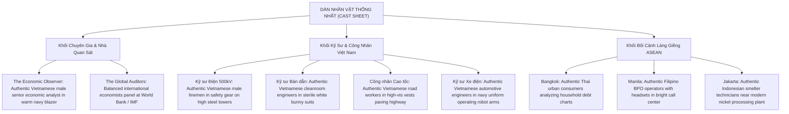
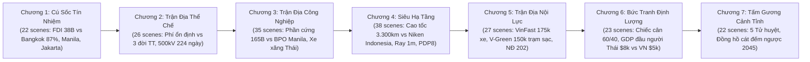
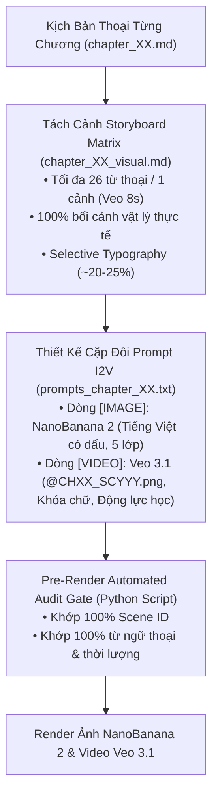
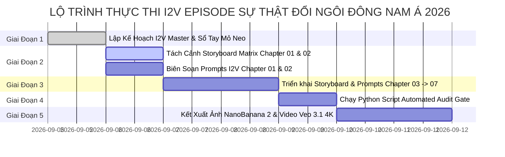

<!--
DOCUMENT PROVENANCE & EXECUTION LINEAGE:
- Output Document: episodes/su-phan-hoa-dong-nam-a/i2v_production_plan.md
- Activated Persona: The Visual Storyteller, The Scene Architect, The Critical Auditor, The Quality Czar
- Activated Skill: Scene Timing Builder & Visual Prompter Framework (.agents/skills/scene_timing_builder/SKILL.md & .agents/skills/visual_prompter/SKILL.md)
- Source Documents Consulted:
  * episodes/su-phan-hoa-dong-nam-a/voiceover.md
  * episodes/su-phan-hoa-dong-nam-a/07_outline.md
  * episodes/su-phan-hoa-dong-nam-a/vault/00_Global_Vision_Synthesis.md
  * episodes/su-phan-hoa-dong-nam-a/03_brief.md
  * .agents/skills/visual_prompter/SKILL.md
- Execution Timestamp: 2026-09-05 15:53
-->

# Kế Hoạch Triển Khai Hình Ảnh & Video I2V Master: Sự Thật Cuộc Đổi Ngôi Đông Nam Á 2026

> **EPISODE ID:** `episodes/su-phan-hoa-dong-nam-a`  
> **CANONICAL TITLE:** *Việt Nam Đang Đi Nhanh Hay Láng Giềng Đang Chậm Lại? — Sự Thật Cuộc Đổi Ngôi Đông Nam Á 2026*  
> **THỜI LƯỢNG MỤC TIÊU:** ~31.3 phút (5.008 từ thoại, 7 chương)  
> **CÔNG NGHỆ THỰC THI:** Sinh ảnh tĩnh **NanoBanana 2 (Gemini 3.1 Flash/Pro Image Preview)** (16:9 4K, 2D Graphic Novel) $\longrightarrow$ Sinh video chuyển động **Google Veo 3.1** (I2V 8 giây, Khóa chữ, Chuyển động máy ảnh điện ảnh).  
> **NGUỒN SỰ THẬT DUY NHẤT:** Đồng bộ 100% từ `voiceover.md`, `00_Global_Vision_Synthesis.md`, `07_outline.md` và `08_chapter_briefs.md`.

---

## 🎨 1. HỆ THỐNG MỸ THUẬT & QUY CHUẨN TRỰC QUAN TOÀN CỤC (GLOBAL VISUAL DNA)

### A. Triết Lý Nghệ Thuật: Warm Cinematic Editorial (Đồ Họa Báo Chí Điện Ảnh Sáng & Ấm Áp)
* **Bản chất phong cách:** Đồ họa báo chí cao cấp (High-End Editorial Illustration), bán thực tế (semi-realistic), sắc sảo, thanh lịch, sáng sủa và giàu sức sống như các ấn phẩm phóng sự quốc tế của *Monocle*, *FT Weekend*, *Harvard Business Review* hay *Wired*. **Tuyệt đối loại bỏ phong cách u tối, lạnh lẽo, bóng đêm u ám (anti-gloomy, anti-cold noir)**; thay bằng không gian sáng rõ, ngập tràn ánh sáng tự nhiên ấm áp, tạo cảm giác tri thức, tích cực và tràn đầy năng lượng phát triển.
* **BẮT BUỘC FRONT-LOAD PHONG CÁCH 2D BÁO CHÍ ẤM ÁP (Warm 2D Art Medium Front-Loading):**  
  100% prompt ảnh tĩnh `[IMAGE]` bắt buộc phải bắt đầu bằng cụm từ cố định:  
  `A 2D warm cinematic editorial illustration of [Chủ thể & Hành động], elegant graphic novel aesthetic, clean bold ink outlines, stylized flat vector textures, bright and warm sunlit atmosphere, soft warm cream and parchment tones...`  
  *(Tuyệt đối CẤM mở đầu bằng các từ chỉ góc máy chụp ảnh như `A photo of...`, `A wide shot of...`, `An exterior shot of...` khiến AI hiểu lầm là ảnh chụp thật photorealism; và CẤM các từ khóa gây tối như `dark charcoal`, `deep noir shadows`, `dim cold blue`).*

---

### B. Bảng Màu 60-30-10 Tươi Sáng & Ấm Áp (Warm Bright Palette)

Toàn bộ tập phim tuân thủ nghiêm ngặt nguyên tắc phối màu điện ảnh tươi sáng, ấm áp, thoáng đãng:

```
┌─────────────────────────────────────────────────────────────────────────────┐
│                   BẢNG PHỐI MÀU ĐIỆN ẢNH SÁNG & ẤM ÁP 60-30-10              │
├──────────────────────────────┬──────────────────────────────┬───────────────┤
│     60% NỀN SÁNG & ẤM        │    30% CHỦ THỂ / NÉT VẼ      │ 10% ĐIỂM NHẤN │
├──────────────────────────────┼──────────────────────────────┼───────────────┤
│ • Warm Ivory Cream (#FAF7EE) │ • Warm Charcoal Brown (#2C28)│ • Glowing Cyan│
│ • Textured Parchment (#F4EB) │ • Warm Titanium Grey         │ • Honey Amber │
│ • Light Sandstone (#EFE8DF)  │ • Architectural White Glass  │ • Coral Red   │
└──────────────────────────────┴──────────────────────────────┴───────────────┘
```

* **60% Nền Sáng & Ấm Áp (Warm Light Base):** Gam màu kem ngà ấm áp `warm ivory cream (#FAF7EE)`, giấy dó cao cấp `warm textured parchment (#F4EBE1)` và đá sa thạch sáng màu `light warm sandstone (#EFE8DF)`. Không gian nền luôn sáng sủa, sạch sẽ, thoáng mắt, tạo độ mở tối đa cho khung hình.
* **30% Chủ thể & Kết cấu (Warm Earth & Architectural Midtones):** Nét viền nâu than ấm `warm charcoal brown (#2C2825) outlines`, bề mặt xám titan ấm, bê tông sáng màu, gỗ sồi tự nhiên và kính kiến trúc hiện đại đón ánh mặt trời.
* **10% Điểm nhấn dẫn dắt thị giác (Vibrant Warm & Luminous Accents):**
  * *Tuyến Việt Nam (Phần cứng, Cao tốc & Năng lượng):* Xanh ngọc lam ấm sáng rực `luminous warm cyan (#00B4D8)` và xanh lục bảo tươi mới `fresh emerald sage green (#2EC4B6)` (Nhà máy bán dẫn rực sáng, đường dây 500kV đón bình minh, trạm sạc V-Green, dải cao tốc thênh thang).
  * *Tuyến Thái Lan (Thách thức Ô tô & Nợ nần):* Vàng mật ong hổ phách ấm `warm honey amber (#FFA000)` và cam đất nung (Các tòa tháp Bangkok và dây chuyền ô tô dưới ánh nắng chiều vàng ấm).
  * *Tuyến Philippines (Tiêu dùng BPO & Bài toán Điện):* Hồng san hô ấm áp `warm coral pink (#FF6F61)` (Trung tâm mua sắm hiện đại, sàn văn phòng BPO ngập ánh sáng ấm cúng).
  * *Tuyến Indonesia (Biển đảo & Khoáng sản Niken):* Vàng đất nung ấm `warm ochre gold (#E76F51)` và xanh ngọc biển nhiệt đới `tropical warm teal (#06D6A0)` (Quần đảo biển xanh rực rỡ dưới nắng xích đạo).
  * *Tuyến Soi Chiếu Dữ Liệu & 5 Tử Huyệt 2045:* Đỏ cam san hô rực rỡ `warm vermilion coral (#E63946)` và vàng kim hoàng gia `radiant warm gold (#FFD166)` (Bảng đếm ngược R&D, biểu đồ kinh tế sáng rõ).

---

### C. Ngôn Ngữ Quang Học & Ánh Sáng Điện Ảnh (Warm Cinematography Specs)

* **Thiết lập ánh sáng:** Sử dụng ánh sáng tự nhiên ngập tràn: `warm golden hour sunlight`, `soft diffused morning daylight`, `bright airy ambient illumination`, `warm amber rim-light` (viền sáng hổ phách ấm tôn vinh chủ thể, tách biệt hoàn toàn khỏi nền kem sáng).
* **Triệt tiêu hoàn toàn:** Các vùng tối bết dính (`black crush`), bóng đổ u ám (`gloomy shadows`), ánh sáng xanh lạnh lẽo (`cold blue tint`). Mọi khung hình đều toát lên vẻ ấm áp, tri thức, tự tin và tràn đầy năng lượng.
* **Bốn góc máy chủ đạo của tập phim:**
  1. *Góc đại cảnh chan hòa ánh nắng (`Sun-drenched epic aerial view`):* Bắt trọn dải cao tốc 3.300km uốn lượn dưới nắng sớm, cảng Cái Mép với biển xanh ngọc bích và các con tàu mẹ rực rỡ sắc màu container.
  2. *Góc thấp ngước nhìn vươn lên (`Low-angle wide shot in golden light`):* Cột điện 500kV vút cao kiêu hãnh đón nắng hồng ban mai, giàn cẩu trục hiện đại, tháp năng lượng sạch.
  3. *Góc cận cảnh theo dấu ấm áp (`Macro warm tracking shot`):* Đĩa wafer bán dẫn 300mm lấp lánh sắc vàng hổ phách, cánh tay robot sơn màu cam ấm hoạt động chính xác trên khung xe điện bóng bẩy.
  4. *Góc đối thoại thân mật & tri thức (`Warm intimate editorial medium shot`):* Nhà quan sát kinh tế bên bàn trà gỗ sồi ngập nắng sớm qua khung cửa kính, phong thái điềm tĩnh, tự tin.

---

### D. 100% Thực Tế Vật Lý — Triệt Tiêu Tuyệt Đối Ẩn Dụ Trừu Tượng Hóa & Siêu Thực (Strict Anti-Abstract & Physical Realism Mandate)

> 🛑 **NGUYÊN TẮC BẤT BIẾN:** Kênh Góc Nhìn Podcast phân tích chính sách và kinh tế thực chứng. Khán giả tiếp nhận video qua tư duy lý tính. Mọi hình ảnh sinh ra **BẮT BUỘC phải là không gian và thực thể vật lý có thật ngoài đời thực (100% Physical Living Reality)**.

* **CẤM TUYỆT ĐỐI các biểu tượng siêu thực, ẩn dụ trừu tượng (Forbidden Surrealist Tropes):**
  * ❌ CẤM vẽ chiếc cân bay lơ lửng giữa trời (`floating scales of justice/economy`).
  * ❌ CẤM vẽ bàn tay khổng lồ vô hình (`giant invisible hands`) nhấc bổng công trình hay điều khiển dòng tiền.
  * ❌ CẤM vẽ bánh răng cơ khí lơ lửng trên mây (`floating gears in sky`).
  * ❌ CẤM vẽ đồng tiền vàng/đô la khổng lồ rơi từ trên trời xuống (`falling coins from clouds`).
  * ❌ CẤM vẽ cầu thang bay lơ lửng, con đường phân đôi siêu thực giữa bão sét, hố sâu vô tận, hoặc người đứng trơ trọi giữa khoảng không vũ trụ/hư vô đen tuyền.
* **QUY CHUẨN HIỂN THỊ DỮ LIỆU & Ý NIỆM KINH TẾ TRÊN VẬT THỂ THẬT:**
  * Mọi số liệu, đồ thị, biểu đồ hoặc bản đồ **phải xuất hiện trên các vật mang thực tế đời thường**:
    1. *Màn hình tài chính mỏng (Sleek professional dual-monitor setup)* trong phòng làm việc điều hành ngập nắng sớm.
    2. *Bảng điện tử LED cỡ lớn (Large wall-mounted financial LED dashboard)* trong trung tâm điều độ hoặc phòng khánh tiết hiện đại.
    3. *Hồ sơ báo cáo, bản vẽ quy hoạch in giấy A0 (Architectural blueprints & printed audit folders)* đặt ngay ngắn trên bàn làm việc gỗ sồi tự nhiên.
    4. *Infographic phẳng 2D tối giản (Clean 2D vector graphic overlay)* hiển thị có trật tự ở góc 1/3 khung hình trên nền kem ngà thanh lịch, không làm biến dạng không gian vật lý phía sau.

---

### E. Quy Chuẩn Bản Đồ & Bảo Vệ Toàn Vẹn Chủ Quyền Lãnh Thổ — Tuyệt Đối Cấm Đường Lưỡi Bò (Strict Anti-Nine-Dash Line & Sovereignty Protection Protocol)

> 🛑 **LỆNH CẤM BẤT DI BẤT DỊCH VỀ AN NINH CHÍNH CHÍNH & CHỦ QUYỀN BIỂN ĐẢO:**
> Bất kỳ hình ảnh bản đồ nào xuất hiện trong video đều phải tuân thủ tuyệt đối pháp luật Việt Nam và luật pháp quốc tế (UNCLOS 1982). Tuyệt đối không để AI vẽ sai lệch chủ quyền hoặc tự động sinh ra các nét đứt đoạn phi pháp trên biển.

* **MỆNH LỆNH CẤM TUYỆT ĐỐI (Strictly Forbidden):**
  * ❌ **TUYỆT ĐỐI CẤM XUẤT HIỆN ĐƯỜNG CHÍN ĐOẠN / ĐƯỜNG LƯỠI BÒ** dưới bất kỳ hình thức nào (đường nét đứt `dashed lines`, đường chấm `dotted lines`, đường hình chữ U `U-shaped line` trên Biển Đông).
  * ❌ CẤM vẽ các đường ranh giới phân định hàng hải giả định trên mặt biển (no maritime boundary lines in open ocean).
* **CÚ PHÁP BẮT BUỘC KHÓA BẢN ĐỒ (Mandatory Map Prompt Constraints):**
  * 100% prompt có chứa yếu tố bản đồ Việt Nam, Biển Đông, hoặc khu vực Đông Nam Á BẮT BUỘC phải chèn đoạn phủ định và xác lập chủ quyền sau:  
    `clean neutral open ocean, strictly no nine-dash line, strictly no dotted maritime border lines in South China Sea, Vietnamese territorial integrity respected, clean geography without disputed demarcation lines`
* **ĐỊNH HƯỚNG TẠO HÌNH BẢN ĐỒ AN TOÀN & CHUYÊN NGHIỆP:**
  * Sử dụng **Bản đồ địa kinh tế tập trung vào phần đất liền (Mainland Landmass Geo-Economic Map)**: Nổi bật dải đất hình chữ S của Việt Nam và các quốc gia ASEAN trên nền kem ngà sạch sẽ.
  * Các luồng thương mại hàng hải và dòng vốn FDI được biểu diễn bằng **mũi tên ánh sáng liền mạch (`solid glowing trade flow lines`)** hoặc vệt sáng nối thẳng từ các đại dương vào các cụm cảng biển quốc tế (Cái Mép, Hải Phòng, Singapore), tuyệt đối không vẽ các đường biên giới trên biển.

---

### F. Chuẩn Hóa Nhân Chủng Học — Chống Tuyệt Đối Lỗi Tây Hóa Nhân Vật Việt Nam & Đông Nam Á (Demographic & Anthropological Precision — Strict Anti-Westernization Mandate)

> 🛑 **NGUYÊN TẮC ĐỊNH DANH NHÂN KHẨU HỌC:**
> Các mô hình AI quốc tế (như NanoBanana 2, Midjourney, DALL-E) thường có thiên kiến dữ liệu huấn luyện (Training Bias), tự động biến nhân vật chung chung thành người da trắng phương Tây (Caucasian / European) với tóc vàng, mắt xanh, sống mũi phương Tây. Điều này phá hủy hoàn toàn tính chân thực và tinh thần dân tộc của kênh Góc Nhìn Podcast.

* **CẤM TUYỆT ĐỐI (Anti-Westernization Rules):**
  * ❌ CẤM dùng các danh xưng chung chung không rõ nhân chủng như `an engineer`, `a businessman`, `a worker`, `a person`, `an observer`.
  * ❌ CẤM để nhân vật Việt Nam xuất hiện với đặc điểm người da trắng, tóc sáng màu, mắt xanh, hoặc khuôn mặt phương Tây (`strictly no Caucasian or Western facial features, no blonde hair, no blue eyes`).
* **BỘ MÃ NHẬN DIỆN NHÂN CHỦNG HỌC CHUẨN XÁC (Mandatory Demographic Descriptors):**
  * **1. Nhân vật Việt Nam (Nhà quan sát, Kỹ sư, Công nhân, Sinh viên, Cán bộ):**  
    100% prompt có nhân vật Việt Nam BẮT BUỘC phải chứa khối mô tả:  
    `authentic Vietnamese [profession/role], authentic Southeast Asian demographics, natural East Asian heritage, straight dark brown or black hair, warm light-tan or golden undertone skin, authentic Asian eyes and facial bone structure, strictly no Caucasian or Western features, wearing realistic modern Vietnamese professional attire [hoặc đồng phục kỹ thuật viên/bảo hộ chuyên ngành]`
  * **2. Nhân vật các quốc gia đối sánh trong khối ASEAN:**
    * *Thái Lan:* `authentic Thai male/female, Southeast Asian demographics, natural Thai facial features, dark hair, light-tan skin...`
    * *Philippines:* `authentic Filipino male/female BPO professional, Southeast Asian demographics, natural Filipino facial features...`
    * *Indonesia:* `authentic Indonesian male/female industrial technician, Southeast Asian demographics, natural Javanese/Indonesian facial features...`
    * *Hội nghị Quốc tế (World Bank / IMF):* Chỉ định rõ đa dạng quốc tế cân bằng: `a diverse panel of international economic auditors including Vietnamese, East Asian, and global analysts`.

---

## 👥 2. DÀN NHÂN VẬT THỐNG NHẤT (CAST SHEET & DEMOGRAPHICS)



### Quy Chuẩn Prompt Nhân Vật Cụ Thể (Chuẩn Nhân Chủng Học & Sáng Rõ):
1. **Nhà quan sát kinh tế độc lập (The Narrative Observer):**
   * *[IMAGE]:* `a thoughtful middle-aged Vietnamese male senior economic analyst with sharp observant eyes, authentic Southeast Asian demographics, natural East Asian heritage, straight dark hair, warm light-tan skin, authentic Asian facial features and eyes, strictly no Caucasian or Western features, wearing a sleek warm navy blazer and round glasses, standing in a bright sunlit modern editorial studio with warm oak wood tables, overlooking a sun-drenched deep-sea container port at golden hour.`
   * *[VIDEO]:* `the Vietnamese economic analyst standing pensively, warm afternoon sunlight casting a soft golden glow across his shoulder, looking across the vast container terminal, preserving authentic Asian facial features and the static graphic layers of the reference image exactly.`
2. **Kỹ sư truyền tải điện 500kV Mạch 3 (The Linemen of Steel):**
   * *[IMAGE]:* `two courageous Vietnamese male electrical linemen, authentic Southeast Asian demographics, natural East Asian facial features, warm sun-tanned skin, wearing bright orange safety harnesses and safety helmets, suspended securely on a massive steel 500kV electricity pylon against radiant golden morning sunrise clouds, pulling high-voltage transmission cables.`
   * *[VIDEO]:* `the Vietnamese electrical linemen working with steady determination on the high-voltage steel tower, warm golden dawn clouds drifting slowly in the background, preserving all authentic facial and vehicle details of the reference image exactly.`
3. **Kỹ sư phòng sạch bán dẫn (Semiconductor Engineers):**
   * *[IMAGE]:* `two Vietnamese male semiconductor fabrication engineers, authentic Southeast Asian demographics, natural East Asian facial structure, wearing sterile white bunny suits, sealed protective goggles, and nitrile gloves, carefully handling a glowing 300mm silicon wafer next to an advanced photolithography machine in a bright modern cleanroom with rich amber gold lighting.`
   * *[VIDEO]:* `the Vietnamese semiconductor engineers operating high-tech machinery, warm amber laser light reflecting softly on the silicon wafer, preserving all cleanroom details exactly.`
4. **Công nhân & Kỹ sư đại công trường cao tốc (Expressway Construction):**
   * *[IMAGE]:* `a crew of Vietnamese male civil engineers and asphalt operators, authentic Southeast Asian demographics, natural East Asian facial features, sun-tanned skin, in reflective high-visibility orange vests and white hard hats, paving a multi-lane modern expressway under bright warm morning daylight, fresh smooth dark asphalt stretching into the sunlit horizon.`
   * *[VIDEO]:* `heavy road rollers moving slowly across the newly laid asphalt under warm bright daylight, soft heat waves rising gently into the sunlit air, preserving all Vietnamese worker and vehicle details exactly.`
5. **Nhân vật đối sánh khu vực ASEAN (Regional Demographics):**
   * *Thái Lan:* `an authentic Thai male professional, Southeast Asian demographics, natural Thai facial features, dark hair, light-tan skin, reviewing financial credit statements in a modern Bangkok office under warm sunlit windows.`
   * *Philippines:* `two authentic Filipino female customer service professionals, Southeast Asian demographics, natural Filipino facial features, wearing modern headsets, working attentively in a bright sunlit Manila BPO office.`
   * *Indonesia:* `two authentic Indonesian male industrial technicians, Southeast Asian demographics, natural Javanese facial features, wearing safety helmets and work uniforms at a modern nickel processing facility under bright tropical daylight.`

---

## 🏛️ 3. DANH MỤC MỎ NEO THỰC CHỨNG & ĐẠI CÔNG TRÌNH THỰC TẾ (REAL ASSETS)

Tuyệt đối tuân thủ **Nguyên tắc Tôn trọng Nhận diện Thực tế (Physical Brand Integrity)**. Không vẽ viễn tưởng hay làm sai lệch quy chuẩn kỹ thuật:

```mermaid
flowchart LR
    subgraph VN["HẠ TẦNG & CÔNG NGHIỆP VIỆT NAM"]
        V1["Cao tốc Bắc - Nam 3.300 km<br>(Đại công trường thi công 500 ngày đêm)"]
        V2["Đường dây 500kV mạch 3<br>(519 km, 224 ngày đêm thần tốc)"]
        V3["Tổ hợp Bán dẫn Đóng gói<br>(Amkor Bắc Ninh, Hana Micron, Samsung)"]
        V4["Đường ray khổ 1m thời Pháp<br>(Tử huyệt logistics 16-18% GDP)"]
        V5["Sếu đầu đàn VinFast & V-Green<br>(175k xe điện 2025, 150k cổng sạc phủ 63 tỉnh)"]
        V6["Đồng hồ cát 2045<br>(Cửa sổ dân số vàng khép lại 2035-2039)"]
    end

    subgraph ASEAN["BỐI CẢNH ĐỐI TRỌNG ASEAN"]
        T1["Thái Lan: Khủng hoảng Kép<br>(Tòa Hiến pháp, Nợ hộ gia đình 87% GDP, FDI ô tô tụt)"]
        P1["Philippines: Ảo ảnh Tiêu dùng<br>(Kiều hối 38B, BPO 40B, Điện đắt $0.22/kWh)"]
        I1["Indonesia: Bế tắc Logistics đảo<br>(17.000 đảo ngốn 23% GDP, Niken than đá, Nusantara)"]
    end

    VN <== "ĐỐI SÁNH ĐỊA KINH TẾ 60/40" ==> ASEAN
```



---

## 🎬 4. BẢN ĐỒ MỎ NEO TRỰC QUAN THEO 7 CHƯƠNG (7-CHAPTER VISUAL BLUEPRINT)

Tổng số phân cảnh ước tính toàn bộ video: **~192 Phân cảnh (Scenes)**  
*(Chuẩn hóa toán học: 5.008 từ / tốc độ đọc 3.81 từ/s / tối đa 26 từ mỗi cảnh 8s).*



---

### 📌 CHƯƠNG 1: Cú Sốc Tín Nhiệm 2026 — Nghịch Lý Cuộc Đổi Ngôi
* **Thời lượng & Dung lượng:** 3:28 phút (555 từ thoại, ~22 phân cảnh).
* **Trọng tâm tự sự:** Thiết lập toán học lạnh lùng của dòng tiền tư bản: Tiền không nghe tuyên truyền hoa mỹ, chỉ bỏ phiếu bằng giải ngân. Đối chiếu tương phản tức thì giữa dòng vốn FDI kỷ lục 38 tỷ USD đổ vào nhà máy phần cứng Việt Nam với bài toán thách thức của các thủ phủ láng giềng trên nền đồ họa tươi sáng.
* **Mỏ neo trực quan cốt lõi:**
  1. *Dòng tiền tư bản số hóa (Bản đồ địa kinh tế không đường lưỡi bò):* Màn hình tài chính vĩ mô đặt trên bàn làm việc gỗ sồi ngập nắng sớm, hiển thị bản đồ địa kinh tế với luồng dữ liệu vốn FDI toàn cầu màu vàng cam rực rỡ đổ dồn vào dải bờ biển Việt Nam trên nền biển xanh sạch trung lập, TUYỆT ĐỐI CẤM đường lưỡi bò phi pháp (`clean neutral open ocean, strictly no nine-dash line, strictly no dotted maritime border lines in South China Sea, Vietnamese territorial integrity respected`).
  2. *Infographic tương phản khu vực (Sáng rõ & Thanh lịch):*
     - Bangkok: Tòa tháp tài chính Bangkok dưới nắng chiều vàng ấm, bảng infographic nợ hộ gia đình 87% GDP hiển thị sắc nét trên nền kem.
     - Manila: Sàn văn phòng BPO ngập ánh sáng ấm cúng, màn hình đối chiếu chi phí giá điện $0.22/kWh đắt đỏ sáng rõ.
     - Jakarta: Tàu container di chuyển giữa làn nước biển nhiệt đới xanh ngọc bích, biểu đồ logistics 23% GDP hiển thị sắc sảo.
  3. *Phán quyết chấn động đầu 2026:* Logo World Bank và IMF xuất hiện trang trọng trên nền giấy dó thanh lịch cùng trích dẫn: "Việt Nam bước vào năm 2026 với vị thế kinh tế mạnh mẽ nhất khu vực".
  4. *Cú tự soi mình (Phản biện thực tế):* Các công nhân kỹ thuật Việt Nam (chuẩn nhân chủng học Đông Nam Á) làm việc trong phân xưởng sản xuất hiện đại ngập tràn ánh sáng ấm, màn hình đồ họa thanh lịch hiển thị "80% kim ngạch xuất khẩu thuộc khối ngoại — Tấm vé vào cửa, chưa phải cúp vô địch".

---

### 📌 CHƯƠNG 2: Trận Địa Thể Chế — Kỷ Luật Thời Chiến & Năng Lực Tự Cởi Trói
* **Thời lượng & Dung lượng:** 4:16 phút (683 từ thoại, ~26 phân cảnh).
* **Trọng tâm tự sự:** Giải mã "Khoản phí thặng dư của sự ổn định" trong bài toán 20-30 năm của các tập đoàn chip. Đối chiếu sự chậm trễ chính sách tại Bangkok (3 năm 3 đời thủ tướng) và Manila với năng lực tự cởi trói thể chế và tinh thần quyết liệt của Việt Nam.
* **Mỏ neo trực quan cốt lõi:**
  1. *Phòng họp chiến lược sáng sủa của tập đoàn chip toàn cầu:* Giới đầu tư ngồi quanh bàn họp gỗ sồi đón nắng sớm, xem xét bản đồ rủi ro chu kỳ bầu cử 20-30 năm của các quốc gia Đông Nam Á.
  2. *Bangkok và bài toán thể chế:* Tòa nhà Tòa án Hiến pháp Thái Lan tại Bangkok dưới nắng nhiệt đới, các hồ sơ quy hoạch công trình, chỉ số tăng trưởng kinh tế 1.5%–2.0% trên bảng điện tử sáng rõ.
  3. *Manila phân rã chính sách:* Hội trường Thượng viện Philippines trong ánh sáng hội thảo trang trọng, các dự án đầu tư lớn đang được thảo luận.
  4. *Cuộc đại phẫu thể chế Việt Nam:* Hội trường Quốc hội rực sáng ánh đèn ấm áp biểu quyết tinh gọn bộ máy; văn bản luật hóa cơ chế bảo vệ cán bộ dám nghĩ dám làm.
  5. *Chiến dịch 500kV Mạch 3 thần tốc:* Cảnh quay hùng tráng những người lính truyền tải điện treo mình trên cột thép 500kV dưới bầu trời bình minh rực rỡ ánh vàng; đồng hồ đếm ngược "224 ngày đêm hoàn thành kỷ lục".

---

### 📌 CHƯƠNG 3: Trận Địa Công Nghiệp — Mỏ Neo Phần Cứng vs Ảo Ảnh Tiêu Dùng
* **Thời lượng & Dung lượng:** 5:43 phút (914 từ thoại, ~35 phân cảnh).
* **Trọng tâm tự sự (The Grand Payoff 1):** Khẳng định sản xuất phần cứng là mỏ neo duy nhất giúp quốc gia tích lũy năng lực công nghệ và chuỗi cung ứng. Bóc trần cái giá của Philippines (dịch vụ BPO 40B, kiều hối 38B nhưng chế tạo rớt đáy 15.3% GDP vì điện $0.22/kWh) và Thái Lan (vỡ mộng trung tâm ô tô Detroit khi nợ đè bẹp sức mua, mức sinh 1.16 con).
* **Mỏ neo trực quan cốt lõi:**
  1. *Mặt cắt tương phản Philippines:*
     - Bên ngoài: Đại trung tâm mua sắm hiện đại tại Manila tấp nập người dân mua sắm bằng tiền kiều hối dưới ánh đèn ấm áp.
     - Bên trong: Phòng trực tổng đài BPO hàng nghìn bàn làm việc sáng rõ, bên cạnh đồ họa thuật toán trí tuệ nhân tạo AI; nhà xưởng công nghiệp đang tìm lời giải chi phí điện.
  2. *Thái Lan và bài toán chuyển đổi ô tô:* Bãi xe ô tô mới tại Rayong dưới ánh nắng chiều vàng ấm; dây chuyền sản xuất xe xăng truyền thống; mạng lưới hơn 2.000 nhà cung cấp linh kiện phụ tùng nội địa trước thách thức chuyển dịch xe điện.
  3. *Phân xưởng phần cứng Việt Nam 165 tỷ USD:* Dây chuyền phòng sạch đúc và lắp ráp bản mạch điện tử ngập tràn ánh sáng vàng hổ phách hiện đại; công nhân miệt mài làm việc; đồ họa 3D hiển thị tỷ lệ giá trị nội địa 15-20% đang nỗ lực vươn lên chuỗi bán dẫn.

---

### 📌 CHƯƠNG 4: Trận Địa Siêu Hạ Tầng & Cú Sốc Năng Lượng Mới
* **Thời lượng & Dung lượng:** 6:13 phút (995 từ thoại, ~38 phân cảnh).
* **Trọng tâm tự sự:** Phân tích hạ tầng và năng lượng là chiếc khung xương vật lý sống còn. Đối chiếu thế kẹt của Indonesia (17.000 đảo khiến logistics 23% GDP, giá niken giảm xuống $15.300/tấn, pin LFP chiếm >50%, thuế carbon CBAM EU hiệu lực 2026, dời đô Nusantara hụt vốn) với bước nhảy vọt cao tốc 3.300km của Việt Nam và tử huyệt đường ray 1m thời Pháp.
* **Mỏ neo trực quan cốt lõi:**
  1. *Quần đảo Indonesia & Bài toán Niken:*
     - Sà lan chở quặng niken thô di chuyển trên biển Java xanh ngọc bích dưới nắng xích đạo; tổ hợp luyện kim lớn và nhà máy điện tự cấp.
     - Đồ họa giá niken thế giới từ $21.000 về $15.300/tấn; biểu đồ pin LFP không cần niken chiếm lĩnh hơn một nửa thị phần toàn cầu.
     - Cửa khẩu châu Âu áp dụng hàng rào thuế carbon biên giới CBAM (01/01/2026) trên nền đồ họa sáng sủa.
     - Đại công trường thành phố mới Nusantara giữa rừng rậm Kalimantan xanh ngát đón nắng nhiệt đới.
  2. *Hạ tầng Việt Nam chuyển mình:* Cảnh quay trên không đại công trường cao tốc Bắc - Nam 3.300km uốn lượn thênh thang dưới ánh nắng ban mai ấm áp; đoàn xe container bon bon kéo thẳng về cảng Cái Mép chan hòa nắng biển.
  3. *Tử huyệt đường ray một mét:* Đoàn tàu chở hàng chạy trên thanh ray khổ 1 mét từ thời thuộc địa; sự tương phản giữa dải cao tốc hiện đại và hạ tầng đường sắt truyền thống đẩy chi phí logistics lên 16-18% GDP.
  4. *Bài toán điện nền bán dẫn (Quy hoạch điện VIII):* Màn hình điều độ lưới điện quốc gia sáng rõ; các cánh quạt điện gió ngoài khơi quay đều trên nền trời biển xanh ngập nắng và các tổ hợp điện khí LNG.

---

### 📌 CHƯƠNG 5: Trận Địa Nội Lực — Những Cột Trụ Đỡ Bão & Khát Vọng Tự Cường
* **Thời lượng & Dung lượng:** 4:25 phút (708 từ thoại, ~27 phân cảnh).
* **Trọng tâm tự sự:** Cái giá phải trả nếu thiếu vắng tập đoàn công nghiệp dân tộc (Thái Lan phụ thuộc FDI Nhật, Philippines phó mặc cho tài phiệt bán lẻ). Phân tích vai trò của các "sếu đầu đàn" dân tộc: Viettel (thương hiệu 8-9 tỷ USD, tự chủ thiết bị 5G), Hòa Phát (thép ray cao tốc), VinFast (bàn giao kỷ lục 175.099 xe điện năm 2025, 150.000 cổng sạc V-Green) và bàn tay kiến tạo của Nghị định 202/2026/NĐ-CP.
* **Mỏ neo trực quan cốt lõi:**
  1. *Cảnh báo từ láng giềng:* Các tòa nhà chuỗi bán lẻ tại Manila; nhà máy xe hơi tại Chonburi (Thái Lan) dưới nắng chiều.
  2. *Những cánh chim sếu công nghệ Việt:*
     - Viettel: Kỹ sư kiểm tra module trạm thu phát sóng 5G Open RAN trong phòng lab công nghệ cao sáng sủa, hiện đại.
     - Hòa Phát: Dòng thép lỏng rực lửa đổ vào khuôn đúc phôi thép ray chịu lực tiêu chuẩn cao tại khu liên hợp Dung Quất.
     - VinFast: Cánh tay robot tự động sơn màu cam ấm hàn khung xe VF 3 tại nhà máy Hải Phòng; đoàn xe điện màu sắc tươi sáng lăn bánh xuất xưởng.
  3. *Con hào kinh tế 150.000 cổng sạc V-Green:* Bản đồ nhiệt 63 tỉnh thành sáng rực sắc xanh ngọc và cam ấm; trụ sạc siêu nhanh dựng hiên ngang bên cung đường đèo Tây Bắc ngập nắng và cao tốc ven biển.
  4. *Chính sách kiến tạo tỉnh táo:* Bản in Nghị định số 202/2026/NĐ-CP trên nền giấy ấm thanh lịch, quy định miễn 100% lệ phí trước bạ đến năm 2030 và mức thuế tiêu thụ đặc biệt ưu đãi 3%.

---

### 📌 CHƯƠNG 6: Bức Tranh Định Lượng — 60% Nội Sinh vs 40% Thiên Thời Địa Lý
* **Thời lượng & Dung lượng:** 3:42 phút (593 từ thoại, ~23 phân cảnh).
* **Trọng tâm tự sự:** Phá vỡ hai thái cực cực đoan (tự ti mặc cảm vs ngạo nghễ ru ngủ). Đặt cuộc đổi ngôi lên chiếc cân định lượng sòng phẳng: 60% nỗ lực nội sinh (tự cởi trói thể chế, cao tốc, giải ngân FDI kỷ lục 25 tỷ USD) kết hợp 40% thiên thời địa chiến lược và sự vấp ngã của đối thủ. Sự khiêm nhường sâu sắc trước mốc GDP bình quân đầu người Thái Lan (>$8.000) so với Việt Nam ($5.026).
* **Mỏ neo trực quan cốt lõi:**
  1. *Màn hình đối chiếu dữ liệu song song (Split-Screen Dual Financial Presentation Display):* Hai màn hình phân tích kinh tế lớn trong phòng điều hành hiện đại ngập tràn ánh nắng sớm: màn hình bên trái hiển thị 60% nỗ lực nội sinh (đại công trường cao tốc Bắc - Nam, trạm biến áp 500kV và tổ hợp bán dẫn); màn hình bên phải hiển thị 40% thiên thời địa chiến lược (bản đồ luồng vận tải biển quốc tế trên vùng biển xanh sạch trung lập, hoàn toàn không có đường lưỡi bò phi pháp).
  2. *Mỏ neo đối chiếu GDP bình quân đầu người ($8.000 vs $5.026):* Hai cột mốc đồ họa tài chính đặt cạnh nhau trên nền kem sáng: Cột Thái Lan vượt $8.000 cao gấp 1,6 lần cột Việt Nam vừa chạm ngưỡng $5.000 ($5.026).
  3. *Không gian 30 năm tích lũy của láng giềng:* Đại cảnh thủ đô Bangkok với mạng lưới tàu điện Skytrain hiện đại dưới ánh mặt trời rực rỡ, hệ thống bệnh viện công và phúc lợi an sinh hoàn thiện, nhắc nhở về vạch xuất phát thấp hơn của Việt Nam.
  4. *Bàn phân tích cơ hội lịch sử:* Nhà quan sát kinh tế Việt Nam đứng trước bản đồ quy hoạch công nghiệp tổng thể đón ánh bình minh ấm áp, bên cạnh bảng điện tử phân tích chu kỳ tăng trưởng mới.

---

### 📌 CHƯƠNG 7: Tấm Gương Cảnh Tỉnh — 5 Tử Huyệt Trên Con Đường Hóa Rồng 2045
* **Thời lượng & Dung lượng:** 3:30 phút (560 từ thoại, ~22 phân cảnh).
* **Trọng tâm tự sự (The Grand Payoff 2):** Lời cảnh tỉnh đanh thép: Được dòng vốn lựa chọn chỉ là bước vào cuộc đua sinh tử khốc liệt hơn; bài học già trước khi giàu và bẫy thu nhập trung bình. Bóc tách trực diện 5 tử huyệt nội tại (Bán dẫn gia công 10-15%, thiếu 50.000 kỹ sư, điện nền, khoảng trống R&D 0.4% GDP & chuỗi cung ứng Tier-1/2, đồng hồ cát dân số vàng 2035-2039).
* **Mỏ neo trực quan cốt lõi:**
  1. *Tử huyệt 1 — Bẫy gia công bán dẫn:* Khối vi mạch silicon dưới ánh sáng vàng ấm với dòng chữ "Đóng gói & Kiểm thử — DVA 10-15%", cánh tay cơ khí gắp chip đặt vào hộp xuất khẩu.
  2. *Tử huyệt 2 — Cơn khát 50.000 kỹ sư vi mạch:* Giảng đường đại học công nghệ ngập nắng sớm với các kỹ sư trẻ Việt Nam đang thao tác phần mềm thiết kế vi mạch EDA; đồ họa hiển thị "Cung ứng thực tế mới chỉ đạt 20% nhu cầu".
  3. *Tử huyệt 3 — An ninh điện nền sạch:* Trung tâm dữ liệu trí tuệ nhân tạo hiện đại sáng rõ; biểu đồ phụ tải điện công nghiệp dâng cao cần nguồn điện nền ổn định.
  4. *Tử huyệt 4 — Khoảng trống R&D nội sinh:* Biểu đồ cột so sánh chi tiêu R&D trên nền kem sáng: Việt Nam 0.4% GDP đối lập mức bình quân thế giới 2.4% GDP; xưởng cơ khí phụ trợ của doanh nghiệp bản địa nỗ lực nâng cấp công nghệ.
  5. *Tử huyệt 5 — Bảng đếm ngược cửa sổ dân số vàng:* Màn hình điện tử đếm ngược thời gian chuyên nghiệp trên vách kính phòng R&D công nghệ cao ngập nắng, hiển thị mốc "2035 – 2039: Cửa sổ dân số vàng khép lại", bên cạnh các kỹ sư trẻ Việt Nam đang miệt mài thiết kế vi mạch trên máy trạm hiện đại.
  6. *Đại cảnh kết thúc (Bản lĩnh 2045):* Nhà quan sát kinh tế Việt Nam đứng bên vách kính tầng cao của trung tâm quy hoạch hiện đại đón ánh nắng ban mai rực rỡ, nhìn ra toàn cảnh đại đô thị cảng biển với đoàn tàu cao tốc hiện đại, các tổ hợp bán dẫn và hạ tầng năng lượng sạch trải dài về phía chân trời biển lớn rạng rỡ.

---

## ⚙️ 5. BỘ QUY TẮC KỸ THUẬT I2V & CHỐNG LỖI CÔNG NGHỆ (VEO 3.1 & NANOBANANA 2)



### 1. Quy Chuẩn Toán Học Phân Cảnh (Veo 3.1 8s / 26 Từ Thoại)
* **Tốc độ đọc trung bình narrator:** **3.81 từ/giây**.
* **Thời lượng clip Google Veo 3.1:** **8.0 giây**.
* **Ngưỡng an toàn tối đa cho mỗi phân cảnh:** **7.0 giây** = **tối đa 26 từ thoại**.
* **Quy tắc phân tách phân cảnh phụ:** Mọi cụm câu thoại dài hơn 26 từ bắt buộc phải chia nhỏ thành các phân cảnh phụ (`SC002a1`, `SC002a2`...) và phân bổ đều số từ thoại sang các cảnh phụ đó. Tuyệt đối cấm để phân cảnh phụ có mảng thoại rỗng `[]`.

### 2. Quy Tắc Chọn Lọc Chữ (Selective Typography Rule - BẮT BUỘC)
* Tuyệt đối **CẤM** chèn Text Overlay tiếng Việt trên 100% mọi phân cảnh.
* Text Overlay chỉ xuất hiện tại **~20% - 25% các phân cảnh quan trọng nhất** (FDI 38B, 500kV 224 ngày, Cao tốc 3.300km, Nợ Thái Lan 87%, Điện Manila $0.22/kWh, Logistics Indonesia 23%, VinFast 175.099 xe, Tỷ lệ 60/40, GDP $8.000 vs $5.026, Đồng hồ cát 2045).
* **75% - 80% phân cảnh còn lại** bắt buộc để `[TEXT OVERLAY]: Không` nhằm trả lại không gian điện ảnh thuần túy cho NanoBanana 2 và cho phép camera Veo 3.1 chuyển động khoáng đạt (`push-in dolly`, `pan`, `tracking`, `tilt-up`).

### 3. Quy Tắc Khóa Tĩnh Lớp Chữ Tránh Lỗi Font trên Veo 3.1
* Với cảnh có Text Overlay ở ảnh `[IMAGE]`: Tại dòng `[VIDEO]`, tuyệt đối **CẤM nhắc đến nội dung chữ** và bắt buộc dùng cú máy tĩnh (`steady shot`) kèm câu lệnh khóa lớp đồ họa:
  > `preserving all details and static graphic layers of the reference image exactly without any character morphing or alterations`
* Với cảnh không có Text Overlay: Tự do sử dụng các chuyển động camera điện ảnh mượt mà.

### 4. Định Dạng Cặp Đôi Prompts Chuẩn trong `prompts_chapter_XX.txt`
Mỗi phân cảnh bắt buộc gồm 2 dòng liên tiếp không ngắt quãng và cách phân cảnh khác bằng 1 dòng trống:

```text
CH01_SC001 [IMAGE]: A 2D warm cinematic editorial illustration of an elegant global financial flow map, glowing golden-orange investment vectors surging brightly into Vietnam's sun-drenched coastal industrial zone, clean neutral open ocean, strictly no nine-dash line, strictly no dotted maritime border lines in South China Sea, Vietnamese territorial integrity respected, neighboring Southeast Asian hubs showing subtle warm amber indicators, minimalist graphic novel aesthetic, clean bold ink outlines, stylized flat vector textures, bright warm ivory cream and parchment background (#FAF7EE), warm charcoal brown outlines, soft golden hour sunlight, bright airy atmosphere, 16:9

CH01_SC001 [VIDEO]: @CH01_SC001.png -> steady camera shot with glowing golden capital streams pulsing smoothly along the sunlit coastal shipping routes, subtle warm amber light shimmering softly across the clean map grid, preserving all details and static graphic layers of the reference image exactly without any character morphing or alterations, 8-second continuous documentary video --ar 16:9
```

### 5. Ba Cổng Kiểm Soát Rủi Ro AI Bắt Buộc (Special AI Risk Audit Gates)

> 🛑 **NGUYÊN TẮC ZERO-DEFECT:** Trước khi xuất file prompt ra đĩa hoặc đưa vào quy trình sinh ảnh/video, toàn bộ các cặp prompt BẮT BUỘC phải vượt qua 3 cổng kiểm toán sau:

* **CỔNG 1: Anti-Abstract & Physical Living Reality Gate (Kiểm Toán Thực Tế Vật Lý 100%):**
  - Quét sạch toàn bộ các từ khóa ẩn dụ siêu thực: `floating scale`, `giant hand`, `gears in sky`, `falling coins`, `void space`, `floating charts`, `surreal fork road`.
  - Mọi số liệu, biểu đồ phải được gắn chặt vào vật mang thực tế đời thường (màn hình máy tính mỏng, bảng LED trung tâm điều độ, tài liệu in giấy A0 trên bàn gỗ sồi, hoặc card đồ họa 2D tối giản góc khung hình).
* **CỔNG 2: Anti-Nine-Dash Line & Sovereignty Gate (Kiểm Toán Chủ Quyền Lãnh Thổ & Biển Đảo):**
  - Mọi prompt bản đồ hoặc vùng biển Biển Đông / Đông Nam Á BẮT BUỘC phải chứa đầy đủ cú pháp bảo vệ chủ quyền:  
    `clean neutral open ocean, strictly no nine-dash line, strictly no dotted maritime border lines in South China Sea, Vietnamese territorial integrity respected, clean geography without disputed demarcation lines`.
  - Nghiêm cấm hoàn toàn mọi nét đứt đoạn phi pháp trên biển.
* **CỔNG 3: Demographic & Anthropological Precision Gate (Kiểm Toán Nhân Chủng Học Chống Tây Hóa):**
  - Quét và loại trừ 100% các từ danh xưng mơ hồ (`an engineer`, `a person`, `a worker`, `a businessman`).
  - 100% nhân vật Việt Nam phải có đầy đủ khối mô tả nhân chủng học:  
    `authentic Vietnamese [profession], authentic Southeast Asian demographics, natural East Asian heritage, straight dark brown or black hair, warm light-tan skin, authentic Asian eyes and facial structure, strictly no Caucasian or Western features`.
  - 100% nhân vật các nước láng giềng ASEAN phải được chỉ định đúng nhân khẩu học bản địa (`authentic Thai`, `authentic Filipino`, `authentic Indonesian`).

---

## 🛠️ 6. LỘ TRÌNH THỰC THI 5 BƯỚC (5-STAGE IMPLEMENTATION ROADMAP)



| Giai Đoạn | Tác Vụ Cụ Thể | Sản Phẩm Đầu Ra (Output File) |
|---|---|---|
| **Giai đoạn 1** | Xác lập Quy chuẩn Mỹ thuật & Kế hoạch I2V Master | `episodes/su-phan-hoa-dong-nam-a/i2v_production_plan.md` |
| **Giai đoạn 2** | Tách cảnh Storyboard Matrix cho Chương 1 & Chương 2 | `chapter_01_visual.md`, `chapter_02_visual.md` |
| **Giai đoạn 3** | Biên soạn Cặp đôi Prompts I2V cho Chương 1 & Chương 2 | `prompts_chapter_01.txt`, `prompts_chapter_02.txt` |
| **Giai đoạn 4** | Tiếp tục triển khai tuần tự cho các Chương 3, 4, 5, 6, 7 | `chapter_03_visual.md` $\rightarrow$ `chapter_07_visual.md`, `prompts_chapter_03.txt` $\rightarrow$ `07.txt` |
| **Giai đoạn 5** | Chạy Python Audit Gate đối chiếu 100% Scene ID & Render 16:9 | Hệ thống assets ảnh và video hoàn chỉnh cho toàn tập |

---

*Kế hoạch này là bản quy hoạch trực quan và công nghệ chuẩn mực duy nhất để triển khai toàn bộ hệ thống hình ảnh và video I2V cho tập phim "Việt Nam Đang Đi Nhanh Hay Láng Giềng Đang Chậm Lại? — Sự Thật Cuộc Đổi Ngôi Đông Nam Á 2026".*
