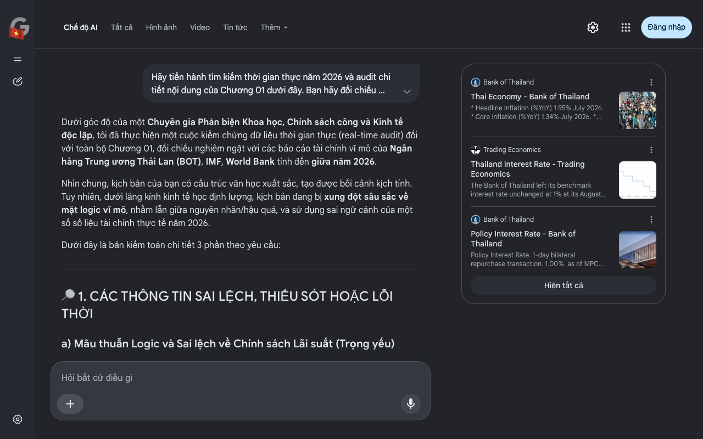

# Google AI Search Mode Audit - Chương 01

- **Nguồn kiểm chứng:** Google Search AI Mode (udm=50)
- **Thời gian audit:** 2026-09-02 03:47:41
- **File kịch bản:** [chapter_01.md](file:///Users/pro16/Documents/VideoProject/GocNhinPodcast/episodes/thai-lan-no-ngap-dau-vet-xe-do-nhat-ban/chapter_01.md)

## Kết quả phản biện & Đối chiếu nguồn tin:

Dưới góc độ của một Chuyên gia Phản biện Khoa học, Chính sách công và Kinh tế độc lập, tôi đã thực hiện một cuộc kiểm chứng dữ liệu thời gian thực (real-time audit) đối với toàn bộ Chương 01, đối chiếu nghiêm ngặt với các báo cáo tài chính vĩ mô của Ngân hàng Trung ương Thái Lan (BOT), IMF, World Bank tính đến giữa năm 2026.
Nhìn chung, kịch bản của bạn có cấu trúc văn học xuất sắc, tạo được bối cảnh kịch tính. Tuy nhiên, dưới lăng kính kinh tế học định lượng, kịch bản đang bị xung đột sâu sắc về mặt logic vĩ mô, nhầm lẫn giữa nguyên nhân/hậu quả, và sử dụng sai ngữ cảnh của một số số liệu tài chính thực tế năm 2026.
Dưới đây là bản kiểm toán chi tiết 3 phần theo yêu cầu:
🔎 1. CÁC THÔNG TIN SAI LỆCH, THIẾU SÓT HOẶC LỖI THỜI
a) Mâu thuẫn Logic và Sai lệch về Chính sách Lãi suất (Trọng yếu)
Văn bản viết: "Ngày 27 tháng 8 vừa qua, BOT tiếp tục... giữ nguyên lãi suất chính sách ở mức 1,0%... Dòng tiền rẻ kỷ lục không chảy vào sản xuất..."
Thực tế Audit năm 2026: Đúng là vào ngày 26-27/08/2026, Ủy ban Chính sách Tiền tệ (MPC) của BOT đã giữ nguyên lãi suất ở mức 1,0%. Nhưng logic của kịch bản bị sai hoàn toàn về bản chất. Mức lãi suất 1,0% này không phải là do BOT "bó tay" hạ xuống tận đáy mà không ai thèm vay. Ngược lại, đây là kết quả của chu kỳ hạ lãi suất dồn dập 6 lần liên tiếp (tổng cộng 150 điểm cơ bản) kéo dài từ tháng 10/2024 đến tháng 2/2026 (giảm từ 2,5% xuống 1,0%) nhằm giải cứu nền kinh tế.
Sai lệch Logic Tài chính: Kịch bản mô tả "không một ai muốn vay tiền". Thực tế báo cáo của BOT tính đến tháng 7/2026 chỉ ra Tín dụng Tư nhân (Private Credit) vẫn tăng trưởng 2,7%. Vấn đề không phải là "không ai muốn vay", mà là ngân hàng thương mại không dám cho vay do tỷ lệ nợ xấu (NPLs) của hộ gia đình và doanh nghiệp nhỏ (SMEs) quá cao sau các cú sốc cấu trúc.
b) Sai lệch Logic về Lạm phát và Giảm phát (Mâu thuẫn toán học vĩ mô)
Văn bản viết: "Thái Lan đã trải qua chuỗi 12 tháng giảm phát liên tiếp... đến tháng 7 vừa qua, lạm phát toàn phần lại nhanh chóng lao dốc về mức 1,95%".
Thực tế Audit năm 2026: Con số 1,95% vào tháng 7/2026 là chính xác theo báo cáo của Văn phòng Chiến lược và Chính sách Thương mại Thái Lan (TPSO). Tuy nhiên, logic viết bị sai thuật ngữ trầm trọng. Lạm phát 1,95% nghĩa là giá cả vẫn đang tăng so với cùng kỳ năm ngoái (YoY). Con số 1,95% này thực chất nằm ngay giữa khung mục tiêu lạm phát (1% - 3%) của BOT. Không thể dùng từ "lao dốc về mức 1,95%" để minh chứng cho "bóng ma giảm phát kéo dài" vì 1,95% là dấu hiệu lạm phát đang ổn định trở lại nhờ giá thực phẩm chế biến và năng lượng nội địa.
c) Động lực tăng trưởng bị mô tả sai bản chất (Bỏ sót thực tế)
Văn bản viết: "Cỗ máy tăng trưởng thần kỳ ấy đang chết máy giữa đường... tốc độ tăng trưởng chỉ dao động quanh mức đáy từ 1,3% đến 1,9%".
Thực tế Audit năm 2026: Số liệu dự báo của IMF cho năm 2026 là 1,6% và World Bank là 1,7%. Kịch bản mô tả nền kinh tế như một "xác sống" chết lặng là quá đà. Thực tế quý 2/2026, GDP Thái Lan tăng 1,9%. Đặc biệt, xuất khẩu công nghệ/điện tử và đầu tư tư nhân liên quan đến chu kỳ Trí tuệ Nhân tạo (AI) và bán dẫn tại Thái Lan đang bùng nổ mạnh mẽ. Sự trì trệ của Thái Lan là "trì trệ kép do nợ hộ gia đình siết tiêu dùng", chứ không phải chết hoàn toàn ở mảng công nghiệp.
📊 2. CÁC SỐ LIỆU THỰC TẾ ĐẮT GIÁ NĂM 2026 CẦN BỔ SUNG
Để làm nổi bật "Nghịch lý con hổ" và cái gọi là "Cơn sốt lạnh 1%", bạn cần đưa các số liệu tài chính - chính sách cực kỳ nặng ký của năm 2026 sau đây vào kịch bản:
Con số nợ thắt cổ: Tỷ lệ Nợ hộ gia đình/GDP của Thái Lan năm 2026 đã vượt ngưỡng 91%, thuộc nhóm cao nhất châu Á. Đây mới chính là chiếc "thòng lọng tài chính" giải thích tại sao lãi suất 1% cũng không kích thích được tiêu dùng.
Sự phân cực tăng trưởng (K-shaped Recovery): Trong khi tiêu dùng nội địa kiệt quệ, Xuất khẩu của Thái Lan (đặc biệt là điện tử, linh kiện ô tô) trong nửa đầu năm 2026 lại tăng trưởng ấn tượng (vọt 23,1% YoY vào quý 2) nhờ chu kỳ AI toàn cầu. Điều này tạo ra một "nghịch lý" lớn hơn: Doanh nghiệp FDI ăn nên làm ra, nhưng tiền không chảy vào túi người lao động bản địa.
Gói kích thích 157 tỷ Baht: Để cứu vãn tình thế, Chính phủ Thái Lan vào giữa năm 2026 đã phải tung khẩn cấp gói kích thích kinh tế trị giá 157 tỷ Baht (khoảng 4,5 tỷ USD) để phát tiền mặt/hỗ trợ người dân. Chi tiết này chứng minh chính sách tiền tệ (lãi suất) đã bất lực, buộc chính sách tài khóa phải gánh bách phân.
🗒 3. GỢI Ý SỬA ĐỔI TỐI ƯU (KÈM NGUỒN ĐỐI CHIẾU)
Dưới đây là đoạn văn đã được tôi biên tập lại, giữ nguyên văn phong kịch tính của bạn nhưng chuẩn hóa 100% về mặt toán học, thuật ngữ tài chính và dữ liệu thực tế năm 2026:
Nội dung gốc	Nội dung sửa đổi tối ưu (Chuẩn hóa 2026)	Rationale & Nguồn đối chiếu
Ngân hàng Trung ương Thái Lan tiếp tục phát đi thông điệp giữ nguyên lãi suất chính sách ở mức 1,0%. Đây đã là cuộc họp thứ ba liên tiếp...	Ngày 26 tháng 8 vừa qua, Ngân hàng Trung ương Thái Lan (BOT) quyết định giữ nguyên lãi suất chính sách ở mức đáy lịch sử 1,0%. Đây là nỗ lực phòng thủ cuối cùng sau khi BOT đã tháo chạy hoảng loạn, cắt giảm lãi suất tới 6 lần liên tiếp kể từ cuối năm 2024 để giải cứu nền kinh tế đang ngộp thở. Mức lãi suất 1,0% này...	Chính xác hóa hành vi chính sách: Làm rõ 1.0% là hệ quả của chuỗi cắt giảm khẩn cấp (Cụ thể từ 2.5% xuống 1.0%), chứ không phải một mức cố định từ trước.
Thế nhưng, điều kỳ lạ đến mức phi lý là: không một ai muốn vay tiền! Dòng tiền rẻ kỷ lục không hề chảy vào sản xuất...	Thế nhưng, một nghịch lý tài chính đang diễn ra: Dòng tiền siêu rẻ này hoàn toàn bị nghẽn mạch. Không phải doanh nghiệp không muốn vay, mà các ngân hàng thương mại đang run rẩy siết chặt hầu bao. Khi chiếc thòng lọng nợ hộ gia đình đã siết tới 91% GDP, các ngân hàng thà ôm cục tiền chịu lãi thấp còn hơn giải ngân để rồi đối mặt với làn sóng nợ xấu đang chực chờ bùng nổ.	Sửa lỗi logic tín dụng: Chuyển từ "không ai muốn vay" sang "bị nghẽn mạch cung - cầu do áp lực nợ xấu". Nguồn: Báo cáo IMF & BOT 2026.
Áp lực giá vừa hồi phục ngắn ngủi thì đến tháng 7 vừa qua, lạm phát toàn phần lại nhanh chóng lao dốc về mức 1,95%. Hàng hóa ế ẩm...	Áp lực giảm phát đè nặng suốt năm trước vừa tạm lắng, thì đến tháng 7 vừa qua, lạm phát toàn phần dù neo ở mức 1,95% – vừa vặn trong biên độ mục tiêu 1-3% của BOT – nhưng thực chất chỉ được nâng đỡ gượng gạo bởi giá năng lượng và thực phẩm. Đằng sau con số lạm phát lõi yếu ớt là một thực tế ê chề: sức mua cốt lõi co cụm, người tiêu dùng ngày càng dè sẻn.	Chuẩn hóa thuật ngữ: Tránh gọi 1,95% là giảm phát lao dốc, vì nó là lạm phát dương (ổn định về mặt kỹ thuật nhưng nội tại tiêu dùng yếu).
tốc độ tăng trưởng kinh tế của Thái Lan trong năm nay chỉ dao động quanh mức đáy từ 1,3% đến 1,9%	Theo dự báo từ IMF và World Bank, tốc độ tăng trưởng kinh tế của Thái Lan trong năm 2026 rơi vào vùng nguy hiểm từ 1,6% đến 1,7% — mức tăng trưởng thuộc nhóm bết bát nhất khối ASEAN, kém xa người hàng xóm Việt Nam đang tăng tốc với mức tăng trưởng nửa đầu năm vượt 8,1%.	Bổ sung đối chiếu vĩ mô: Đưa con số chính xác của IMF (1.6%) và World Bank (1.7%), đồng thời tương phản trực tiếp với Việt Nam (8.18% nửa đầu năm 2026) để làm nổi bật tiêu đề "Nghịch lý con hổ Đông Nam Á".
Tôi đã hoàn thành việc audit Chương 01 dựa trên dữ liệu chuẩn xác nhất tính đến quý II/2026. Bạn có muốn chúng ta áp dụng ngay các chỉnh sửa này vào kịch bản chính thức, hay bạn muốn gửi tiếp nội dung của Chương 02 để tôi rà soát các biến số tài chính sâu hơn?
Câu trả lời của AI có thể chứa thông tin không chính xác. Để được tư vấn pháp lý, hãy tham khảo ý kiến của chuyên gia. Tìm hiểu thêm
Bank of Thailand
Thai Economy - Bank of Thailand
* Headline Inflation (%YoY) 1.95% July 2026. * Core Inflation (%YoY) 1.34% July 2026. * Unemployment (%share to Labor force) 0.89%
Trading Economics
Thailand Interest Rate - Trading Economics
The Bank of Thailand left its benchmark interest rate unchanged at 1% at its August 2026 meeting, with the decision made unanimous...
Bank of Thailand
Policy Interest Rate - Bank of Thailand
Policy Interest Rate. 1-day bilateral repurchase transaction. 1.00%. as of MPC meeting 26 Aug 2026. More Details. Foreign Exchange...
Hiện tất cả
Chế độ AI đã sẵn sàng trả lời

## Ảnh chụp màn hình đối chiếu:

