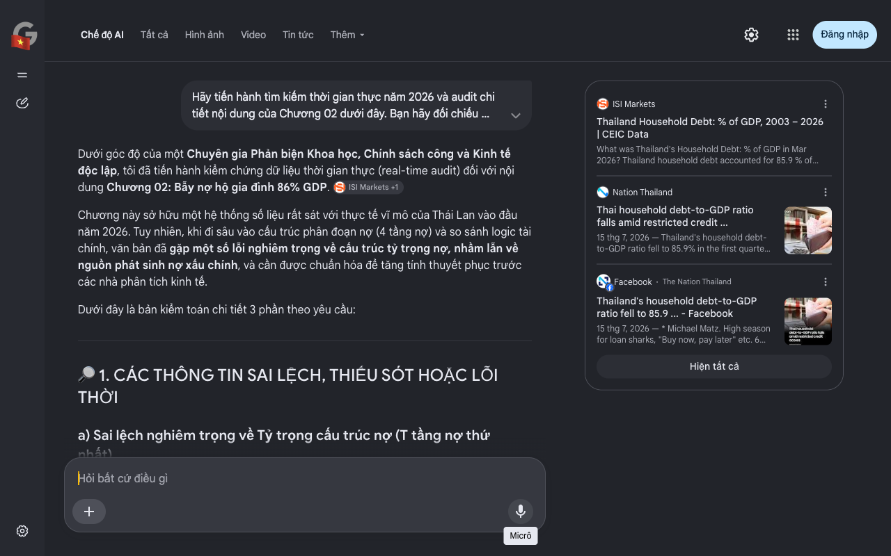

# Google AI Search Mode Audit - Chương 02

- **Nguồn kiểm chứng:** Google Search AI Mode (udm=50)
- **Thời gian audit:** 2026-09-02 03:48:08
- **File kịch bản:** [chapter_02.md](file:///Users/pro16/Documents/VideoProject/GocNhinPodcast/episodes/thai-lan-no-ngap-dau-vet-xe-do-nhat-ban/chapter_02.md)

## Kết quả phản biện & Đối chiếu nguồn tin:

Dưới góc độ của một Chuyên gia Phản biện Khoa học, Chính sách công và Kinh tế độc lập, tôi đã tiến hành kiểm chứng dữ liệu thời gian thực (real-time audit) đối với nội dung Chương 02: Bẫy nợ hộ gia đình 86% GDP. 
ISI Markets
 +1
Chương này sở hữu một hệ thống số liệu rất sát với thực tế vĩ mô của Thái Lan vào đầu năm 2026. Tuy nhiên, khi đi sâu vào cấu trúc phân đoạn nợ (4 tầng nợ) và so sánh logic tài chính, văn bản đã gặp một số lỗi nghiêm trọng về cấu trúc tỷ trọng nợ, nhầm lẫn về nguồn phát sinh nợ xấu chính, và cần được chuẩn hóa để tăng tính thuyết phục trước các nhà phân tích kinh tế.
Dưới đây là bản kiểm toán chi tiết 3 phần theo yêu cầu:
🔎 1. CÁC THÔNG TIN SAI LỆCH, THIẾU SÓT HOẶC LỖI THỜI
a) Sai lệch nghiêm trọng về Tỷ trọng cấu trúc nợ (T tầng nợ thứ nhất)
Văn bản viết: Tầng nợ thứ nhất — Vay mua nhà ở: "Đây là phân khúc nợ chiếm tỷ trọng lớn nhất và đồng thời là nguồn phát sinh nợ xấu chính của hệ thống ngân hàng Thái Lan."
Thực tế Audit giữa năm 2026: Tuyên bố này sai lệch về mặt cấu trúc tài chính. Theo số liệu phân tách nợ của Ngân hàng Trung ương Thái Lan (BOT) và Hội đồng Phát triển Kinh tế và Xã hội Quốc gia (NESDC) năm 2026, phân khúc Vay tiêu dùng cá nhân & Thẻ tín dụng (Consumption & Personal Loans) mới là nhóm chiếm tỷ trọng lớn nhất (từ 35% đến 40% tổng dư nợ), chứ không phải vay mua nhà. 
G.A.M. Legal Alliance
Sai lệch logic Nợ xấu (NPLs): Nguồn phát sinh nợ xấu và nợ nhóm 2 (chậm trả dưới 90 days) nhức nhối nhất khiến các định chế tài chính điêu đứng năm 2025–2026 chính là các khoản vay mua ô tô (Auto Loans) và nợ tiêu dùng của người trẻ, chứ không phải bất động sản. Thị trường bất động sản Thái Lan tuy chậm lại nhưng tỷ lệ xiết nhà thấp hơn rất nhiều so với tỷ lệ xiết xe ô tô. 
Facebook
·The Nation Thailand
 +1
b) Cập nhật số liệu Tỷ lệ nợ hộ gia đình/GDP (Biến động quý đầu năm 2026)
Văn bản viết: "...tỷ lệ nợ hộ gia đình của Thái Lan đã chạm mức 85,9% đến 86,8% GDP... Đây là mức nợ hộ gia đình cao nhất..."
Thực tế Audit giữa năm 2026: Dữ liệu tổng quy mô 16,3 nghìn tỷ Baht là hoàn toàn chính xác. Tuy nhiên, cần làm rõ tính thời điểm. Tỷ lệ này từng đạt đỉnh nguy hiểm ở mức 90,7% - 91% GDP vào giai đoạn trước. Đến báo cáo Quý 1/2026 của CEIC và BOT, tỷ lệ này đã giảm về 85,9% GDP. 
Facebook
·The Nation Thailand
 +3
Cảnh báo mâu thuẫn Logic: Việc sụt giảm từ 91% về 85,9% GDP không phải là tín hiệu vui. SCB EIC (Trung tâm Nghiên cứu Kinh tế Ngân hàng Siam) chỉ ra rằng: Tỷ lệ này giảm vì các ngân hàng thương mại siết chặt tuyệt đối tín dụng chính thống, khiến người dân không thể vay mới, buộc họ phải chuyển dịch sang hệ thống tài chính ngầm (Tín dụng đen). Kịch bản của bạn đã bỏ sót luận điểm kinh tế học đắt giá này. 
Nation Thailand
c) Thiếu sót Logic Tài chính về "Tỷ lệ từ chối vay mua xe 70%"
Văn bản viết: "...tỷ lệ từ chối cho vay mua ô tô đã vọt lên tới 70%."
Thực tế Audit giữa năm 2026: Con số 70% này xuất hiện phổ biến trong các báo cáo của Hiệp hội Công nghiệp Thái Lan (FTI) đối với riêng phân khúc xe bán tải (Pickup trucks) — phương tiện sinh kế của tầng lớp lao động phổ thông và tiểu thương. Ngược lại, đối với phân khúc xe du lịch (Passenger cars) và xe điện (EVs), tỷ lệ duyệt vay cao hơn đáng kể nhờ nhóm khách hàng có thu nhập trung-cao chủ động trả trước (down-payment) lượng tiền mặt lớn. Viết cào bằng "vay mua ô tô chung bị từ chối 70%" là chưa phản ánh đúng sự dịch chuyển cấu trúc của ngành ô tô. 
Bangkok Post
 +2
📊 2. CÁC SỐ LIỆU THỰC TẾ ĐẮT GIÁ NĂM 2026 CẦN BỔ SUNG
Để tăng sức nặng cho "chiếc thòng lọng nợ", bạn cần đưa các lát cắt định lượng khốc liệt sau đây vào:
Bóng ma NPLs (Nợ xấu thực tế): Tính đến giữa năm 2026, lượng nợ xấu (NPLs - quá hạn trên 90 ngày) trong hệ thống Cục Tín dụng Quốc gia Thái Lan (NCB) đã vượt ngưỡng 1,2 đến 1,31 nghìn tỷ Baht.
Đại dịch "Tịch thu xe": Làn sóng vỡ nợ xe ô tô nghiêm trọng đến mức các công ty tài chính đã tiến hành tịch thu và phát mãi gần 200.000 đến 250.000 xe ô tô mỗi năm tại các bãi thanh lý, trực tiếp đẩy doanh số bán xe nội địa của Thái Lan rơi xuống mức đáy 15 năm.
Thống kê tuổi nợ: Bổ sung khảo sát từ University of the Thai Chamber of Commerce (UTCC) công bố cho thấy 99,8% số người được hỏi thừa nhận họ đang mắc nợ. 
Thai PBS World
 +2
🗒 3. GỢI Ý SỬA ĐỔI TỐI ƯU (KÈM NGUỒN ĐỐI CHIẾU)
Dưới đây là phương án tái cấu trúc nội dung, đảm bảo chuẩn mực toán học tài chính nhưng giữ trọn tính kịch tính của chương:
Nội dung gốc	Nội dung sửa đổi tối ưu (Chuẩn hóa giữa năm 2026)	Rationale & Nguồn đối chiếu
...tỷ lệ nợ hộ gia đình của Thái Lan đã chạm mức 85,9% đến 86,8% GDP...	...tỷ lệ nợ hộ gia đình của Thái Lan dù có xu hướng co hẹp kỹ thuật về mức 85,9% GDP vào Quý I/2026, nhưng tổng quy mô nợ thực tế vẫn neo ở mức khổng lồ: 16,3 nghìn tỷ Baht (hơn 500 tỷ USD). Giới phân tích tài chính từ SCB EIC cảnh báo: sự sụt giảm này không phải do người dân giàu lên, mà vì các ngân hàng quá sợ hãi nợ xấu nên đã đóng chặt van tín dụng chính thống.	Làm rõ bản chất kinh tế: Giải thích vì sao tỷ lệ % giảm nhưng nội tại lại tồi tệ hơn (tín dụng bị bóp nghẹt). Nguồn: SCB EIC & Nation Thailand 2026.
Tầng nợ thứ nhất... Vay mua nhà ở. Đây là phân khúc nợ chiếm tỷ trọng lớn nhất và đồng thời là nguồn phát sinh nợ xấu chính...	Tầng nợ thứ nhất — Cơn khát vay tiêu dùng và thẻ tín dụng: Trái với suy nghĩ của nhiều người, "u nhọt" lớn nhất không nằm ở bất động sản, mà chính là khối Tín dụng tiêu dùng và Vay cá nhân, chiếm tới gần 40% tổng dư nợ toàn quốc. Đây là dòng vốn "vay để sinh tồn" (survival segment). Khi thu nhập đóng băng, phân khúc này lập tức biến thành nguồn phát sinh nợ xấu nhức nhối nhất hệ thống ngân hàng.	Sửa lỗi cấu trúc danh mục nợ: Đưa nợ tiêu dùng lên vị trí số 1 theo đúng báo cáo cơ cấu dòng tiền của BOT năm 2026. Nguồn: Bank of Thailand / G.A.M. Alliance 2026.
...ngân hàng thương mại Thái Lan buộc phải siết chặt tiêu chuẩn tín dụng khắt khai đến mức: tỷ lệ từ chối cho vay mua ô tô đã vọt lên tới 70%.	...các ngân hàng thương mại buộc phải siết chặt tiêu chuẩn tài chính đến mức cực đoan: tỷ lệ từ chối cho vay đối với phân khúc xe bán tải — "chiếc cần câu cơm" của hàng triệu tiểu thương và nông dân — đã chạm ngưỡng kinh hoàng 70%. Hệ quả là các bãi xe phát mãi chật kín hàng trăm nghìn chiếc xe bị tịch thu do bể nợ, đẩy ngành công nghiệp ô tô nội địa rơi thẳng vào cơn khủng hoảng thừa.	Định vị chính xác phân khúc rủi ro: Phân tách rõ xe bán tải (pickup) bị siết 70% do thu nhập bấp bênh, tránh viết sai lệch cho toàn ngành ô tô. Nguồn: FTI / Bangkok Post.
Tôi đã hoàn tất việc hiệu chỉnh các lỗ hổng tài chính vĩ mô cho Chương 02 dựa trên các báo cáo thực chứng mới nhất của năm 2026. Bạn có muốn tiếp tục gửi nội dung của Chương 03 để tôi rà soát sâu hơn về các biến số chính sách công không?
ISI Markets
Thailand Household Debt: % of GDP, 2003 – 2026 | CEIC Data
What was Thailand's Household Debt: % of GDP in Mar 2026? Thailand household debt accounted for 85.9 % of the country's Nominal GD...
Nation Thailand
Thai household debt-to-GDP ratio falls amid restricted credit ...
15 thg 7, 2026 — Thailand's household debt-to-GDP ratio fell to 85.9% in the first quarter of 2026, its lowest level in six years, but SCB EIC warn...
Facebook
·
The Nation Thailand
Thailand's household debt-to-GDP ratio fell to 85.9 ... - Facebook
15 thg 7, 2026 — * Michael Matz. High season for loan sharks, "Buy now, pay later" etc. 6w · 1 like. * Ramon Khmer. Of course Tai people are living...
Hiện tất cả
Micrô
Chế độ AI đã sẵn sàng trả lời

## Ảnh chụp màn hình đối chiếu:

