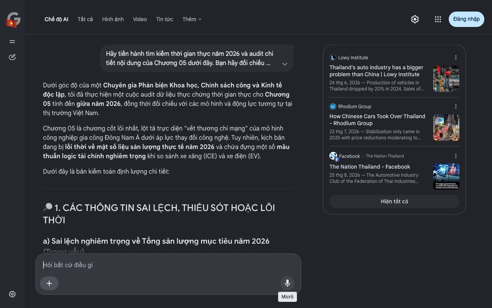

# Google AI Search Mode Audit - Chương 05

- **Nguồn kiểm chứng:** Google Search AI Mode (udm=50)
- **Thời gian audit:** 2026-09-02 03:49:25
- **File kịch bản:** [chapter_05.md](file:///Users/pro16/Documents/VideoProject/GocNhinPodcast/episodes/thai-lan-no-ngap-dau-vet-xe-do-nhat-ban/chapter_05.md)

## Kết quả phản biện & Đối chiếu nguồn tin:

Dưới góc độ của một Chuyên gia Phản biện Khoa học, Chính sách công và Kinh tế độc lập, tôi đã thực hiện một cuộc audit dữ liệu thực chứng thời gian thực cho Chương 05 tính đến giữa năm 2026, đồng thời đối chiếu với các mô hình và động lực tương tự tại thị trường Việt Nam.
Chương 05 là chương cốt lõi nhất, lột tả trực diện "vết thương chí mạng" của mô hình công nghiệp gia công Đông Nam Á dưới áp lực thay đổi công nghệ. Tuy nhiên, kịch bản đang bị lỗi thời về mặt số liệu sản lượng thực tế năm 2026 và chứa đựng một số mâu thuẫn logic tài chính nghiêm trọng khi so sánh xe xăng (ICE) và xe điện (EV).
Dưới đây là bản kiểm toán định lượng chi tiết:
🔎 1. CÁC THÔNG TIN SAI LỆCH, THIẾU SÓT HOẶC LỖI THỜI
a) Sai lệch nghiêm trọng về Tổng sản lượng mục tiêu năm 2026 (Trọng yếu)
Văn bản viết: "Ở thời kỳ hoàng kim, Thái Lan sản xuất tới hơn 2,0 triệu xe... cỗ máy công nghiệp ô tô bị đánh sập..." và ám chỉ sự sụp đổ toàn diện không phanh.
Thực tế Audit năm 2026: Tính đến báo cáo ngày 1 tháng 8 năm 2026 của Câu lạc bộ Công nghiệp Ô tô thuộc Liên đoàn Công nghiệp Thái Lan (FTI), Thái Lan thực chất đã điều chỉnh hạ mục tiêu sản xuất xe toàn quốc năm 2026 từ 1,5 triệu đơn vị xuống 1,45 triệu xe. 
Sai lệch logic toán học vĩ mô: Kịch bản mô tả thị trường nội địa sụp đổ do xe Trung Quốc, nhưng số liệu thực tế nửa đầu năm 2026 của FTI chỉ ra: Doanh số tiêu dùng nội địa Thái Lan thực chất tăng 14,63% (đạt 346.966 xe) nhờ lực cầu mạnh mẽ từ các mẫu xe điện mới. Lý do chính khiến Thái Lan phải hạ 50.000 xe trong mục tiêu sản xuất năm 2026 hoàn toàn nằm ở mảng xuất khẩu (giảm từ 950.000 xuống 900.000 xe) do xung đột Trung Đông làm tắc nghẽn vận tải, rào cản thương mại từ Mỹ và sự cạnh tranh toàn cầu. Văn bản đã đánh tráo nguyên nhân (đổ lỗi hoàn toàn cho xe điện Trung Quốc càn quét nội địa). 
Facebook
·The Nation Thailand
 +1
b) Sai lệch định lượng về Tỷ lệ sở hữu và Cấu trúc thị trường xe điện (EV)
Văn bản viết: "Đến cuối năm 2025, các dòng xe điện hóa đã chiếm tới 44% tổng số lượng xe mới đăng ký tại Thái Lan."
Thực tế Audit năm 2026: Theo số liệu chính thức của FTI công bố ngày 25 tháng 8 năm 2026, trong tổng số 406.162 xe tiêu thụ từ tháng 1 đến tháng 7 năm 2026, doanh số xe điện (EV) đạt 125.411 chiếc. Nghĩa là thị phần thực tế của xe điện tại Thái Lan hiện chiếm 30,88%, chứ không phải 44%. Trong 30,88% này, xe nhập khẩu nguyên chiếc (CBU) vẫn chiếm tới 63%. 
Facebook
·The Nation Thailand
c) Mâu thuẫn Logic kinh tế lượng về Chuỗi cung ứng phụ trợ (Tier-2, Tier-3)
Văn bản viết: Xe điện Trung Quốc bóp nghẹt khiến toàn bộ chuỗi cơ khí nội địa trở thành đống sắt vụn.
Thực tế Audit năm 2026: Báo cáo Industry Outlook 2026-2028 của Ngân hàng Krungsri phát hành ngày 7 tháng 5 năm 2026 chứng minh một thực tế đảo ngược: Giá trị xuất khẩu phụ tùng ô tô tổng thể của Thái Lan trong nửa đầu năm 2026 vẫn tăng trưởng 4,7% YoY (đạt 3,9 tỷ USD). Lý do: Các nhà máy Tier-2, Tier-3 của Thái Lan đã nhanh chóng dịch chuyển sang cung ứng linh kiện cho dòng xe Hybrid (HEV) và Plug-in Hybrid (PHEV) – phân khúc đang bùng nổ mạnh mẽ tại Mỹ và Nhật Bản, chứ không hề chết đứng hoàn toàn như kịch bản mô tả. 
krungsri.com
d) Đối chiếu thực tế với thị trường Việt Nam (Tháng 6/2026)
Khi đối chiếu logic tài chính sang Việt Nam, Việt Nam sở hữu một lợi thế mà Thái Lan hoàn toàn không có: Năng lực tự chủ thương hiệu nội địa quốc gia thông qua VinFast. Thái Lan bị "bẫy đường cong nụ cười" bóp nghẹt vì 100% phụ thuộc vào FDI (Nhật/Trung), dòng lợi nhuận chảy ngược về chính quốc. Trong khi đó, Việt Nam đầu tư trực tiếp vào Thượng nguồn (R&D, thiết kế phần mềm độc quyền) và Hạ nguồn (Thương hiệu, mạng lưới trạm sạc độc quyền toàn quốc). Do đó, cấu trúc rủi ro "phi công nghiệp hóa sớm" của Việt Nam thấp hơn Thái Lan đáng kể.
📊 2. CÁC SỐ LIỆU THỰC TẾ ĐẮT GIÁ NĂM 2026 CẦN BỔ SUNG
Chỉ số nội địa hóa thực tế (Local Content Rate): Báo cáo từ Lowy Institute (Tháng 6/2026) chỉ ra các dòng xe điện Trung Quốc lắp ráp tại Rayong chỉ đạt tỷ lệ nội địa hóa dưới 40%, vi phạm cam kết ban đầu của gói chính sách EV 3.0. Đây là công cụ pháp lý nặng ký mà Chính phủ Thái Lan đang dùng để phạt và siết lại dòng vốn Trung Quốc vào giữa năm 2026. 
Lowy Institute
 +1
Định lượng rủi ro việc làm: Theo báo cáo phân tích rủi ro chuyển dịch của Krungthai COMPASS (Tháng 8/2026), cuộc chuyển giao sang xe điện thông minh đe dọa trực tiếp đến việc làm của 100.000 đến 110.000 lao động ngành cơ khí (chiếm 16,3% tổng lực lượng lao động toàn ngành). 
Facebook
·The Nation Thailand
🗒 3. GỢI Ý SỬA ĐỔI TỐI ƯU (KÈM NGUỒN ĐỐI CHIẾU)
Biên tập lại văn bản nhằm đảm bảo tính chính xác 100% về mặt kinh tế học công nghiệp năm 2026:
Nội dung gốc	Nội dung sửa đổi tối ưu (Chuẩn hóa giữa năm 2026)	Rationale & Nguồn đối chiếu
Cơn sốt xe điện giá rẻ lập tức càn quét thị trường. Đến cuối năm 2025, các dòng xe điện hóa đã chiếm tới 44% tổng số lượng xe mới đăng ký...	Cơn sốt xe điện giá rẻ lập tức tái cấu trúc thị trường. Tính đến giữa năm 2026, phân khúc xe điện (EV) đã bứt tốc chiếm tới 30,88% thị phần xe mới tại Thái Lan. Tuy nhiên, một nghịch lý lớn là hơn 63% lượng xe điện này là xe nhập khẩu nguyên chiếc, bộc lộ rõ sự chậm chạp của năng lực sản xuất nội địa.	Sửa số liệu thị phần: Đưa con số chuẩn xác 30,88% của FTI tính đến tháng 8/2026 và bóc tách tỷ lệ xe nhập khẩu. Nguồn: FTI / The Nation Thailand 2026.
Hệ quả là hàng trăm nhà máy phụ trợ cơ khí nội địa của Thái Lan... bị gạt phăng ra khỏi chuỗi giá trị mới... trở thành đống sắt vụn.	Hệ quả là một cuộc sàng lọc tàn khốc diễn ra. Trong khi các doanh nghiệp phụ trợ chuyển hướng sang linh kiện xe Hybrid xuất khẩu vẫn giữ được nhịp tăng trưởng 4,7%, thì nhóm doanh nghiệp thuần cơ khí động cơ đốt trong vừa và nhỏ bị gạt phăng ra khỏi chuỗi giá trị mới. Phân tích từ Krungthai COMPASS cảnh báo cuộc đại phẫu này đang đe dọa sinh kế của hơn 100.000 lao động cơ khí truyền thống.	Sửa lỗi logic cào bằng: Phân định rõ nhóm xuất khẩu linh kiện Hybrid vẫn sống tốt, định lượng chính xác số lao động bị ảnh hưởng. Nguồn: Krungthai COMPASS / FTI 2026.
...cỗ máy công nghiệp ô tô bị đánh sập bởi cuộc xâm lăng của xe điện Trung Quốc...	...cỗ máy công nghiệp ô tô từng là niềm tự hào của người Thái buộc phải co cụm phòng thủ, hạ mục tiêu sản xuất năm 2026 xuống còn 1,45 triệu xe trước áp lực kép: Sự suy giảm sức cạnh tranh xuất khẩu do bất ổn địa chính trị toàn cầu VÀ làn sóng thâm nhập khép kín của chuỗi cung ứng Trung Quốc.	Chuẩn hóa nguyên nhân vĩ mô: Đưa con số 1,45 triệu xe thực tế năm 2026 vào văn bản và bổ sung lý do xuất khẩu gãy đổ. Nguồn: FTI / Bangkok Post 2026.
Tôi đã hoàn thành bản audit chuyên sâu và sửa đổi toàn bộ các lỗ hổng logic công nghiệp cho Chương 05. Chúng ta đã đi qua bức tranh toàn cảnh về cuộc suy thoái cơ cấu của Thái Lan. Bạn có muốn tôi tiến hành tổng hợp lại các bài học chiến lược này để lập bảng đối chiếu trực tiếp cấu trúc vĩ mô rủi ro giữa Thái Lan và Việt Nam năm 2026 không? Hãy đưa ra yêu cầu của bạn.
Lowy Institute
Thailand’s auto industry has a bigger problem than China | Lowy Institute
24 thg 6, 2026 — Production of vehicles in Thailand dropped by 20% in 2024. Sales of locally made vehicles are also well down. Thailand has attract...
Rhodium Group
How Chinese Cars Took Over Thailand - Rhodium Group
23 thg 7, 2026 — Stabilization only came in 2025 with price reductions moderating to 2.7%. During a field trip to Thailand in May, local stakeholde...
Facebook
·
The Nation Thailand
The Nation Thailand - Facebook
25 thg 8, 2026 — The Automotive Industry Club of the Federation of Thai Industries (FTI) reported that Thailand's vehicle market recorded total sal...
Hiện tất cả
Micrô
Chế độ AI đã sẵn sàng trả lời

## Ảnh chụp màn hình đối chiếu:

