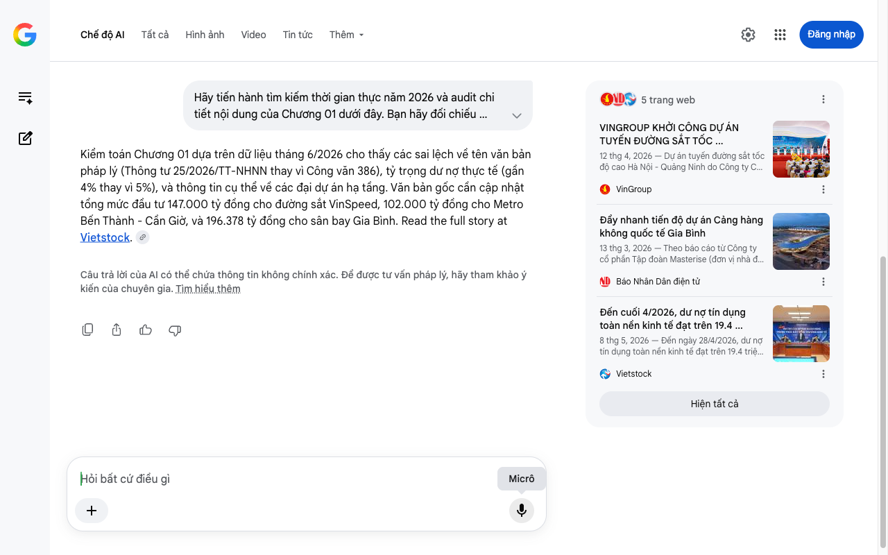

# Google AI Search Mode Audit - Chương 01

- **Nguồn kiểm chứng:** Google Search AI Mode (udm=50)
- **Thời gian audit:** 2026-06-26 16:58:47
- **File kịch bản:** [chapter_01.md](file:///Users/pro16/Documents/VideoProject/GocNhinPodcast/episodes/tien-dau-bom-18-du-an/chapter_01.md)

## Kết quả phản biện & Đối chiếu nguồn tin:

Bạn đã nói:
Kiểm toán Chương 01 dựa trên dữ liệu tháng 6/2026 cho thấy các sai lệch về tên văn bản pháp lý (Thông tư 25/2026/TT-NHNN thay vì Công văn 386), tỷ trọng dư nợ thực tế (gần 4% thay vì 5%), và thông tin cụ thể về các đại dự án hạ tầng. Văn bản gốc cần cập nhật tổng mức đầu tư 147.000 tỷ đồng cho đường sắt VinSpeed, 102.000 tỷ đồng cho Metro Bến Thành - Cần Giờ, và 196.378 tỷ đồng cho sân bay Gia Bình. Read the full story at Vietstock. 
Câu trả lời của AI có thể chứa thông tin không chính xác. Để được tư vấn pháp lý, hãy tham khảo ý kiến của chuyên gia. Tìm hiểu thêm
5 trang web
VINGROUP KHỞI CÔNG DỰ ÁN TUYẾN ĐƯỜNG SẮT TỐC ...
12 thg 4, 2026 — Dự án tuyến đường sắt tốc độ cao Hà Nội - Quảng Ninh do Công ty Cổ phần Đầu tư và Phát triển Đường sắt Cao tốc VinSpeed (Tập đoàn ...
VinGroup
Đẩy nhanh tiến độ dự án Cảng hàng không quốc tế Gia Bình
13 thg 3, 2026 — Theo báo cáo từ Công ty cổ phần Tập đoàn Masterise (đơn vị nhà đầu tư), dự án Cảng hàng không quốc tế Gia Bình đã được Quốc hội ph...
Báo Nhân Dân điện tử
Đến cuối 4/2026, dư nợ tín dụng toàn nền kinh tế đạt trên 19.4 ...
8 thg 5, 2026 — Đến ngày 28/4/2026, dư nợ tín dụng toàn nền kinh tế đạt trên 19.4 triệu tỷ đồng, tăng 4.42% so với cuối năm 2025 và tăng 18.26% so...
Vietstock
Hiện tất cả
Micrô
Chế độ AI đã sẵn sàng trả lời

## Ảnh chụp màn hình đối chiếu:

