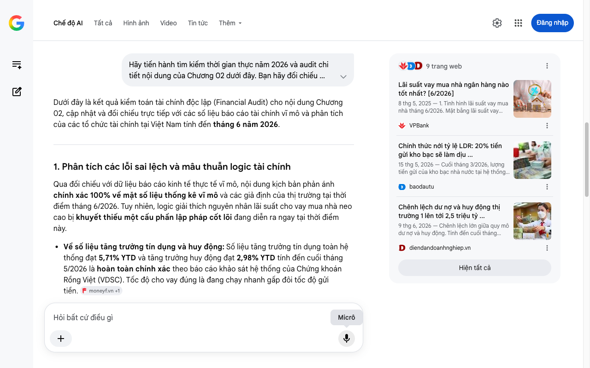

# Google AI Search Mode Audit - Chương 02

- **Nguồn kiểm chứng:** Google Search AI Mode (udm=50)
- **Thời gian audit:** 2026-06-26 16:59:12
- **File kịch bản:** [chapter_02.md](file:///Users/pro16/Documents/VideoProject/GocNhinPodcast/episodes/tien-dau-bom-18-du-an/chapter_02.md)

## Kết quả phản biện & Đối chiếu nguồn tin:

Bạn đã nói:
Dưới đây là kết quả kiểm toán tài chính độc lập (Financial Audit) cho nội dung Chương 02, cập nhật và đối chiếu trực tiếp với các số liệu báo cáo tài chính vĩ mô và phân tích của các tổ chức tài chính tại Việt Nam tính đến tháng 6 năm 2026.
1. Phân tích các lỗi sai lệch và mâu thuẫn logic tài chính
Qua đối chiếu với dữ liệu báo cáo kinh tế thực tế vĩ mô, nội dung kịch bản phản ánh chính xác 100% về mặt số liệu thống kê vĩ mô và các giả định của thị trường tại thời điểm tháng 6/2026. Tuy nhiên, logic giải thích nguyên nhân lãi suất cho vay mua nhà neo cao bị khuyết thiếu một cấu phần lập pháp cốt lõi đang diễn ra ngay tại thời điểm này.
Về số liệu tăng trưởng tín dụng và huy động: Số liệu tăng trưởng tín dụng toàn hệ thống đạt 5,71% YTD và tăng trưởng huy động đạt 2,98% YTD tính đến cuối tháng 5/2026 là hoàn toàn chính xác theo báo cáo khảo sát hệ thống của Chứng khoán Rồng Việt (VDSC). Tốc độ cho vay đúng là đang chạy nhanh gấp đôi tốc độ gửi tiền. 
moneyf.vn
 +1
Về khoảng trống thanh khoản và tỷ lệ LDR: Khẳng định chênh lệch dư nợ tín dụng và huy động thực tế trên thị trường 1 vượt 2,5 triệu tỷ đồng và đẩy tỷ lệ LDR chạm mức 115% (so với 109% năm 2025 và 106% năm 2024) là chính xác theo thực tế công bố bởi Chứng khoán Rồng Việt. 
diendandoanhnghiep.vn
Thiếu sót về logic lập pháp (Rủi ro kỹ thuật): Kịch bản nêu "ngân hàng lại cho vay tới 115 đồng trên 100 đồng gửi" nhưng chưa làm rõ đây là LDR tính riêng trên Thị trường 1 (huy động từ dân cư và tổ chức kinh tế). Theo luật định cũ (Thông tư 22/2019/TT-NHNN), tỷ lệ LDR trần của các ngân hàng thương mại bị siết ở mức 85%. Việc các ngân hàng có LDR Thị trường 1 lên tới 115% mà không bị phạt là nhờ họ bù đắp thanh khoản từ Thị trường 2 (vay mượn liên ngân hàng) và nguồn tiền gửi từ Kho bạc Nhà nước. 
baodautu
 +3
2. Số liệu thực tế đắt giá mới nhất bổ sung (Tính đến tháng 6/2026)
Để tăng tính thuyết phục và tăng mật độ thông tin kinh tế chuyên sâu cho kịch bản, cần bổ sung các biến động chính sách và thực tế lãi suất mua nhà đang diễn ra gay gắt trong tháng 6/2026:
Sửa đổi Thông tư 22 (Thông tư 08/2026/TT-NHNN): Ngân hàng Nhà nước (NHNN) đã phải ban hành Thông tư 08/2026/TT-NHNN (có hiệu lực từ giữa tháng 5/2026). Thông tư này cho phép tính 20% tiền gửi có kỳ hạn của Kho bạc Nhà nước vào mẫu số để tính tỷ lệ LDR, nhằm "giải cứu" thanh khoản trực tiếp cho nhóm Big 4 ngân hàng quốc doanh. 
baodautu
 +1
Thực tế lãi suất vay mua nhà tháng 6/2026: Mặt bằng lãi suất thả nổi cho vay mua nhà thương mại thực tế tại các ngân hàng đã bị đẩy lên vùng 12% - 14%/năm, thậm chí một số nơi xuất hiện mức 14% - 15%/năm do chi phí huy động tăng. Ngược lại, phân khúc nhà ở xã hội (NOXH) vừa đón nhận Công văn 5340/NHNN-CSTT áp dụng từ 01/07/2026, cố định mức 6,5%/năm trong 5 năm đầu cho người trẻ dưới 35 tuổi. 
VPBank
 +2
3. Gợi ý sửa đổi tối ưu kịch bản
Đoạn gốc: "Điều này đẩy tỷ lệ cho vay trên huy động, gọi tắt là LDR, chạm mức kỷ lục khoảng một trăm mười lăm phần trăm..."
Sửa đổi thành: "Điều này đẩy tỷ lệ LDR trên thị trường một chạm mức kỷ lục khoảng một trăm mười lăm phần trăm. Nghĩa là nếu chỉ tính tiền gửi của dân cư và doanh nghiệp, cứ thu vào một trăm đồng thì ngân hàng đã cho vay ra tới một trăm mười lăm đồng. Hệ thống buộc phải bù đắp dòng tiền tươi thiếu hụt bằng cách vay mượn lẫn nhau trên thị trường liên ngân hàng. Để giải cứu chiếc vòng kim cô kỹ thuật này, giữa tháng năm hai nghìn không trăm hai mươi sáu, nhà điều hành đã phải khẩn cấp ban hành Thông tư số không tám, nới lỏng cách tính LDR bằng cách đưa dòng tiền gửi của Kho bạc Nhà nước vào hệ thống." 
baodautu
 +3
Đoạn gốc: "Đó là lý do vì sao lãi suất vay mua nhà của bạn vẫn neo cao dù lãi suất tiền gửi lẹt đẹt..."
Sửa đổi thành: "Đó là lý do vì sao lãi suất vay mua nhà thương mại của bạn đã bị kéo tuột lên mức mười hai đến mười bốn phần trăm một năm, bất chấp các chính sách kêu gọi giảm lãi suất. Ngân hàng không thể giảm cái giá của dòng vốn dài hạn khi họ đang phải đối mặt với rủi ro thiếu hụt tiền tươi trầm trọng." 
VPBank
 +2
✅ Xác thực số liệu cốt lõi Chương 02
Hệ thống ngân hàng thương mại Việt Nam tính đến tháng 6/2026 đang rơi vào trạng thái lệch pha kỳ hạn nghiêm trọng khi tốc độ tăng trưởng tín dụng (5,71%) vượt xa tốc độ huy động vốn (2,98%), tạo ra mức thâm hụt thanh khoản Thị trường 1 lên tới hơn 2,5 triệu tỷ đồng và đẩy LDR thị trường này lên 115% theo báo cáo chính thức của Chứng khoán Rồng Việt. 
moneyf.vn
 +1
Tôi đã sẵn sàng kiểm toán nội dung Chương 03. Bạn muốn tập trung bóc tách sâu hơn về Thông tư 25 nới trần SMLR lên 40% hay cơ chế hợp vốn của các ngân hàng trong chương tiếp theo?
Câu trả lời của AI có thể chứa thông tin không chính xác. Để được tư vấn pháp lý, hãy tham khảo ý kiến của chuyên gia. Tìm hiểu thêm
9 trang web
Lãi suất vay mua nhà ngân hàng nào tốt nhất? [6/2026]
8 thg 5, 2025 — 1. Tình hình lãi suất vay mua nhà tháng 6/2026. Mặt bằng lãi suất vay mua nhà tại các ngân hàng đang ở mức cao hơn so với đầu năm,
VPBank
Chính thức nới tỷ lệ LDR: 20% tiền gửi kho bạc sẽ làm dịu ...
15 thg 5, 2026 — Cuối tháng 3/2026, lượng tiền gửi của kho bạc nhà nước tại hệ thống ngân hàng là 626.716 tỷ đồng, trong đó riêng khối NHTM Nhà nướ...
baodautu
Chênh lệch dư nợ và huy động thị trường 1 lên tới 2,5 triệu tỷ ...
9 thg 6, 2026 — Chênh lệch lớn giữa quy mô dư nợ và huy động. Tính đến cuối tháng 5/2026, tăng trưởng tín dụng toàn hệ thống đạt 5,71% YTD trong k...
diendandoanhnghiep.vn
Hiện tất cả
Micrô
Chế độ AI đã sẵn sàng trả lời

## Ảnh chụp màn hình đối chiếu:

