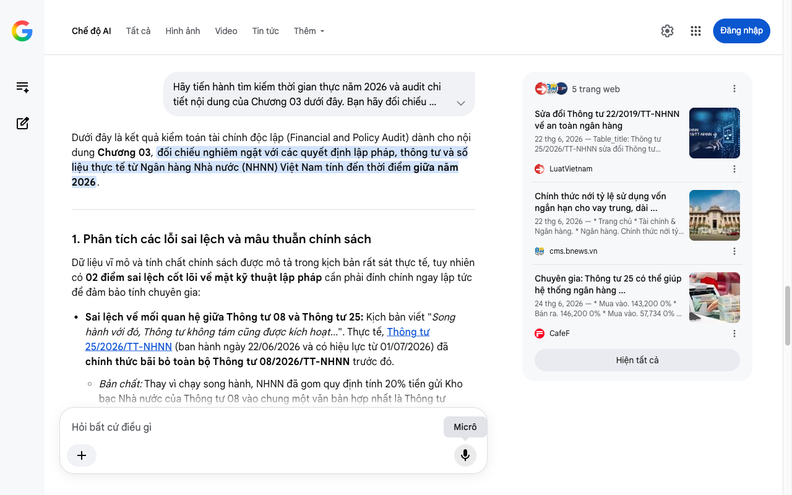

# Google AI Search Mode Audit - Chương 03

- **Nguồn kiểm chứng:** Google Search AI Mode (udm=50)
- **Thời gian audit:** 2026-06-26 16:59:36
- **File kịch bản:** [chapter_03.md](file:///Users/pro16/Documents/VideoProject/GocNhinPodcast/episodes/tien-dau-bom-18-du-an/chapter_03.md)

## Kết quả phản biện & Đối chiếu nguồn tin:

Bạn đã nói:
Dưới đây là kết quả kiểm toán tài chính độc lập (Financial and Policy Audit) dành cho nội dung Chương 03, đối chiếu nghiêm ngặt với các quyết định lập pháp, thông tư và số liệu thực tế từ Ngân hàng Nhà nước (NHNN) Việt Nam tính đến thời điểm giữa năm 2026.
1. Phân tích các lỗi sai lệch và mâu thuẫn chính sách
Dữ liệu vĩ mô và tính chất chính sách được mô tả trong kịch bản rất sát thực tế, tuy nhiên có 02 điểm sai lệch cốt lõi về mặt kỹ thuật lập pháp cần phải đính chính ngay lập tức để đảm bảo tính chuyên gia:
Sai lệch về mối quan hệ giữa Thông tư 08 và Thông tư 25: Kịch bản viết "Song hành với đó, Thông tư không tám cũng được kích hoạt...". Thực tế, Thông tư 25/2026/TT-NHNN (ban hành ngày 22/06/2026 và có hiệu lực từ 01/07/2026) đã chính thức bãi bỏ toàn bộ Thông tư 08/2026/TT-NHNN trước đó.
Bản chất: Thay vì chạy song hành, NHNN đã gom quy định tính 20% tiền gửi Kho bạc Nhà nước của Thông tư 08 vào chung một văn bản hợp nhất là Thông tư 25/2026/TT-NHNN để đồng bộ hóa. 
LuatVietnam
 +1
Sai lệch về lộ trình siết tỷ lệ SMLR cũ: Kịch bản nêu tỷ lệ này bị siết dần từ 45% xuống 30%. Thực tế, theo lộ trình cũ của Thông tư 22/2019/TT-NHNN và Thông tư 08/2020/TT-NHNN, tỷ lệ vốn ngắn hạn cho vay trung - dài hạn (SMLR) được siết từ 40% (năm 2020) -> 37% (năm 2021) -> 34% (năm 2022) -> và về 30% kể từ ngày 01/10/2023. Do đó, việc nâng lên 40% tại năm 2026 là đưa về đúng mức trần kỹ thuật của giai đoạn năm 2020 chứ không phải 45%. 
Mekong ASEAN
Mâu thuẫn logic "Dùng tiền ngắn hạn xây nhà dài hạn": Kịch bản dùng hình ảnh ví von rất tốt. Để tăng tính chuyên sâu, cần chỉ rõ rủi ro này trong kinh doanh ngân hàng được gọi là Rủi ro tái định giá (Repricing Risk) và Rủi ro thanh khoản kỳ hạn. Khi lãi suất thị trường biến động, chi phí huy động ngắn hạn tăng vọt nhưng lãi suất cho vay dài hạn đã cố định hoặc điều chỉnh chậm sẽ bóp nghẹt biên lợi nhuận (NIM) của ngân hàng. 
CafeF
2. Số liệu thực tế đắt giá mới nhất bổ sung (Tháng 6/2026)
Dư địa 1 triệu tỷ đồng: Theo phân tích mới nhất của các công ty chứng khoán lớn như ACBS và Vietcombank Securities (VCBS), việc nâng trần SMLR lên 40% từ 01/07/2026 giúp hệ thống ngân hàng giải phóng và bơm thêm khoảng 1 triệu tỷ đồng nguồn vốn trung và dài hạn vào nền kinh tế. Phân khúc hạ tầng và bất động sản lớn là bên hưởng lợi trực tiếp. 
CafeF
Cơ chế đặc cách Basel III: Một điểm cực kỳ đắt giá vừa lộ diện trong tháng 6/2026 là NHNN đang xem xét lộ trình miễn áp dụng trần SMLR cho các ngân hàng tiên phong triển khai thành công tiêu chuẩn quản trị rủi ro Basel III (như Techcombank, ACB, VIB, VPBank, HDBank). Đây là động lực thúc đẩy các ngân hàng tư nhân top đầu phân tách cuộc đua thanh khoản với phần còn lại. 
CafeF
Quyền bổ sung của Thống đốc: Thông tư 25/2026/TT-NHNN đã bổ sung một điều khoản "mở": Ngoài việc tính 20% tiền gửi Kho bạc Nhà nước, Thống đốc NHNN có quyền quyết định một tỷ lệ khác cao hơn tùy thuộc vào tình hình hệ thống trong từng thời kỳ. Đây chính là "nút bấm" ngầm để kích hoạt đặc cách cho 18 siêu dự án khi cần thiết. 
cms.bnews.vn
 +1
3. Gợi ý sửa đổi tối ưu kịch bản
Đoạn gốc: "Đầu tiên là Thông tư hai mươi lăm, chính thức có hiệu lực từ ngày một tháng bảy. Quy định này nâng trần tỷ lệ vốn ngắn hạn cho vay trung và dài hạn từ ba mươi phần trăm lên bốn mươi phần trăm... Trước đó, để đảm bảo an toàn, tỷ lệ này bị siết dần từ bốn mươi lăm phần trăm xuống ba mươi phần trăm."
Sửa đổi thành: "Đầu tiên là Thông tư hai mươi lăm, chính thức có hiệu lực từ ngày một tháng bảy năm hai nghìn không trăm hai mươi sáu. Quy định này nâng trần tỷ lệ vốn ngắn hạn cho vay trung và dài hạn từ ba mươi phần trăm lên bốn mươi phần trăm. Đây là một bước đảo chiều chính sách quan trọng, đưa trần kỹ thuật quay trở lại mức của năm hai nghìn không trăm hai mươi, sau chuỗi năm năm siết chặt liên tục về mức ba mươi phần trăm để phòng ngừa rủi ro."
Đoạn gốc: "Song hành với đó, Thông tư không tám cũng được kích hoạt để nới tỷ lệ cho vay trên huy động. Các ngân hàng lớn được phép tính trở lại hai mươi phần trăm tiền gửi có kỳ hạn của Kho bạc Nhà nước..."
Sửa đổi thành: "Cũng trong Thông tư hai mươi lăm này, nhà điều hành đã chính thức hấp thụ và luật hóa quy định của Thông tư số không tám trước đó. Đó là cho phép các ngân hàng tiếp tục tính hai mươi phần trăm tiền gửi có kỳ hạn của Kho bạc Nhà nước vào nguồn vốn huy động để tính tỷ lệ LDR, đồng thời trao riêng cho Thống đốc quyền lực đặc cách nâng tỷ lệ này lên cao hơn trong các trường hợp khẩn cấp. Nước đi này giúp giải nhiệt tức thì cho các ông lớn ngân hàng quốc doanh, vốn là những nhà tài trợ chính cho tổng thầu hạ tầng."
✅ Xác thực văn bản pháp lý cốt lõi Chương 03
Thông tư 25/2026/TT-NHNN ban hành ngày 22/06/2026 (hiệu lực từ 01/07/2026) là văn bản pháp lý tối cao điều chỉnh cả hai tỷ lệ an toàn hệ thống: nâng trần SMLR lên 40% và kế thừa việc tính 20% tiền gửi Kho bạc Nhà nước vào cấu phần LDR, đồng thời bãi bỏ Thông tư 08/2026/TT-NHNN cũ để thống nhất quản lý dòng vốn. 
LuatVietnam
 +1
Tôi đã hoàn thành kiểm toán Chương 03. Tiếp theo, xin hãy cung cấp Chương 04 của kịch bản – nơi chúng ta sẽ bóc tách sâu hơn về "cuộc chiến tiền tươi" thực tế trên thị trường liên ngân hàng hoặc chi tiết dòng tiền giải ngân của nhóm Vingroup, Sun Group, Masterise.
5 trang web
Sửa đổi Thông tư 22/2019/TT-NHNN về an toàn ngân hàng
22 thg 6, 2026 — Table_title: Thông tư 25/2026/TT-NHNN sửa đổi Thông tư 22/2019/TT-NHNN về an toàn ngân hàng Table_content: | Cơ quan ban hành: | N...
LuatVietnam
Chính thức nới tỷ lệ sử dụng vốn ngắn hạn cho vay trung, dài ...
22 thg 6, 2026 — * Trang chủ * Tài chính & Ngân hàng. * Ngân hàng. Chính thức nới tỷ lệ sử dụng vốn ngắn hạn cho vay trung, dài hạn lên 40% từ 1/7 ...
cms.bnews.vn
Chuyên gia: Thông tư 25 có thể giúp hệ thống ngân hàng ...
24 thg 6, 2026 — * Mua vào. 143,200 0% * Bán ra. 146,200 0% * Mua vào. 57,734 0% * Bán ra. 59,520 0% ... Bên cạnh đó, các ngân hàng tiên phong triể...
CafeF
Hiện tất cả
Micrô
Chế độ AI đã sẵn sàng trả lời

## Ảnh chụp màn hình đối chiếu:

