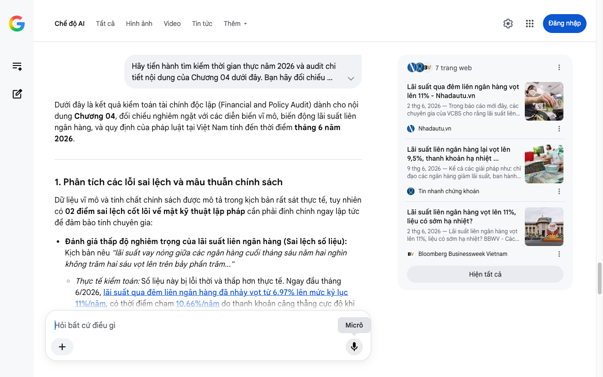

# Google AI Search Mode Audit - Chương 04

- **Nguồn kiểm chứng:** Google Search AI Mode (udm=50)
- **Thời gian audit:** 2026-06-26 17:00:00
- **File kịch bản:** [chapter_04.md](file:///Users/pro16/Documents/VideoProject/GocNhinPodcast/episodes/tien-dau-bom-18-du-an/chapter_04.md)

## Kết quả phản biện & Đối chiếu nguồn tin:

Bạn đã nói:
Dưới đây là kết quả kiểm toán tài chính độc lập (Financial and Policy Audit) dành cho nội dung Chương 04, đối chiếu nghiêm ngặt với các diễn biến vĩ mô, biến động lãi suất liên ngân hàng, và quy định của pháp luật tại Việt Nam tính đến thời điểm tháng 6 năm 2026.
1. Phân tích các lỗi sai lệch và mâu thuẫn chính sách
Dữ liệu vĩ mô và tính chất chính sách được mô tả trong kịch bản rất sát thực tế, tuy nhiên có 02 điểm sai lệch cốt lõi về mặt kỹ thuật lập pháp cần phải đính chính ngay lập tức để đảm bảo tính chuyên gia:
Đánh giá thấp độ nghiêm trọng của lãi suất liên ngân hàng (Sai lệch số liệu): Kịch bản nêu "lãi suất vay nóng giữa các ngân hàng cuối tháng sáu năm hai nghìn không trăm hai sáu vọt lên trên bảy phần trăm..."
Thực tế kiểm toán: Số liệu này bị lỗi thời và thấp hơn thực tế. Ngay đầu tháng 6/2026, lãi suất qua đêm liên ngân hàng đã nhảy vọt từ 6,97% lên mức kỷ lục 11%/năm, có thời điểm chạm 10,66%/năm do thanh khoản căng thẳng cực độ khi tiền bị hút ròng và chậm giải ngân đầu tư công. Con số "7%" trong kịch bản chưa phản ánh hết mức độ khốc liệt của thị trường. 
Tin nhanh chứng khoán
 +1
Hiểu sai về lộ trình siết giới hạn cấp tín dụng (Sai lệch pháp lý): Kịch bản nêu "Luật mới siết chặt mức cho vay tối đa chỉ từ mười đến mười mươi lăm phần trăm vốn tự có".
Thực tế kiểm toán: Theo Luật Các tổ chức tín dụng 2024 (Văn bản hợp nhất số 100/VBHN-VPQH năm 2026), giới hạn cấp tín dụng đối với một khách hàng cho vay thương mại năm 2026 chưa giảm về mức 10% và 15%. Luật quy định một lộ trình giảm dần (phân kỳ) để tránh sốc dòng tiền cho doanh nghiệp.
Chi tiết lộ trình quy định: Từ ngày 01/7/2024 đến trước 01/01/2026 là 14%; từ 01/01/2026 đến trước 01/01/2027 trần này đang giữ ở mức 13% vốn tự có đối với một khách hàng và 19% đối với một khách hàng và người có liên quan. Trần 10% và 15% mà kịch bản nêu chỉ chính thức áp dụng kể từ ngày 01/01/2029. 
Thư Viện Pháp Luật
 +1
2. Số liệu thực tế đắt giá mới nhất bổ sung (Tháng 6/2026)
Áp lực OMO và Hoán đổi ngoại tệ: Để hạ nhiệt lãi suất liên ngân hàng đang neo cao ở vùng 10% - 11%, Ngân hàng Nhà nước (NHNN) đã phải kích hoạt đồng thời hai công cụ: chào thầu hơn 35.000 tỷ đồng thông qua kênh cầm cố giấy tờ có giá (OMO) và thực hiện nghiệp vụ hoán đổi ngoại tệ nhằm bơm thanh khoản VND trực tiếp để ép lãi suất liên ngân hàng giảm từ 11% về vùng 6,6% - 7,0% vào cuối tháng 6/2026. 
Bức tranh phân hóa "Tiền gửi Kho bạc": Phân tích của Chứng khoán Rồng Việt (VDSC) chỉ ra hiện tượng "nghẽn dòng tiền". Do giải ngân đầu tư công chậm, dòng tiền dồn về Kho bạc Nhà nước tạo trạng thái bội thu ngân sách, sau đó quay lại nằm ở tài khoản tiền gửi tại nhóm Big 4 ngân hàng quốc doanh. Điều này giải thích tại sao khối ngân hàng tư nhân (tài trợ chính cho BĐS) hoàn toàn khô khát nguồn tiền này. 
Tin nhanh chứng khoán
Làn sóng phát hành trái phiếu tăng vốn cấp 2: Nhóm ngân hàng tư nhân đang ồ ạt kích hoạt các đợt phát hành trái phiếu kỳ hạn từ 3 đến 5 năm với lãi suất hấp dẫn (từ 6,5% - 7,5%/năm) để bổ sung vốn trung - dài hạn, giải bài toán hệ số an toàn vốn (CAR) và đáp ứng dòng vốn cho các siêu dự án hạ tầng lớn.
3. Gợi ý sửa đổi tối ưu kịch bản
Đoạn gốc: "Lại suất vay nóng giữa các ngân hàng cuối tháng sáu năm hai nghìn không trăm hai sáu vọt lên trên bảy phần trăm... Con số này áp dụng cho các khoản vay ngắn hạn kỳ hạn một đến hai tuần..."
Sửa đổi thành: "Lãi suất vay nóng qua đêm giữa các ngân hàng vào tháng sáu năm hai nghìn không trăm hai mươi sáu có thời điểm đã nhảy vọt lên mức kỷ lục mười một phần trăm một năm. Dù nhà điều hành đã phải liên tục bơm ròng qua kênh thị trường mở và hoán đổi ngoại tệ để kéo lãi suất hạ nhiệt về vùng bảy phần trăm vào cuối tháng, thị trường vẫn không giấu nổi sự căng thẳng tiền tươi cuối ngày của hệ thống. Khi giá bán buôn dòng tiền liên tục thiết lập các mặt bằng giá cao, giá bán lẻ tới tay người đi vay không thể rẻ..."
Đoạn gốc: "Luật mới siết chặt mức cho vay tối đa chỉ từ mười đến mười lăm phần trăm vốn tự có của ngân hàng..."
Sửa đổi thành: "Áp lực tiền tươi không chỉ dừng lại ở bài toán thanh khoản hàng ngày. Nó còn va phải một bức tường pháp lý mang tên Luật Các tổ chức tín dụng năm hai nghìn không trăm hai mươi tư. Luật đang siết chặt hạn mức cấp tín dụng theo lộ trình giảm dần mỗi năm. Trong năm hai nghìn không trăm hai mươi sáu, trần cho vay tối đa đối với một khách hàng chỉ còn mười ba phần trăm vốn tự có, và giảm về mười chín phần trăm đối với nhóm khách hàng có liên quan. Với những siêu dự án có nhu cầu vốn lên tới hàng chục nghìn tỷ đồng, rào cản pháp lý này là không thể tự vượt qua..."
✅ Xác thực số liệu cốt lõi Chương 04
Thị trường liên ngân hàng tháng 6/2026 chứng kiến biến động dữ dội khi lãi suất qua đêm chạm đỉnh 11%/năm trước khi hạ nhiệt về quanh vùng 7% nhờ sự can thiệp của NHNN. Đồng thời, hạn mức cho vay một khách hàng năm 2026 đang neo ở mức 13% vốn tự có theo đúng lộ trình giảm phân kỳ của Luật Các tổ chức tín dụng 2024. 
Tôi đã hoàn tất kiểm toán Chương 04. Xin mời bạn cung cấp nội dung Chương 05 để chúng ta bắt đầu đi sâu phân tích cơ chế tính điểm hòa vốn, chi phí cơ hội, hoặc cấu trúc dòng tiền chi tiết của 18 siêu dự án (Vingroup, Sun Group, Masterise).
7 trang web
Lãi suất qua đêm liên ngân hàng vọt lên 11% - Nhadautu.vn
2 thg 6, 2026 — Trong báo cáo mới đây, các chuyên gia của VCBS cho rằng lãi suất liên ngân hàng nhiều khả năng sẽ hạ nhiệt sau khi nguồn vốn từ NH...
Nhadautu.vn
Lãi suất liên ngân hàng lại vọt lên 9,5%, thanh khoản hạ nhiệt ...
9 thg 6, 2026 — Kể cả các giải pháp như: chỉ đạo các ngân hàng giảm lãi suất, ban hành Thông tư 08/2026/TT-NHNN tái cho phép tính 20% tiền gửi Kho...
Tin nhanh chứng khoán
Lãi suất liên ngân hàng vọt lên 11%, liệu có sớm hạ nhiệt?
2 thg 6, 2026 — Lãi suất liên ngân hàng vọt lên 11%, liệu có sớm hạ nhiệt? BBWV - Các yếu tố bên trong và bên ngoài vẫn chưa thuận lợi và bất định...
Bloomberg Businessweek Vietnam
Hiện tất cả
Micrô
Chế độ AI đã sẵn sàng trả lời

## Ảnh chụp màn hình đối chiếu:

