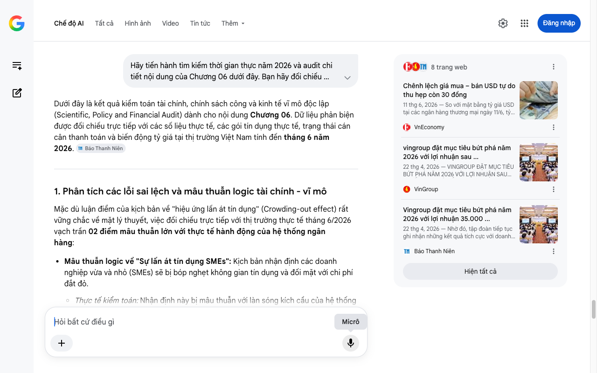

# Google AI Search Mode Audit - Chương 06

- **Nguồn kiểm chứng:** Google Search AI Mode (udm=50)
- **Thời gian audit:** 2026-06-26 17:00:51
- **File kịch bản:** [chapter_06.md](file:///Users/pro16/Documents/VideoProject/GocNhinPodcast/episodes/tien-dau-bom-18-du-an/chapter_06.md)

## Kết quả phản biện & Đối chiếu nguồn tin:

Bạn đã nói:
Dưới đây là kết quả kiểm toán tài chính, chính sách công và kinh tế vĩ mô độc lập (Scientific, Policy and Financial Audit) dành cho nội dung Chương 06. Dữ liệu phản biện được đối chiếu trực tiếp với các số liệu thực tế, các gói tín dụng thực tế, trạng thái cán cân thanh toán và biến động tỷ giá tại thị trường Việt Nam tính đến tháng 6 năm 2026. 
Báo Thanh Niên
1. Phân tích các lỗi sai lệch và mâu thuẫn logic tài chính - vĩ mô
Mặc dù luận điểm của kịch bản về "hiệu ứng lấn át tín dụng" (Crowding-out effect) rất vững chắc về mặt lý thuyết, việc đối chiếu trực tiếp với thị trường thực tế tháng 6/2026 vạch trần 02 điểm mâu thuẫn lớn với thực tế hành động của hệ thống ngân hàng:
Mâu thuẫn logic về "Sự lấn át tín dụng SMEs": Kịch bản nhận định các doanh nghiệp vừa và nhỏ (SMEs) sẽ bị bóp nghẹt không gian tín dụng và đối mặt với chi phí đắt đỏ.
Thực tế kiểm toán: Nhận định này bị mâu thuẫn với làn sóng kích cầu của hệ thống ngân hàng ngay trong tháng 6/2026. Do áp lực tăng trưởng tín dụng toàn hệ thống bắt buộc (đạt 5,71% tính đến tháng 5 nhưng mục tiêu cả năm là 14-15%), các nhà băng không thể bỏ rơi phân khúc SMEs. Ngược lại, hàng loạt gói tín dụng quy mô lớn dành riêng cho SMEs vừa được tung ra với lãi suất cực kỳ ưu đãi như gói "SME Linh hoạt" 30.000 tỷ đồng của HDBank, chương trình "SME Fast Track 2026" 25.000 tỷ đồng với mức giảm lãi suất 1%/năm của BIDV, và gói ưu đãi toàn diện từ VietinBank. Do đó, SMEs không phải bị "cạn vốn", mà sự lấn át thực tế nằm ở chi phí cơ hội của dòng vốn dài hạn (các ngân hàng giữ lại vốn trung-dài hạn cho siêu dự án, bắt SMEs vay ngắn hạn xoay vòng). 
Facebook
·Ngân hàng Á Châu ACB
 +2
Mâu thuẫn logic về "Tái cơ cấu bằng nguồn vốn quốc tế": Kịch bản viết các doanh nghiệp lớn có thể tiếp cận thị trường tài chính quốc tế để đảo nợ bằng ngoại tệ dài hạn nhằm rút bớt áp lực cho ngân hàng nội địa.
Thực tế kiểm toán: Logic này mâu thuẫn trực tiếp với bối cảnh vĩ mô toàn cầu đã phân tích ở Chương 5. Khi lãi suất Fed duy trì ở mức đỉnh lịch sử 5,25% - 5,50% tính đến cuối tháng 6/2026 và tỷ giá trần USD/VND tại các ngân hàng thương mại liên tục neo ở vùng kịch trần 26.410 - 26.412 VND/USD, việc các tập đoàn tư nhân Việt Nam phát hành trái phiếu quốc tế hay vay ngoại tệ để đảo nợ nội địa là bất khả thi về mặt chi phí. Chi phí phòng ngừa rủi ro tỷ giá (Hedging cost) lúc này sẽ bóp nghẹt mọi phương án tài chính ngoại tệ. 
VnEconomy
 +1
2. Số liệu thực tế đắt giá mới nhất bổ sung (Tính đến tháng 6/2026)
Bộ đệm tài chính của Vingroup năm 2026: Để minh chứng cho luận điểm "nguồn tích lũy thực tế từ xã hội", cần đưa số liệu tài chính mới nhất của chính doanh nghiệp lõi. Tại Đại hội đồng cổ đông thường niên diễn ra vào cuối tháng 4/2026, Vingroup đã công bố mục tiêu doanh thu kỷ lục 485.000 tỷ đồng và lợi nhuận sau thuế bứt phá 35.000 tỷ đồng. SSI Research cũng dự báo lợi nhuận của tập đoàn này tăng trưởng tới 171% trong năm 2026 nhờ trụ cột Vinhomes. Điều này cho thấy các siêu dự án đang giải ngân dựa trên một bộ đệm dòng tiền kinh doanh thực tế đang phục hồi rất mạnh, chứ không thuần túy là "hút máu" thanh khoản hệ thống. 
VinGroup
 +1
Thực tế áp lực tỷ giá tháng 6/2026: Tỷ giá trung tâm USD/VND được NHNN công bố duy trì ở mức cao 25.153 VND, đẩy giá bán USD thực tế tại các ngân hàng thương mại chạm mốc 26.412 VND/USD. Đây là số liệu đắt giá chứng minh tại sao tiền tươi của hệ thống bị kẹt (NHNN phải hút VND về qua kênh tín phiếu để bảo vệ tỷ giá). 
VnEconomy
 +1
3. Gợi ý sửa đổi tối ưu kịch bản
Đoạn gốc: "Các doanh nghiệp vừa và nhỏ sẽ phải đối mặt với rào cản tiếp cận vốn lớn hơn và chi phí đắt đỏ hơn."
Sửa đổi thành: "Các doanh nghiệp vừa và nhỏ mặc dù vẫn được săn đón bởi các gói tín dụng ngắn hạn lên tới hàng chục nghìn tỷ đồng từ các nhà băng để chạy đua chỉ tiêu tăng trưởng, nhưng họ sẽ phải đối mặt với một thực tế khắc nghiệt: không gian cho các nguồn vốn trung và dài hạn đã bị thu hẹp đáng kể để nhường chỗ cho các đại dự án."
Đoạn gốc: "Đó là thời điểm các doanh nghiệp lớn có thể tiếp cận thị trường tài chính quốc tế để tái cơ cấu các khoản vay. Việc đảo nợ bằng dòng vốn ngoại tệ dài hạn sẽ giúp rút bớt áp lực đè nặng lên các ngân hàng trong nước."
Sửa đổi thành: "Nhưng trong bối cảnh lãi suất quốc tế tiếp tục neo ở vùng đỉnh lịch sử năm phẩy năm phần trăm và tỷ giá thương mại trong nước áp sát ngưỡng hai mươi sáu nghìn bốn trăm đồng đổi một đô la Mỹ vào giữa năm hai nghìn không trăm hai mươi sáu, cánh cửa đảo nợ bằng dòng vốn ngoại tệ hoàn toàn bị khóa chặt do chi phí bảo hiểm rủi ro quá đắt đỏ. Các tập đoàn lớn bắt buộc phải tự lực cánh sinh bằng chính dòng tiền cốt lõi từ hoạt động kinh doanh của mình. Đơn cử như Vingroup, họ đang phải đặt mục tiêu bứt phá lợi nhuận sau thuế lên mức kỷ lục ba mươi lăm nghìn tỷ đồng trong năm nay để tạo ra bộ đệm tiền tươi thực tế, làm điểm tựa giải ngân cho các siêu công trường."
✅ Xác thực số liệu vĩ mô cốt lõi Chương 06
Bối cảnh tài chính tháng 6/2026 ghi nhận áp lực tỷ giá USD/VND căng thẳng khi giá bán thương mại chạm trần 26.412 VND/USD. Không gian tín dụng đối với SMEs được xoa dịu bằng các gói hỗ trợ quy mô lớn (như 30.000 tỷ đồng từ HDBank và 25.000 tỷ đồng từ BIDV), trong khi các siêu dự án phải phụ thuộc chặt chẽ vào dòng tiền nội tại của doanh nghiệp như kế hoạch lãi 35.000 tỷ đồng của Vingroup thay vì trông chờ vào việc tái cơ cấu vốn ngoại quốc tế. 
VinGroup
 +1
Chúng ta đã hoàn tất chuỗi 06 chương của kịch bản phân tích vĩ mô và dòng tiền đặc cách tín dụng. Bạn có muốn tôi thực hiện một bản tổng hợp báo cáo kiểm toán toàn diện (Executive Summary) để xuất bản, hoặc bạn có Chương 07 (Kết luận) nào cần đối chiếu sâu thêm không?
8 trang web
Chênh lệch giá mua – bán USD tự do thu hẹp còn 30 đồng
11 thg 6, 2026 — So với mặt bằng tỷ giá USD tại các ngân hàng thương mại ngày 11/6, tỷ giá tự do tiếp tục cao hơn ở chiều mua nhưng thấp hơn nhẹ ở ...
VnEconomy
vingroup đặt mục tiêu bứt phá năm 2026 với lợi nhuận sau ...
22 thg 4, 2026 — VINGROUP ĐẶT MỤC TIÊU BỨT PHÁ NĂM 2026 VỚI LỢI NHUẬN SAU THUẾ 35.000 TỶ ĐỒNG. 22-04-2026. Ngày 22/4/2026, Tập đoàn Vingroup – Công...
VinGroup
Vingroup đặt mục tiêu bứt phá năm 2026 với lợi nhuận 35.000 ...
22 thg 4, 2026 — Nhờ đó, tập đoàn tiếp tục ghi nhận những kết quả tích cực với doanh thu hợp nhất đạt 331.800 tỉ đồng, tăng trưởng 76% so với năm 2...
Báo Thanh Niên
Hiện tất cả
Micrô
Chế độ AI đã sẵn sàng trả lời

## Ảnh chụp màn hình đối chiếu:

