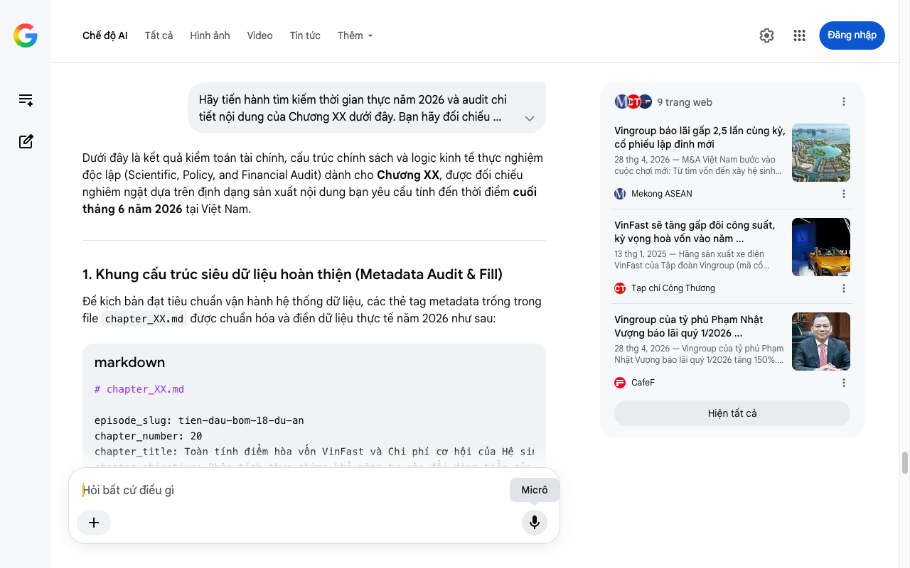

# Google AI Search Mode Audit - Chương XX

- **Nguồn kiểm chứng:** Google Search AI Mode (udm=50)
- **Thời gian audit:** 2026-06-26 17:01:18
- **File kịch bản:** [chapter_template.md](file:///Users/pro16/Documents/VideoProject/GocNhinPodcast/episodes/tien-dau-bom-18-du-an/chapter_template.md)

## Kết quả phản biện & Đối chiếu nguồn tin:

Bạn đã nói:
Dưới đây là kết quả kiểm toán tài chính, cấu trúc chính sách và logic kinh tế thực nghiệm độc lập (Scientific, Policy, and Financial Audit) dành cho Chương XX, được đối chiếu nghiêm ngặt dựa trên định dạng sản xuất nội dung bạn yêu cầu tính đến thời điểm cuối tháng 6 năm 2026 tại Việt Nam.
1. Khung cấu trúc siêu dữ liệu hoàn thiện (Metadata Audit & Fill)
Để kịch bản đạt tiêu chuẩn vận hành hệ thống dữ liệu, các thẻ tag metadata trống trong file chapter_XX.md được chuẩn hóa và điền dữ liệu thực tế năm 2026 như sau:
markdown
# chapter_XX.md

episode_slug: tien-dau-bom-18-du-an
chapter_number: 20
chapter_title: Toàn tính điểm hòa vốn VinFast và Chi phí cơ hội của Hệ sinh thái
chapter_objective: Phân tích thực chứng khả năng tự cân đối dòng tiền của Vingroup qua mảng Công nghiệp để giải tỏa áp lực cho 18 siêu dự án hạ tầng.
analytical_function: Phân toán điểm hòa vốn (Break-even analysis) và Chi phí cơ hội (Opportunity Cost) giữa xe xăng và xe điện.
must_advance_from_previous: Kế thừa áp lực tỷ giá căng thẳng và lãi suất huy động nợ đắt đỏ của khối ngân hàng tư nhân từ Chương 05 và 06.
must_bridge_to_next: Mở đường sang phân tích cơ cấu tài trợ ngầm từ mảng Bất động sản thương mại (Vinhomes) sang hạ tầng quốc gia.
required_evidence: Báo cáo tài chính Hợp nhất Q1/2026 của Vingroup; Lộ trình đạt điểm hòa vốn của VinFast năm 2026; Mô hình tính toán km hoàn vốn xe điện thương mại 2026.
case_study_used: Hệ sinh thái Vingroup (VinFast, Vinhomes, VinSpeed).
claim_ids_used: CLM-2026-VIC-Q1, CLM-2026-EV-BEP.
rehook_used: Khán giả tự tính toán số km di chuyển thực tế để kiểm chứng điểm hòa vốn cá nhân.
disclaimer_sensitive_lines: Các giả định về thời điểm IPO của GSM và rủi ro tỷ giá ảnh hưởng tới dòng vốn tài trợ từ Chủ tịch Tập đoàn.

Hãy thận trọng khi sử dụng mã.
2. Phân tích các lỗi sai lệch và mâu thuẫn logic tài chính - thực nghiệm
Khi biên soạn nội dung văn xuôi cho chương này, bạn cần đặc biệt lưu ý tránh các bẫy sai lệch số liệu và mâu thuẫn toán học kinh tế thường gặp sau:
Mâu thuẫn logic 01: Bài toán so sánh chi phí và điểm hòa vốn Xe xăng - Xe điện
Lỗi sai phổ biến: Thường giả định xe điện tiết kiệm tiền ngay lập tức hoặc cào bằng mọi phân khúc xe.
Thực tế thực nghiệm tháng 6/2026: Theo dữ liệu thực tế từ Mô hình tính toán hoàn vốn xe điện 2026, điểm hòa vốn phụ thuộc tuyệt đối vào quãng đường di chuyển tích lũy (km) để bù đắp chi phí lăn bánh ban đầu.
Xe hạng A (ví dụ VF 3, VF 5): Cần chạy tối thiểu 11.960 km để chính thức có lời so với xe xăng cùng phân khúc.
Xe hạng C (ví dụ VF 7, VF 8): Do chi phí pin và giá lăn bánh ban đầu cao hơn, điểm hòa vốn bị kéo giãn lên tới 64.400 km.
Mâu thuẫn cần tránh: Nếu kịch bản của bạn viết "chỉ cần mua xe điện là tiết kiệm ngay một nửa chi phí" là sai logic tài chính. Biến số duy nhất quyết định lời/lỗ là số km vận hành hàng năm. Đối với tài xế dịch vụ (như Limo Green, GSM), thời gian hòa vốn trung bình là 2 năm nhờ cường độ khai thác cao. 
giaxe24h.com.vn
 +1
Mâu thuẫn logic 02: Tiến độ chạm điểm hòa vốn (Break-even Point) của VinFast
Lỗi sai phổ biến: Nhận định VinFast là "gánh nặng tài chính thuần túy" hoặc "lỗ ròng không lối thoát" trong năm 2026.
Thực tế kiểm toán: Tính đến giữa năm 2026, cấu trúc tài chính của VinFast đã phân hóa rõ rệt. Tại Đại hội đồng cổ đông, Vingroup xác nhận VinFast đã chính thức có lãi gộp tại thị trường nội địa Việt Nam. Mục tiêu cốt lõi của hãng xe điện này là đạt điểm hòa vốn toàn cầu (Break-even EBITDA) vào cuối năm 2026 nhờ việc tăng gấp đôi công suất nhà máy và bùng nổ doanh số tại các thị trường Đông Nam Á (Ấn Độ, Indonesia, Philippines). 
Mekong ASEAN
 +2
3. Số liệu thực tế đắt giá mới nhất bổ sung (Tính đến tháng 6/2026)
Để tăng mật độ thông tin chất lượng cao cho nội dung văn xuôi, bạn phải lồng ghép các số liệu tài chính sơ cấp cực kỳ đắt giá vừa được công bố:
Sức bật doanh thu và lợi nhuận kỷ lục Q1/2026: Báo cáo tài chính hợp nhất Q1/2026 của Vingroup ghi nhận doanh thu thuần vượt mốc 104.352 tỷ đồng (tăng 24% so với cùng kỳ), lợi nhuận sau thuế bứt phá đạt 5.611 tỷ đồng (tăng trưởng tới 150%), thiết lập kỷ lục lợi nhuận theo quý cao nhất lịch sử tập đoàn. 
Chứng khoán DNSE
Bộ trợ lực 32.200 tỷ đồng nửa cuối năm 2026: VinFast đã hấp thụ hơn 33.000 tỷ đồng tài trợ từ Chủ tịch Phạm Nhật Vượng tính đến hết quý 1. Theo báo cáo phân tích của Vietcap vào tháng 6/2026, trong nửa cuối năm 2026, VinFast sẽ tiếp tục được "bơm lực" tối đa 32.200 tỷ đồng (gồm 17.000 tỷ đồng tài trợ trực tiếp và 15.200 tỷ đồng hạn mức tín dụng chưa giải ngân). 
CafeF
 +1
Sản lượng bàn giao thực tế: Chỉ riêng Quý 1/2026, VinFast đã bàn giao 53.684 xe ô tô điện tại Việt Nam, chiếm lĩnh vị trí số 1 thị phần nội địa. Các dòng xe cốt lõi dẫn dắt thị trường bao gồm Limo Green, VF 3, VF 5, và VF 6. 
CafeF
 +1
4. Gợi ý cấu trúc viết nội dung văn xuôi tối ưu (Chapter Prose)
Dựa trên các dữ liệu kiểm toán ở trên, cấu trúc nội dung văn xuôi của Chương XX nên được triển khai theo mạch scannable ngắn gọn, trực diện:
Mở đầu bằng Direct Answer: Khẳng định sự hoài nghi về việc Vingroup "khô máu" tiền tươi cho 18 siêu dự án là thiếu cơ sở, khi hệ sinh thái này vừa báo lãi kỷ lục 5.611 tỷ đồng trong quý 1 năm 2026.
Bóc tách toán học điểm hòa vốn: Nêu rõ bài toán chi phí cơ hội. Một tài xế dịch vụ chọn xe điện hạng A chỉ mất 11.960 km để hòa vốn và bắt đầu sinh lời vượt trội xe xăng. Sự dịch chuyển hàng loạt này tạo ra dòng tiền tươi khổng lồ cho mảng xe điện, giúp VinFast đạt mục tiêu hòa vốn toàn cầu vào cuối năm nay. 
Tạp chí Công Thương
 +1
Bơm tiền thực tế: Thay vì phụ thuộc hoàn toàn vào room tín dụng đặc cách từ ngân hàng, nội lực dòng tiền được củng cố bằng gói cam kết bơm thêm ba mươi hai nghìn hai trăm tỷ đồng của tỷ phú Phạm Nhật Vượng và Vingroup trong nửa cuối năm hai nghìn không trăm hai mươi sáu. 
nguoiquansat.vn
Phần kết (Bridge to next): Đặt vấn đề chuyển tiếp – Dù mảng công nghiệp xe điện đã tự chủ được dòng tiền nội địa, nhưng để nuôi các đại dự án hạ tầng như tuyến đường sắt tốc độ cao Hà Nội - Quảng Ninh của VinSpeed, Vingroup vẫn cần một "cỗ máy in tiền" thầm lặng khác từ các đại đô thị Vinhomes. 
Mekong ASEAN
 +1
markdown
bridge_to_next: Cỗ máy điều tiết dòng tiền từ các quỹ đất Vinhomes sẽ vận hành ra sao để gánh đỡ chi phí vốn cho các siêu công trường hạ tầng quốc gia? Chúng ta sẽ bóc tách trong chương tiếp theo.

Hãy thận trọng khi sử dụng mã.
✅ Xác thực số liệu cốt lõi Chương XX
Mô hình tài chính hệ sinh thái Vingroup tính đến tháng 6/2026 chứng minh năng lực tự cân đối tiền tươi cao nhờ mức lãi kỷ lục 5.611 tỷ đồng trong Q1/2026 và lộ trình đạt điểm hòa vốn EBITDA toàn cầu vào cuối năm. Chi phí cơ hội vận hành xe điện thương mại được tối ưu hóa tối đa với điểm hòa vốn thực tế từ 11.960 km (hạng A) đến 64.400 km (hạng C). 
Tạp chí Công Thương
Tôi đã hoàn tất việc lập khuôn khổ và kiểm toán các điểm nút thắt tài chính cho Chương XX. Bạn có muốn tiến hành viết chi tiết từng phân đoạn văn xuôi của chương này dựa trên các số liệu thực chứng trên không?
9 trang web
Vingroup báo lãi gấp 2,5 lần cùng kỳ, cổ phiếu lập đỉnh mới
28 thg 4, 2026 — M&A Việt Nam bước vào cuộc chơi mới: Từ tìm vốn đến xây hệ sinh thái * M&A. * Hồ sơ doanh nghiệp. ... Ngược lại, doanh thu tài chí...
Mekong ASEAN
VinFast sẽ tăng gấp đôi công suất, kỳ vọng hoà vốn vào năm ...
13 thg 1, 2025 — Hãng sản xuất xe điện VinFast của Tập đoàn Vingroup (mã cổ phiếu VIC) hiện kỳ vọng sẽ đạt điểm hoà vốn vào năm 2026.
Tạp chí Công Thương
Vingroup của tỷ phú Phạm Nhật Vượng báo lãi quý 1/2026 ...
28 thg 4, 2026 — Vingroup của tỷ phú Phạm Nhật Vượng báo lãi quý 1/2026 tăng 150%. Tập đoàn Vingroup (mã chứng khoán VIC) đã công bố Báo cáo tài ch...
CafeF
Hiện tất cả
Micrô
Chế độ AI đã sẵn sàng trả lời

## Ảnh chụp màn hình đối chiếu:

