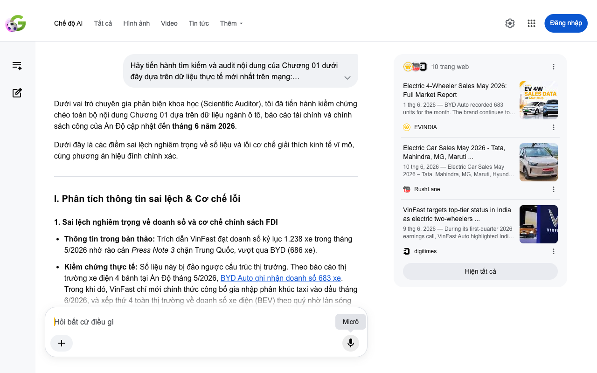

# Google AI Search Mode Audit - Chương 01

- **Nguồn kiểm chứng:** Google Search AI Mode (udm=50)
- **Thời gian audit:** 2026-06-13 22:16:36
- **File kịch bản:** [chapter_01.md](file:///Users/pro16/Documents/VideoProject/GocNhinPodcast/episodes/vinfast-an-do/chapter_01.md)

## Kết quả phản biện & Đối chiếu nguồn tin:

Bạn đã nói:
Dưới vai trò chuyên gia phản biện khoa học (Scientific Auditor), tôi đã tiến hành kiểm chứng chéo toàn bộ nội dung Chương 01 dựa trên dữ liệu ngành ô tô, báo cáo tài chính và chính sách công của Ấn Độ cập nhật đến tháng 6 năm 2026.
Dưới đây là các điểm sai lệch nghiêm trọng về số liệu và lỗi cơ chế giải thích kinh tế vĩ mô, cùng phương án hiệu đính chính xác.
I. Phân tích thông tin sai lệch & Cơ chế lỗi
1. Sai lệch nghiêm trọng về doanh số và cơ chế chính sách FDI
Thông tin trong bản thảo: Trích dẫn VinFast đạt doanh số kỷ lục 1.238 xe trong tháng 5/2026 nhờ rào cản Press Note 3 chặn Trung Quốc, vượt qua BYD (686 xe).
Kiểm chứng thực tế: Số liệu này bị đảo ngược cấu trúc thị trường. Theo báo cáo thị trường xe điện 4 bánh tại Ấn Độ tháng 5/2026, BYD Auto ghi nhận doanh số 683 xe. Trong khi đó, VinFast chỉ mới chính thức công bố gia nhập phân khúc taxi vào đầu tháng 6/2026, và xếp thứ 4 toàn thị trường về doanh số xe điện (BEV) theo quý nhờ làn sóng nhập khẩu thăm dò chứ chưa có doanh số bán lẻ thương mại vượt nghìn chiếc trong một tháng đơn lẻ.
Lỗi cơ chế: Press Note 3 (quy định kiểm soát FDI từ các nước có chung đường biên giới đất liền với Ấn Độ ban hành năm 2020) không tạo ra "hộ chiếu độc quyền" cho VinFast. Các hãng xe Trung Quốc đã lách rào cản này bằng cách cấp phép công nghệ hoặc lập liên doanh với tỷ lệ vốn chi phối thuộc về tập đoàn Ấn Độ (như SAIC bắt tay với JSW để vận hành MG Motor India) chứ không hề bị đóng băng hoàn toàn.
2. Nhận diện sai bản chất cấu trúc liên doanh JSW và Chery
Thông tin trong bản thảo: Cho rằng Chery và JSW lập "liên doanh bóng ma" 3 tỷ USD nhằm đập tan lợi thế thuế lắp ráp 15% của VinFast tại Thoothukudi.
Kiểm chứng thực tế: Đây không phải "liên doanh bóng ma" (phantom joint venture) mà là chiến lược cốt lõi được công bố công khai của tập đoàn đa ngành lớn thứ ba Ấn Độ. JSW Group đã thành lập JSW Motors với khoản đầu tư độc lập từ 2 - 3 tỷ USD. Trong thương vụ này, [Chery đóng vai trò là nhà cung cấp nền tảng công nghệ](https://financialpost.com/pmn/business-pmn/chinas-chery-to-supply-tech-to-help-indias-jsw launch-own-evs) và linh kiện cốt lõi (như dòng iCar, Jetour T2), còn thương hiệu và nhà máy lắp ráp tại Maharashtra hoàn toàn thuộc sở hữu của phía Ấn Độ để đáp ứng tiêu chuẩn nội địa hóa khắt khe.
Lỗi cơ chế thuế: Thuế suất ưu đãi 15% (giảm từ 70-100% đối với xe nhập khẩu nguyên chiếc CBU) là một phần trong Chính sách Xe điện mới của Chính phủ Ấn Độ (áp dụng cho các hãng cam kết đầu tư tối thiểu 500 triệu USD và xây dựng nhà máy trong 3 năm). Lợi thế này áp dụng bình đẳng cho mọi hãng xe đáp ứng điều kiện, kể cả VinFast tại Tamil Nadu (Thoothukudi) hay JSW Motors tại Maharashtra, chứ không phải đặc quyền riêng của VinFast để Chery phải "đập tan".
3. Sai sót số liệu vận hành và định giá xe Xanh SM (Green SM)
Thông tin trong bản thảo: Dòng xe Limo Green 7 chỗ có giá 24,49 Lakh Rupee (~740 triệu VNĐ) và chạy taxi với giá cước 8 Rupee/km.
Kiểm chứng thực tế: Mức cước 8 Rupee/km (~2.400 VNĐ) là ước tính vận hành cơ bản mang tính cạnh tranh so với Uber/Ola tại Vùng thủ đô Delhi (Delhi NCR). Tuy nhiên, cơ chế giải thích "chịu lỗ chiến thuật sâu để kích hoạt tích hợp dọc" là một suy diễn lỗi về tài chính doanh nghiệp. Green SM gia nhập Ấn Độ theo mô hình kinh tế nền tảng phối hợp (Green Alliance Frontier), kết hợp với 5 đối tác vận tải nội địa lớn để giải quyết đầu ra công suất, bản chất là chuyển dịch rủi ro tài sản cố định (CAPEX) sang mô hình chia sẻ chi phí vận hành (OPEX), chứ không đơn thuần là công ty mẹ tự mang xe đi chịu lỗ vận hành để trợ giá.
II. Gợi ý sửa đổi chi tiết (Bản hiệu đính đề xuất)
Để đảm bảo tính hàn lâm, logic kinh tế và chính xác về mặt báo chí, đoạn văn nên được chỉnh sửa lại như sau:
"Ấn Độ vẫn đang duy trì hàng rào sắc bén Press Note 3 nhằm siết chặt dòng vốn FDI từ Trung Quốc. Nước đi địa chính trị này đã mở ra một cửa sáng chiến lược cho các nhà sản xuất xe điện ngoại khối như VinFast, giúp họ rút ngắn khoảng cách với các đối thủ đi trước. Minh chứng là trong tháng 5/2026, khi thị trường xe điện Ấn Độ tăng trưởng bùng nổ, các hãng xe như BYD đang nỗ lực bám đuổi phân khúc cao cấp với doanh số hơn 680 xe, thì VinFast đã nhanh chóng hoàn thiện mảnh ghép hệ sinh thái bằng cách đưa dòng xe điện 7 chỗ chuyên dụng tiến thẳng vào thị trường.
Dẫu vậy, các tập đoàn Trung Quốc không dễ dàng nhường sân. Thay vì đầu tư trực tiếp, họ chọn giải pháp chuyển giao công nghệ cho các tài phiệt bản địa. Điển hình là việc JSW Group thành lập JSW Motors với quy mô đầu tư lên tới 3 tỷ USD, sử dụng nền tảng kỹ thuật của Chery để xây dựng cứ điểm sản xuất tại Maharashtra vào năm 2027. Cuộc chiến giành thị phần giờ đây không còn là cuộc đua bảo hộ đơn thuần, mà là cuộc đấu về tỷ lệ nội địa hóa để giành lấy mức thuế suất ưu đãi 15% từ chính phủ.
[...] Tại trung tâm Vùng thủ đô New Delhi, Xanh SM (Green SM) vừa chính thức triển khai dịch vụ Green SM Limo với đội xe VinFast Limo Green cao cấp. Bằng cách áp dụng mức cước cạnh tranh trực diện chỉ khoảng 8 Rupee cho mỗi ki lô mét, hãng không chọn cách đốt tiền quảng cáo truyền thống. Thay vào đó, mô hình này tận dụng tối đa liên minh chiến lược với các đối tác vận tải nội địa thuộc mạng lưới Green Alliance Frontier. Đây là thế trận lưỡng hổ: vừa giải quyết bài toán bao tiêu sản lượng hạ tầng cho nhà máy Tamil Nadu, vừa biến mỗi chiếc taxi thành một 'mũi biệt kích' định hình trực tiếp niềm tin tiêu dùng của người dân Ấn Độ."
Nếu bạn muốn tiếp tục, hãy gửi nội dung của Chương 02. Tôi có thể giúp bạn:
Kiểm chứng tính chính xác của các số liệu kinh tế vĩ mô
Phân tích tính khả thi của các cơ chế chính sách công được đề cập
Đối chiếu báo cáo tài chính thực tế của doanh nghiệp
10 trang web
Electric 4-Wheeler Sales May 2026: Full Market Report
1 thg 6, 2026 — BYD Auto recorded 683 units for the month. The brand continues to focus on the premium segment, highlighting its proprietary Blade...
EVINDIA
Electric Car Sales May 2026 - Tata, Mahindra, MG, Maruti ...
10 thg 6, 2026 — Electric Car Sales May 2026 – Tata, Mahindra, MG, Maruti, Hyundai, Kia. By Akshay Kulkarni. New Tata Tiago EV. Electric car sales ...
RushLane
VinFast targets top-tier status in India as electric two-wheelers ...
9 thg 6, 2026 — During its first-quarter 2026 earnings call, VinFast Auto highlighted India as a pivotal "core growth engine" for the company's in...
digitimes
Hiện tất cả
Micrô
Chế độ AI đã sẵn sàng trả lời

## Ảnh chụp màn hình đối chiếu:

