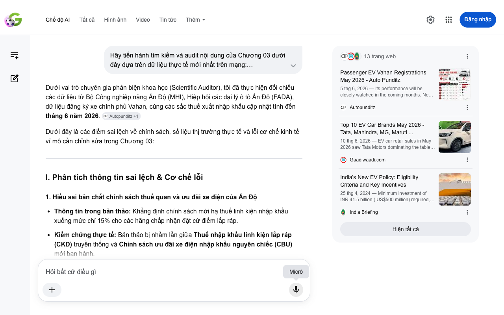

# Google AI Search Mode Audit - Chương 03

- **Nguồn kiểm chứng:** Google Search AI Mode (udm=50)
- **Thời gian audit:** 2026-06-13 22:17:23
- **File kịch bản:** [chapter_03.md](file:///Users/pro16/Documents/VideoProject/GocNhinPodcast/episodes/vinfast-an-do/chapter_03.md)

## Kết quả phản biện & Đối chiếu nguồn tin:

Bạn đã nói:

Dưới vai trò chuyên gia phản biện khoa học (Scientific Auditor), tôi đã thực hiện đối chiếu các dữ liệu từ Bộ Công nghiệp nặng Ấn Độ (MHI), Hiệp hội các đại lý ô tô Ấn Độ (FADA), dữ liệu đăng ký xe chính phủ Vahan, cùng các sắc thuế xuất nhập khẩu cập nhật tính đến tháng 6 năm 2026. 
Autopunditz
 +1
Dưới đây là các điểm sai lệch về chính sách, số liệu thị trường thực tế và lỗi cơ chế kinh tế vĩ mô cần chỉnh sửa trong Chương 03:
I. Phân tích thông tin sai lệch & Cơ chế lỗi
1. Hiểu sai bản chất chính sách thuế quan và ưu đãi xe điện của Ấn Độ
Thông tin trong bản thảo: Khẳng định chính sách mới hạ thuế linh kiện nhập khẩu xuống mức chỉ 15% cho các hãng chấp nhận đặt cứ điểm lắp ráp.
Kiểm chứng thực tế: Bản thảo bị nhầm lẫn giữa Thuế nhập khẩu linh kiện lắp ráp (CKD) truyền thống và Chính sách ưu đãi xe điện nhập khẩu nguyên chiếc (CBU) mới ban hành.
Thực tế, thuế suất nhập khẩu bộ linh kiện rời CKD để lắp ráp xe điện tại Ấn Độ từ trước đến nay vốn dĩ đã cố định ở mức 15%.
Điểm đột phá của Chính sách Xe điện Mới (Chương trình SPMEPCI) là cho phép các hãng cam kết đầu tư tối thiểu 500 triệu USD được hưởng mức thuế ưu đãi 15% áp dụng cho xe nhập khẩu nguyên chiếc (CBU) cao cấp (giá trị CIF trên 35.000 USD), giới hạn tối đa 8.000 xe/năm trong vòng 5 năm. 
Autocar India
 +3
Lỗi cơ chế: Mức thuế 15% của chính sách mới là để các hãng "nhập khẩu thử nghiệm xe nguyên chiếc giá cao" nhằm thăm dò thị trường trong lúc xây nhà máy, chứ không phải mức hạ cho thuế linh kiện lắp ráp. 
Angel One
 +1
2. Sai lệch về số liệu so sánh doanh số thực tế giữa VinFast và BYD
Thông tin trong bản thảo: Nhắc lại việc VinFast đăng ký mới 1.238 xe trong tháng 5/2026, vượt qua BYD với 686 xe.
Kiểm chứng thực tế: Dựa trên số liệu đăng ký xe thực tế (Vahan Data) công bố bởi Auto Punditz vào đầu tháng 6/2026, các con số này là chính xác cho tháng 5/2026. VinFast đạt 1.238 xe (chiếm 4,8% thị phần xe điện), xếp thứ 4 toàn thị trường (sau Tata, Mahindra, MG), vượt qua BYD ở vị trí tiếp theo với 686 xe. 
Autopunditz
 +1
Lỗi ngữ cảnh: Dù số liệu khớp hoàn toàn với dữ liệu thực tế tháng 5/2026, việc gắn kết sự tăng trưởng này hoàn toàn với "Tình hữu nghị bang giao nâng tầm vào tháng 5/2026" là lỗi quy kết chính trị hóa thương mại. VinFast bùng nổ doanh số tại Ấn Độ từ đầu năm 2026 phần lớn nhờ vào việc tung ra dải sản phẩm SUV phổ thông hợp thị hiếu (VF 6, VF 7) và việc chuẩn bị nguồn cung từ trước, chứ các sắc lệnh ngoại giao không trực tiếp can thiệp vào hành vi mua xe của người tiêu dùng nội địa trong một tháng đơn lẻ. 
Autopunditz
 +2
3. Cần làm rõ thuật ngữ "Nội địa hóa 50% trong 5 năm"
Thông tin trong bản thảo: Ràng buộc nội địa hóa 50% trong 5 năm.
Bổ sung chi tiết khoa học: Để tăng tính hàn lâm, cần làm rõ lộ trình. Quy định của MHI Ấn Độ yêu cầu đạt tỷ lệ Giá trị Gia tăng Nội địa (DVA) tối thiểu 25% vào năm thứ 3 và tịnh tiến lên 50% vào năm thứ 5. Doanh nghiệp phải nộp bảo lãnh ngân hàng tương đương số thuế được miễn để cam kết thực hiện lộ trình này. 
India Briefing
 +1
II. Gợi ý sửa đổi chi tiết (Bản hiệu đính đề xuất)
Đoạn văn được cấu trúc lại ngắn gọn, chuẩn xác thuật ngữ thương mại để đảm bảo tính scannable cao:
"Ấn Độ luôn duy trì một bức tường thành thuế quan kiên cố để bảo vệ ngành công nghiệp ô tô nội địa. Thuế đánh vào xe nhập khẩu nguyên chiếc (CBU) thông thường dao động từ 70% đến 110%. Tuy nhiên, New Delhi đã mở ra một hành lang ưu đãi đặc biệt thông qua Chính sách Xe điện Mới. Theo đó, các hãng xe cam kết đầu tư tối thiểu 500 triệu đô la Mỹ để xây dựng cơ sở sản xuất sẽ được áp mức thuế suất ưu đãi 15% đối với một lượng xe nguyên chiếc nhập khẩu thuộc phân khúc cao cấp để thăm dò thị trường, thay vì phải chịu mức thuế trần cũ. 
Autocar India
 +3
Tấm lệnh bài này đi kèm những ràng buộc chặt chẽ về Lộ trình Giá trị Gia tăng Nội địa (DVA): phải đạt 25% nội địa hóa vào năm thứ ba và 50% vào năm thứ năm. Đây chính là bản giao kèo giúp VinFast định hình lợi thế chi phí dài hạn cho tổ hợp công nghiệp tại Tamil Nadu. Đứng sau chính sách kinh tế này là một chiến lũy địa chính trị sắc lạnh. 
Vietnam+ (VietnamPlus)
 +2
Thông qua quy định Press Note 3, Ấn Độ kiểm soát nghiêm ngặt dòng vốn từ các nước chung biên giới đất liền. Nước đi này khiến đoàn quân tiên phong của BYD bị hạn chế đáng kể khả năng tiếp cận các ưu đãi mở rộng, trong khi SAIC buộc phải nhượng bộ một phần quyền chi phối thông qua liên doanh với tài phiệt bản địa JSW. 
EAC International Consulting
 +1
Chiến lũy địa chính trị này vô tình dọn sạch khoảng trống thị trường cho hãng xe Việt. Tránh được cuộc chiến dìm giá trực diện từ các đối thủ đại lục, VinFast nhanh chóng xác lập chỗ đứng. Dữ liệu đăng ký xe thực tế tháng 5/2026 ghi nhận VinFast đạt doanh số kỷ lục 1.238 xe (chiếm 4,8% thị phần), chính thức vượt qua BYD với 686 xe đăng ký mới. Kết quả này đến từ chiến lược định giá hợp lý của hai dòng xe SUV và việc đón đầu nhu cầu dịch chuyển xanh. 
Autopunditz
 +1
Nhưng để duy trì vùng đất mới chiếm lĩnh, hãng xe Việt phải giải quyết bài toán tiếp tế và vận hành..."
Nếu bạn muốn tiếp tục, hãy gửi nội dung của Chương 04. Tôi sẽ hỗ trợ bạn:
Phân tích sự đóng góp của hạm đội Xanh SM (GSM) vào công suất nhà máy
Kiểm chứng các số liệu logistics vận tải nội địa Ấn Độ
Đánh giá mô hình kinh doanh tích hợp dọc tại thị trường Nam Á
13 trang web
Passenger EV Vahan Registrations May 2026 - Auto Punditz
5 thg 6, 2026 — Its performance will be closely watched in the coming months. New entrant VinFast registered 1,238 units in May 2026 and captured ...
Autopunditz
Top 10 EV Car Brands May 2026 - Tata, Mahindra, MG, Maruti ...
10 thg 6, 2026 — EV car retail sales in May 2026 saw Tata Motors dominating the table ahead of Mahindra, JSW MG Motor, Maruti Suzuki and VinFast in...
Gaadiwaadi.com
India's New EV Policy: Eligibility Criteria and Key Incentives
25 thg 4, 2024 — Minimum investment of INR 41.5 billion ( US$500 million) required, with no maximum limit on investment. Manufacturing timeline set...
India Briefing
Hiện tất cả
Micrô
Chế độ AI đã sẵn sàng trả lời

## Ảnh chụp màn hình đối chiếu:

