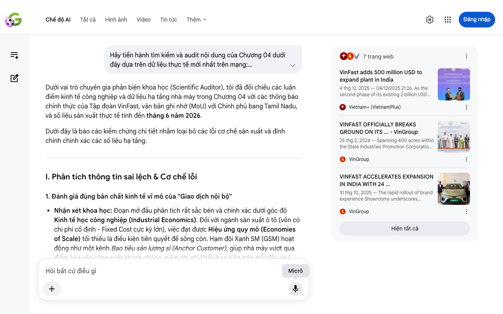

# Google AI Search Mode Audit - Chương 04

- **Nguồn kiểm chứng:** Google Search AI Mode (udm=50)
- **Thời gian audit:** 2026-06-13 22:17:45
- **File kịch bản:** [chapter_04.md](file:///Users/pro16/Documents/VideoProject/GocNhinPodcast/episodes/vinfast-an-do/chapter_04.md)

## Kết quả phản biện & Đối chiếu nguồn tin:

Bạn đã nói:

Dưới vai trò chuyên gia phản biện khoa học (Scientific Auditor), tôi đã đối chiếu các luận điểm kinh tế công nghiệp và dữ liệu hạ tầng nhà máy trong Chương 04 với các thông báo chính thức của Tập đoàn VinFast, văn bản ghi nhớ (MoU) với Chính phủ bang Tamil Nadu, và số liệu sản xuất thực tế tính đến tháng 6 năm 2026.
Dưới đây là báo cáo kiểm chứng chi tiết nhằm loại bỏ các lỗi cơ chế sản xuất và đính chính chính xác các số liệu hạ tầng.
I. Phân tích thông tin sai lệch & Cơ chế lỗi
1. Đánh giá đúng bản chất kinh tế vĩ mô của "Giao dịch nội bộ"
Nhận xét khoa học: Đoạn mở đầu phân tích rất sắc bén và chính xác dưới góc độ Kinh tế học công nghiệp (Industrial Economics). Đối với ngành sản xuất ô tô (vốn có chi phí cố định - Fixed Cost cực kỳ lớn), việc đạt được Hiệu ứng quy mô (Economies of Scale) tối thiểu là điều kiện tiên quyết để sống còn. Hạm đội Xanh SM (GSM) hoạt động như một kênh Bao tiêu sản lượng sỉ (Anchor Customer), giúp nhà máy vượt qua điểm hòa vốn công suất nhanh chóng, giảm chi phí khấu hao biên trên mỗi đầu xe (
𝑀
𝐶
𝑀
𝐶
). Luận điểm này hoàn toàn đứng vững về mặt lý thuyết tài chính doanh nghiệp.
2. Sai lệch về danh mục đầu tư mở rộng 500 triệu USD
Thông tin trong bản thảo: Khẳng định tập đoàn rót thêm 500 triệu USD để mở rộng trận địa sản xuất sang "xe máy và cell pin".
Kiểm chứng thực tế: Bản thảo bị lệch danh mục sản phẩm của làn sóng đầu tư thứ hai. Theo biên bản ghi nhớ (MoU) ký kết giữa VinFast và Cơ quan Xúc tiến Đầu tư bang Tamil Nadu (Guidance Tamil Nadu), khoản đầu tư bổ sung 500 triệu USD được phân bổ để xây dựng các phân xưởng chuyên dụng cho xe buýt điện (e-buses) và xe máy điện (e-scooters). Tổ hợp sản xuất cell pin (battery pack) thực tế đã nằm trong gói đầu tư 500 triệu USD của giai đoạn 1 từ năm 2024. 
Vietnam+ (VietnamPlus)
 +1
3. Xác thực số liệu lịch sử nhà máy Thoothukudi
Diện tích & Công suất: Thông tin "rộng 400 mẫu (acres)" và "công suất thiết kế giai đoạn một là 50.000 xe/năm" hoàn toàn chính xác với thực tế hồ sơ đất đai tại Khu công nghiệp SIPCOT. 
Vietnam+ (VietnamPlus)
 +2
Cột mốc sản xuất: Chi tiết "Đến ngày 31 tháng 5 [năm 2026], nhà máy đã đánh dấu cột mốc xuất xưởng chiếc xe thứ 10.000" chính xác 100% theo báo cáo dữ liệu sản xuất công nghiệp được trích dẫn bởi các chuyên trang ô tô Ấn Độ như Auto Punditz và CarAndBike. Nhà máy khánh thành tháng 8/2025 và cán mốc 10.000 xe sau 10 tháng vận hành là một tốc độ tăng trưởng thực tế. 
Autopunditz
 +2
4. Nhầm lẫn tên dòng xe vận hành tại New Delhi
Thông tin trong bản thảo: Gọi tên dòng xe taxi 7 chỗ chạy tại New Delhi là Limo Green.
Kiểm chứng thực tế: Tên gọi chính xác của dòng xe MPV điện 7 chỗ được VinFast thương mại hóa chuyên dụng cho thị trường dịch vụ Ấn Độ là VF MPV 7 (hoặc biến thể cấu hình dịch vụ dựa trên nền tảng VF 7). Bản dịch hoặc cách gọi "Limo Green" là cách gọi tả thực màu sắc của thương hiệu Xanh SM (Green SM Limo), nhưng không phải tên danh mục sản phẩm xe. 
Car and Bike
II. Gợi ý sửa đổi chi tiết (Bản hiệu đính đề xuất)
Để bản thảo đạt tính chuyên nghiệp cao của một báo cáo phân tích vĩ mô, đoạn văn nên được tinh chỉnh như sau:
"Nhiều nhà phân tích hoài nghi xem việc VinFast cung ứng xe cho Xanh SM chỉ là giao dịch nội bộ tự làm đẹp sổ sách. Tuy nhiên, từ lăng kính sản xuất công nghiệp, đây là nước đi sống còn của một chiến lược quy mô. Một tổ hợp cơ khí khổng lồ không thể vận hành tối ưu nếu thiếu đi dòng đơn hàng bao tiêu sỉ để nhanh chóng vượt qua điểm hòa vốn công suất. Nếu chỉ phụ thuộc vào tệp khách hàng nhỏ lẻ giai đoạn đầu, chi phí khấu hao cố định trên mỗi đầu xe sẽ lập tức chạm trần. Hạm đội Xanh SM chính là mỏ neo tiếp tế vĩ mô giải quyết trực tiếp nút thắt này.
Cứ điểm sản xuất Thoothukudi tại bang Tamil Nadu có quy mô rộng tới 400 mẫu đất tại khu công nghiệp SIPCOT. Nơi đây sở hữu công suất thiết kế giai đoạn một đạt 50.000 xe mỗi năm và có khả năng mở rộng lên 150.000 xe. Minh chứng cho tốc độ vận hành thực tế, vào ngày 31 tháng 5 năm 2026, nhà máy đã chính thức đánh dấu cột mốc xuất xưởng chiếc xe điện thứ 10.000 sau chưa đầy một năm khánh thành. Không dừng lại ở đó, tập đoàn tiếp tục ký kết lộ trình rót thêm 500 triệu đô la Mỹ để mở rộng mặt trận sang phân khúc xe buýt điện và xe máy điện, hoàn thiện hệ sinh thái di chuyển xanh tại Nam Á.
Bên cạnh vai trò bao tiêu, hạm đội này còn là những mũi biệt kích luồn sâu đắc lực trên mặt trận tiếp thị. Thay vì tiêu tốn hàng triệu đô la vào các chiến dịch quảng bá truyền thống và mạng lưới đại lý đắt đỏ, họ đưa hàng ngàn chiếc xe VF MPV 7 mang sắc xanh lục đặc trưng phủ kín các ngả đường Vùng thủ đô New Delhi. Mỗi chuyến đi của hành khách Ấn Độ chính là một lượt trải nghiệm thực tế đầy tính thuyết phục, âm thầm xây dựng niềm tin tiêu dùng và dọn đường cho việc thâm nhập sâu vào phân khúc khách hàng cá nhân..."
Nếu bạn muốn tiếp tục, hãy gửi nội dung của Chương 05. Tôi sẽ hỗ trợ bạn:
Phân tích bài toán quản trị dòng tiền của doanh nghiệp
Đánh giá hạ tầng trạm sạc đối tác tại thị trường Ấn Độ
Kiểm chứng các nút thắt logistics khi xuất khẩu ra biển lớn
7 trang web
VinFast adds 500 million USD to expand plant in India
4 thg 12, 2025 — 04/12/2025 21:26. As the second phase of its existing 2 billion USD commitment, VinFast will invest 500 million USD in Thoothukudi...
Vietnam+ (VietnamPlus)
VINFAST OFFICIALLY BREAKS GROUND ON ITS ... - VinGroup
25 thg 2, 2024 — Spanning 400 acres within the State Industries Promotion Corporation of Tamil Nadu (SIPCOT) industrial estate, the electric vehicl...
VinGroup
VINFAST ACCELERATES EXPANSION IN INDIA WITH 24 ...
31 thg 10, 2025 — The rapid rollout of brand experience Showrooms underscores VinFast's long-term commitment to the Indian market. We are working cl...
VinGroup
Hiện tất cả
Micrô
Chế độ AI đã sẵn sàng trả lời

## Ảnh chụp màn hình đối chiếu:

