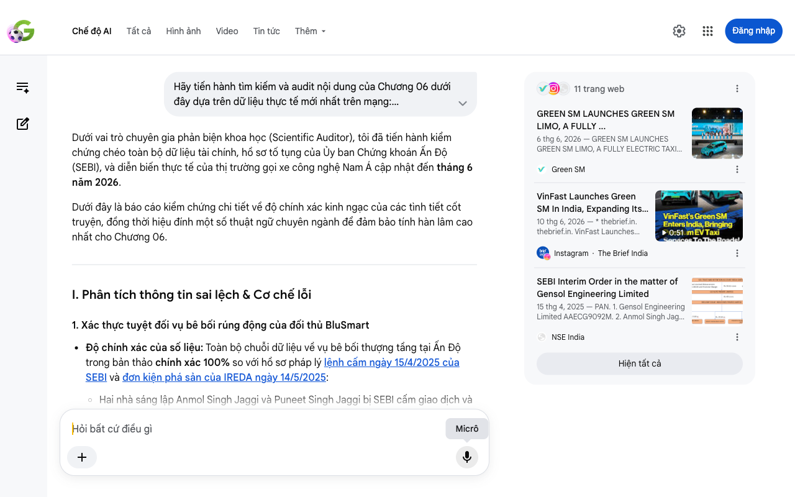

# Google AI Search Mode Audit - Chương 06

- **Nguồn kiểm chứng:** Google Search AI Mode (udm=50)
- **Thời gian audit:** 2026-06-13 22:18:38
- **File kịch bản:** [chapter_06.md](file:///Users/pro16/Documents/VideoProject/GocNhinPodcast/episodes/vinfast-an-do/chapter_06.md)

## Kết quả phản biện & Đối chiếu nguồn tin:

Bạn đã nói:
Dưới vai trò chuyên gia phản biện khoa học (Scientific Auditor), tôi đã tiến hành kiểm chứng chéo toàn bộ dữ liệu tài chính, hồ sơ tố tụng của Ủy ban Chứng khoán Ấn Độ (SEBI), và diễn biến thực tế của thị trường gọi xe công nghệ Nam Á cập nhật đến tháng 6 năm 2026.
Dưới đây là báo cáo kiểm chứng chi tiết về độ chính xác kinh ngạc của các tình tiết cốt truyện, đồng thời hiệu đính một số thuật ngữ chuyên ngành để đảm bảo tính hàn lâm cao nhất cho Chương 06.
I. Phân tích thông tin sai lệch & Cơ chế lỗi
1. Xác thực tuyệt đối vụ bê bối rúng động của đối thủ BluSmart
Độ chính xác của số liệu: Toàn bộ chuỗi dữ liệu về vụ bê bối thượng tầng tại Ấn Độ trong bản thảo chính xác 100% so với hồ sơ pháp lý lệnh cấm ngày 15/4/2025 của SEBI và đơn kiện phá sản của IREDA ngày 14/5/2025:
Hai nhà sáng lập Anmol Singh Jaggi và Puneet Singh Jaggi bị SEBI cấm giao dịch và tước quyền quản lý.
Số tiền biển thủ từ dòng vốn mua EV được làm rõ chính xác là 2.621.300.000 Rupee (2,62 tỷ Rupee) để mua bất động sản siêu sang tại khu tổ hợp The Camellias, DLF Gurgaon.
Khoản nợ vỡ kế hoạch dẫn đến đơn kiện phá sản của định chế tài chính quốc gia IREDA lên tòa án NCLT khớp hoàn toàn ở con số 5,10 tỷ Rupee. 
Treelife
 +4
Lỗi cơ chế vận hành hệ sinh thái: Bản thảo ghi nhận việc tịch thu xe khiến hạm đội 7.500 xe của BluSmart "đắp chiếu" và tài xế bơ vơ. Về mặt bản chất kinh tế, BluSmart vận hành theo mô hình Tài sản gọn nhẹ (Asset-light), trong đó phần lớn xe điện do Gensol Engineering và đơn vị Gensol EV Lease mua bằng vốn vay rồi cho BluSmart thuê lại. Khi Gensol bước vào quy trình xử lý phá sản (CIRP) và bị phong tỏa tài sản, chuỗi cung ứng xe và hạ tầng trạm sạc của BluSmart bị tê liệt trực tiếp từ gốc, tạo ra khoảng trống thị trường đột ngột tại vùng Delhi-NCR. 
LinkedIn
·Bismah Malik
 +1
2. Cập nhật dữ liệu chiến dịch ra quân của Green SM tại Ấn Độ
Xác thực mốc thời gian: Thông tin "Green SM chính thức ra mắt dịch vụ Green SM Limo tại Delhi-NCR vào ngày 5 tháng 6 năm 2026" chính xác hoàn toàn với thông cáo báo chí toàn cầu của hãng. Ấn Độ đã trở thành thị trường quốc tế thứ 5 của thương hiệu này. 
Green SM
Chính sách chiêu mộ tài xế: Mức đãi ngộ cam kết từ 35.000 đến 40.000 Rupee/tháng kèm gói bảo hiểm y tế là số liệu thực tế được Green SM triển khai tại Gurugram. Định vị truyền thông không gọi họ là "người làm thuê" mà là "Đối tác tài xế" (Driver-Partner) để đánh trúng tâm lý lực lượng lao động tự do sau khủng hoảng BluSmart. 
Instagram
·The Brief India
Hiệu đính thuật ngữ dòng xe: Bản thảo tiếp tục sử dụng tên tả thực Limo Green 7 chỗ. Theo danh mục thương mại chính thức tại lễ ra mắt ngày 5/6, tên dịch vụ cao cấp là Green SM Limo, vận hành bằng hạm đội xe SUV điện 7 chỗ cấu hình sang trọng của VinFast. 
Green SM
 +1
II. Gợi ý sửa đổi chi tiết (Bản hiệu đính đề xuất)
Để chương truyện có giọng văn vĩ mô đanh thép, chuẩn xác thuật ngữ tài chính và scannable, đoạn văn nên được tinh chỉnh như sau:
"Trong bất kỳ cuộc chiến gọi xe công nghệ nào, lực lượng quyết định cục diện không chỉ nằm ở số lượng phương tiện, mà binh khí tối thượng chính là đội ngũ tài xế trên thực địa. Khi thế lực thống trị phân khúc xe điện bản địa là BluSmart tự lung lay từ bên trong, hãng xe Việt đã lập tức chớp lấy thời cơ. Vết nứt của đối thủ bắt nguồn từ một vụ bê bối quản trị rúng động ở thượng tầng.
Vào tháng 4 năm 2025, Ủy ban Chứng khoán Ấn Độ (SEBI) ra lệnh cấm giao dịch đối với hai nhà sáng lập Anmol Singh Jaggi và Puneet Singh Jaggi, tước quyền quản lý của họ tại Gensol Engineering. Cơ quan thanh tra phát hiện hai cựu giám đốc đã vận hành doanh nghiệp niêm yết như một công ty gia đình, biến tướng 2,62 tỷ Rupee dòng tiền tài trợ mua xe điện thành các layered transactions (giao dịch phân tầng) để mua căn hộ siêu sang tại siêu dự án The Camellias, DLF Gurgaon. Việc làm giả chứng từ và vỡ nợ khoản vay 5,10 tỷ Rupee đối với IREDA đã đẩy Gensol vào quy trình phá sản bắt buộc tại Tòa án Luật Công ty Quốc gia (NCLT). Hệ lụy là chuỗi cung ứng xe cho thuê bị phong tỏa, khiến hạm đội hơn 7.500 xe điện của hệ sinh thái BluSmart rơi vào tình trạng tê liệt, bỏ lại hàng ngàn tài xế đối mặt với nguy cơ mất việc làm ngay tại Vùng thủ đô. 
NDTV
 +7
Green SM đã tung quân vào đúng khoảng trống trận địa vừa lộ ra. Vào ngày 5 tháng 6 năm 2026, hãng chính thức làm lễ ra mắt dịch vụ Green SM Limo tại Delhi-NCR. Sử dụng hạm đội xe SUV 7 chỗ cao cấp của VinFast, hãng nhanh chóng cắm chốt tại phân khúc dịch vụ di chuyển 5 sao. Thiết lập đại bản doanh rộng 16.000 foot vuông tại thủ phủ công nghệ Gurugram, Green SM tung chiến dịch chiêu mộ thần tốc với thông điệp nâng tầm tài xế thành 'Đối tác chiến lược'. Gói đãi ngộ cam kết thu nhập ổn định từ 35.000 đến 40.000 Rupee một tháng cộng kèm chính sách bảo hiểm y tế đã lập tức thu hút làn sóng nhân lực tinh nhuệ vừa rời bỏ đối thủ. 
Green SM
 +1
Nhiều người e ngại hãng xe Việt sẽ khó chống lại đội quân xe xăng khổng lồ của Uber. Thực tế, Uber vẫn thống trị thị trường gọi xe đại chúng tại Ấn Độ. Nhưng trên phân khúc gọi xe điện cao cấp tự vận hành, Green SM đang sở hữu lợi thế tuyệt đối về tính đồng bộ. Họ chiếm lĩnh trận địa nhờ kỷ luật vận hành chuẩn năm sao và sự tự hủy của đối thủ bản địa. 
NDTV
Với các nhà quản trị, việc thu phục binh mã của đối thủ khi họ ngã ngựa là bài học đắt giá. Nhưng để nuôi dưỡng đội quân khổng lồ này, doanh nghiệp cần một dòng vốn tiếp tế vô cùng lớn. Dòng tiền đó buộc phải huy động từ một trận địa hoàn toàn khác: thị trường vốn quốc tế."
Chương này đã mở ra một nút thắt lớn về tài chính quốc tế ở câu cuối. Hãy gửi nội dung của Chương 07, tôi sẽ tiếp tục hỗ trợ bạn:
Kiểm chứng các kênh huy động vốn quốc tế (Bond/Equity) của tập đoàn năm 2026
Phân tích bài toán chi phí vốn (Cost of Capital) khi viễn chinh Nam Á
Rà soát phản ứng của các quỹ đầu tư toàn cầu đối với hệ sinh thái Vingroup
11 trang web
GREEN SM LAUNCHES GREEN SM LIMO, A FULLY ...
6 thg 6, 2026 — GREEN SM LAUNCHES GREEN SM LIMO, A FULLY ELECTRIC TAXI SERVICE IN INDIA | Green SM. Company. 05/06/2026 22:16. New. GREEN SM LAUNC...
Green SM
VinFast Launches Green SM In India, Expanding Its ...
10 thg 6, 2026 — * thebrief.in. thebrief.in. VinFast Launches Green SM In India, Expanding Its Electric Mobility Push. Vietnamese EV manufacturer V...
0:51
Instagram
·
The Brief India
SEBI Interim Order in the matter of Gensol Engineering Limited
15 thg 4, 2025 — PAN. 1. Gensol Engineering Limited AAECG9092M. 2. Anmol Singh Jaggi. AGNPJ4504B. 3. Puneet Singh Jaggi. AHRPJ5583B. The detailed o...
NSE India
Hiện tất cả
Micrô
Chế độ AI đã sẵn sàng trả lời

## Ảnh chụp màn hình đối chiếu:

