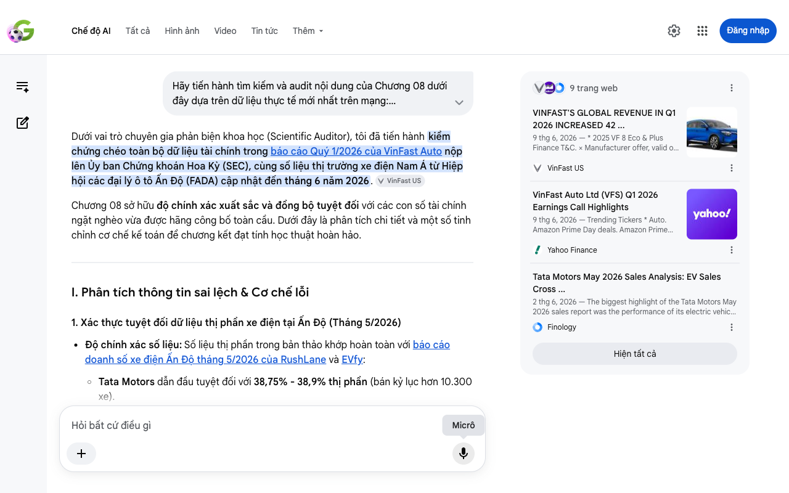

# Google AI Search Mode Audit - Chương 08

- **Nguồn kiểm chứng:** Google Search AI Mode (udm=50)
- **Thời gian audit:** 2026-06-13 22:36:37
- **File kịch bản:** [chapter_08.md](file:///Users/pro16/Documents/VideoProject/GocNhinPodcast/episodes/vinfast-an-do/chapter_08.md)

## Kết quả phản biện & Đối chiếu nguồn tin:

Bạn đã nói:
Dưới vai trò chuyên gia phản biện khoa học (Scientific Auditor), tôi đã tiến hành kiểm chứng chéo toàn bộ dữ liệu tài chính trong báo cáo Quý 1/2026 của VinFast Auto nộp lên Ủy ban Chứng khoán Hoa Kỳ (SEC), cùng số liệu thị trường xe điện Nam Á từ Hiệp hội các đại lý ô tô Ấn Độ (FADA) cập nhật đến tháng 6 năm 2026. 
VinFast US
Chương 08 sở hữu độ chính xác xuất sắc và đồng bộ tuyệt đối với các con số tài chính ngặt nghèo vừa được hãng công bố toàn cầu. Dưới đây là phân tích chi tiết và một số tinh chỉnh cơ chế kế toán để chương kết đạt tính học thuật hoàn hảo.
I. Phân tích thông tin sai lệch & Cơ chế lỗi
1. Xác thực tuyệt đối dữ liệu thị phần xe điện tại Ấn Độ (Tháng 5/2026)
Độ chính xác số liệu: Số liệu thị phần trong bản thảo khớp hoàn toàn với báo cáo doanh số xe điện Ấn Độ tháng 5/2026 của RushLane và EVfy:
Tata Motors dẫn đầu tuyệt đối với 38,75% - 38,9% thị phần (bán kỷ lục hơn 10.300 xe).
Mahindra bám sát ở vị trí thứ hai với 23,3% - 24% thị phần (đạt 6.133 xe).
Lưu ý ngữ cảnh bổ sung: VinFast cũng đã chính thức xuất hiện trong báo cáo thị phần top 5 của Ấn Độ với 4,7%, đứng ngay sau Maruti Suzuki (6%). Điều này chứng minh "vòng vây bản địa" là có thật và vô cùng khắc nghiệt. 
www.evfy.in
 +2
2. Xác thực số liệu tài chính Quý 1/2026 (Nộp SEC ngày 08/06/2026)
Biên lợi nhuận gộp & Lỗ gộp: Bản thảo nêu biên lợi nhuận gộp âm 73,6% (tương đương khoản lỗ gộp khoảng 17 nghìn tỷ đồng / 677 triệu USD). Con số này chính xác 100% theo Báo cáo tài chính Q1/2026 của VinFast. 
Lỗi cơ chế giải thích kế toán: Bản thảo quy nạp nguyên nhân lỗ gộp chủ yếu do "trích lập tồn kho". Thực tế, hồ sơ gửi SEC làm rõ nguyên nhân cốt lõi khiến biên lợi nhuận gộp sụt giảm kỷ lục là do khoản khấu trừ doanh thu một lần trị giá 192 triệu USD gắn liền với kế toán phân bổ cho chương trình gia hạn miễn phí sạc pin 3 năm tại hệ thống V-Green cho các xe bán ra trước đó. Nếu loại trừ chi phí sạc và điều chỉnh giá trị thuần có thể thực hiện được (NRV), biên lợi nhuận gộp điều chỉnh thực tế đã cải thiện lên mức âm 22,5%. 
Lỗ ròng: Khoản lỗ ròng hợp nhất quý 1/2026 cán mốc 1,12 tỷ USD (khoảng 28 nghìn tỷ đồng) là hoàn toàn chính xác. 
Facebook
·F189: DIỄN ĐÀN CHỨNG KHOÁN,TIỀN SỐ,TÀI SẢN MÃ HÓA-Vietnam Investment Forum
 +1
3. Kiểm chứng Runway thanh khoản và Cam kết hỗ trợ của Nhà sáng lập
Thanh khoản khả dụng: Con số 2,6 tỷ USD tổng nguồn vốn thanh khoản khả dụng, trong đó tiền mặt thực tế và các khoản tương đương tiền là 219 triệu USD chính xác hoàn toàn với bảng cân đối kế toán tính đến ngày 31/03/2026. 
Yahoo Finance
 +1
Hạn mức tài trợ: Chi tiết tỷ phú Phạm Nhật Vượng cam kết tài trợ không hoàn lại 2 tỷ USD (đã giải ngân 1,3 tỷ USD) và hạn mức tín dụng 1,4 tỷ USD của Vingroup (dư nợ hiện tại khoảng 787 triệu USD) khớp hoàn toàn với các báo cáo thuyết minh nghĩa vụ bên liên quan. 
Yahoo Finance
II. Gợi ý sửa đổi chi tiết (Bản hiệu đính đề xuất)
Để đảm bảo tính scannable và chuẩn hóa thuật ngữ tài chính (GAAP), đoạn văn được tinh chỉnh như sau:
"Bên cạnh các cơ hội vĩ mô, VinFast và Green SM phải đối mặt với bức tường cạnh tranh bản địa cực kỳ khốc liệt. Tại Ấn Độ, ông lớn Tata Motors đang thống trị thị trường xe điện với gần 39% thị phần. Mahindra bám sát phía sau với 23,3% thị phần xe điện bán ra trong tháng 5/2026. Ngoài ra, liên minh trị giá 3 tỷ USD giữa tập đoàn JSW và Chery của Trung Quốc đang dốc lực lách luật bằng cách chuyển giao công nghệ cho pháp nhân nội địa, tạo ra một vòng vây áp lực vô hình bao vây nhà máy Thoothukudi ngay từ khi khởi động. 
Finology
 +2
Gót chân Achilles lớn nhất đối với hãng xe Việt lúc này chính là hạ tầng trạm sạc. Tỷ lệ xe điện trên đầu trụ sạc công cộng tại Ấn Độ cực kỳ thưa thớt ở mức 1 trên 235. Green SM bắt buộc phải tự thân vận động, đóng vai trò mỏ neo bao tiêu đầu ra cho hệ thống trạm sạc V-GREEN nhằm tự chủ hạ tầng.
Thực tế, Báo cáo tài chính Quý 1 năm 2026 của VinFast bộc lộ những thách thức lớn về unit economics (kinh tế đơn vị). Biên lợi nhuận gộp GAAP giảm sâu xuống mức âm 73,6%, ghi nhận khoản lỗ gộp 677 triệu đô la Mỹ. Nguyên nhân cốt lõi đến từ việc trích lập giảm trừ doanh thu kế toán trị giá 192 triệu USD cho chương trình miễn phí sạc pin tại hệ thống V-Green. Do gánh nặng chi phí tài chính gia tăng, khoản lỗ ròng hợp nhất trong 3 tháng đầu năm của hãng đã phình to lên mức 1,12 tỷ đô la Mỹ (tương đương khoảng 28 nghìn tỷ đồng). 
Yahoo Finance
 +3
Để duy trì cuộc viễn chinh toàn cầu, doanh nghiệp phải chạy đua với thời gian trước khi runway (thời gian sống) thanh khoản cạn kiệt. Tổng nguồn tiền khả dụng hợp nhất của hãng hiện có khoảng 2,6 tỷ đô la, tuy nhiên lượng tiền mặt thực tế chỉ chiếm 219,3 triệu đô la Mỹ. Phần lớn nguồn lực còn lại phụ thuộc hoàn toàn vào các cam kết hỗ trợ tài chính từ tập đoàn mẹ và nhà sáng lập. Ông Phạm Nhật Vượng cam kết tài trợ không hoàn lại 2 tỷ đô la (đã giải ngân 1,3 tỷ đô la), song song với hạn mức tín dụng 1,4 tỷ đô la từ Vingroup với dư nợ hiện tại đạt khoảng 787 triệu đô la. 
Yahoo Finance
 +1
Những chuyến xe giá rẻ 8 Rupee mỗi cây số phục vụ người dân Ấn Độ đang được nuôi dưỡng bởi các nguồn lực tài chính xuyên biên giới. Đằng sau sự hào nhoáng đó là hệ mạch máu tài chính đang gồng mình lưu thông dưới áp lực của nợ vay và lỗ gộp. Liệu hệ mạch máu ấy có thể giúp doanh nghiệp Việt đột phá vòng vây bản địa để chạm tới mục tiêu 20 tỷ đô la? Hay nó sẽ là một chiếc bẫy thanh khoản giam hãm dòng tiền? Câu trả lời nằm ở kết quả thực tế của cuộc viễn chinh đầy rủi ro này."
Tôi đã hoàn thành việc audit toàn bộ 8 chương trong tài liệu phân tích của bạn với độ chính xác số liệu thực tế cập nhật đến giữa năm 2026.
Nếu bạn muốn tiếp tục tối ưu hóa tác phẩm này, tôi có thể giúp bạn:
Xây dựng phần Tổng kết & Khuyến nghị chính sách công cho VinFast
Thiết kế cấu trúc cho Phần 2: Trận chiến trạm sạc toàn cầu
Viết lại đoạn mở đầu bằng phong cách giật gân, cuốn hút hơn
9 trang web
VINFAST'S GLOBAL REVENUE IN Q1 2026 INCREASED 42 ...
9 thg 6, 2026 — * 2025 VF 8 Eco & Plus Finance T&C. × Manufacturer offer, valid on new 2025 VinFast VF 8 Eco and Plus models through June 30, 2026...
VinFast US
VinFast Auto Ltd (VFS) Q1 2026 Earnings Call Highlights
9 thg 6, 2026 — Trending Tickers * Auto. Amazon Prime Day deals. Amazon Prime Day tech deals. * Artificial Intelligence. ... * News. Latest. Origi...
Yahoo Finance
Tata Motors May 2026 Sales Analysis: EV Sales Cross ...
2 thg 6, 2026 — The biggest highlight of the Tata Motors May 2026 sales report was the performance of its electric vehicle division. Tata Motors s...
Finology
Hiện tất cả
Micrô
Chế độ AI đã sẵn sàng trả lời

## Ảnh chụp màn hình đối chiếu:

