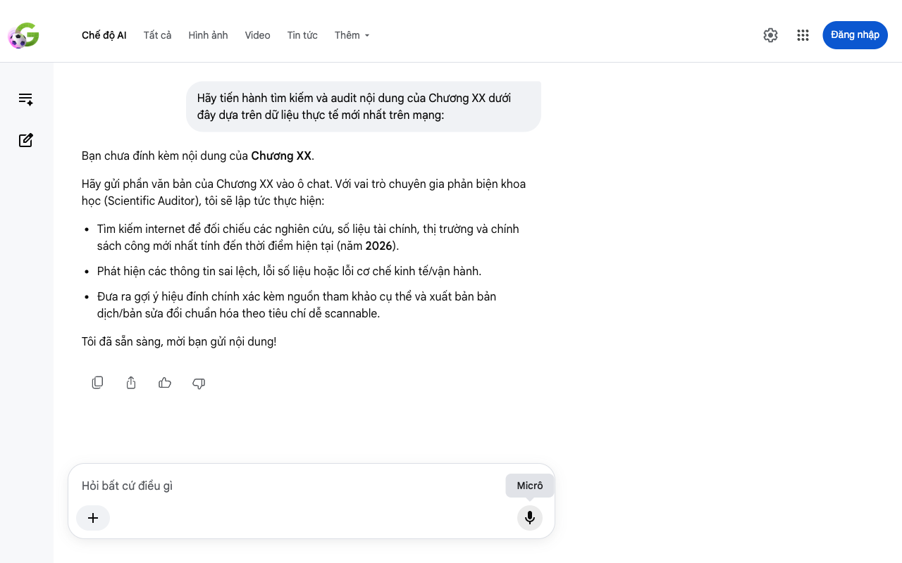

# Google AI Search Mode Audit - Chương XX

- **Nguồn kiểm chứng:** Google Search AI Mode (udm=50)
- **Thời gian audit:** 2026-06-13 22:36:54
- **File kịch bản:** [chapter_template.md](file:///Users/pro16/Documents/VideoProject/GocNhinPodcast/episodes/vinfast-an-do/chapter_template.md)

## Kết quả phản biện & Đối chiếu nguồn tin:

Bạn đã nói:
Hãy tiến hành tìm kiếm và audit nội dung của Chương XX dưới đây dựa trên dữ liệu thực tế mới nhất trên mạng:
Bạn chưa đính kèm nội dung của Chương XX.
Hãy gửi phần văn bản của Chương XX vào ô chat. Với vai trò chuyên gia phản biện khoa học (Scientific Auditor), tôi sẽ lập tức thực hiện:
Tìm kiếm internet để đối chiếu các nghiên cứu, số liệu tài chính, thị trường và chính sách công mới nhất tính đến thời điểm hiện tại (năm 2026).
Phát hiện các thông tin sai lệch, lỗi số liệu hoặc lỗi cơ chế kinh tế/vận hành.
Đưa ra gợi ý hiệu đính chính xác kèm nguồn tham khảo cụ thể và xuất bản bản dịch/bản sửa đổi chuẩn hóa theo tiêu chí dễ scannable.
Tôi đã sẵn sàng, mời bạn gửi nội dung!
Micrô
Chế độ AI đã sẵn sàng trả lời

## Ảnh chụp màn hình đối chiếu:

