# 06_retention_map.md

- **episode_slug:** vinfast-canglo-cang-mo-rong

---

## 📌 BẢN ĐỒ GIỮ CHÂN KHÁN GIẢ XUYÊN SUỐT (RETENTION MAP)

### 1. Phân Bổ Trục Thời Gian & Điểm Reset Chú Ý (Pattern Interrupts)
Dưới đây là kế hoạch phân chia nhịp độ kịch bản để tránh điểm rơi rớt người xem (drop-off) tại các mốc thời gian nhạy cảm:

```mermaid
gantt
    title Trục Thời Gian Retention & Các Điểm Reset Chú Ý
    dateFormat  X
    axisFormat %s
    section Kịch bản
    Ch.1 Hook & CTA          :0, 90
    Ch.2 Định Phí & Khấu Hao :90, 240
    Ch.3 Bẫy Ao Làng & MES  :240, 390
    Ch.4 Thuế Quan & CKD     :390, 540
    Ch.5 Samsung Chicken Game:540, 690
    Ch.6 Airbus & Tách Nợ 182k:690, 840
    Ch.7 Quản Trị Vốn & Kết  :840, 990
    section Re-Hooks
    Re-Hook #1 (Mốc 3:30)    :active, 210, 240
    Data Shock #2 (Mốc 7:00) :active, 420, 450
    Re-Hook #3 (Mốc 11:00)   :active, 660, 690
```

---

### 2. Kế Hoạch Chi Tiết Cho Các Điểm Giữ Chân Bắt Buộc

#### 🪝 Re-Hook #1 (Mốc phút ~3:30 - Cuối Chương 2, Đầu Chương 3)
*   **Vị trí logic:** Ngay sau khi giải thích xong bản chất định phí khấu hao và biên gộp của nhà máy Hải Phòng. Khán giả bắt đầu cảm thấy "đã hiểu cơ chế định phí rồi". Ta phải chặn ngay hiện tượng đóng loop bằng một câu hỏi hở lớn.
*   **Kịch bản Voiceover (dưới 150 ký tự):**
    > "Nhưng nếu nhà máy Hải Phòng đã có sẵn công suất 300.000 xe, tại sao VinFast phải mang hàng tỷ USD đi xây thêm nhà máy ở nước ngoài?
    > Nước đi này thực chất không phải để chơi lớn.
    > Nó là một lựa chọn sinh tồn toán học để thoát khỏi cái bẫy ao làng chật chội."
*   **Tác động tâm lý:** Kích thích sự tò mò trí tuệ (Intellectual Stakes) về việc tại sao thừa công suất ở Hải Phòng lại phải đi xây thêm nhà máy ở Ấn Độ/Indonesia.

#### ⚡ Data Shock Mới #2 (Mốc phút ~7:00 - Đầu Chương 5)
*   **Vị trí logic:** Đầu chương phân tích case study Samsung DRAM. Sau khi phân tích xong rào cản thuế 100% của Ấn Độ, khán giả cần một luồng thông tin mới có sức nặng thay vì tiếp tục nghe phân tích địa chính trị.
*   **Kịch bản Voiceover (dưới 150 ký tự):**
    > "Để hiểu cuộc chiến quy mô của VinFast khốc liệt thế nào, hãy nhìn vào con số này:
    > Thuế nhập khẩu xe nguyên chiếc vào Ấn Độ đang ở mức 70% đến 100%.
    > Đây là bức tường bảo hộ dựng đứng biến việc xuất khẩu xe nguyên chiếc thành hành vi tự sát về giá."
*   **Tác động tâm lý:** Tạo ra một "cú sốc số liệu" cụ thể để người xem hình dung rõ sự khắc nghiệt của thuế quan bảo hộ và lý giải hợp lý vì sao bắt buộc phải xây nhà máy CKD tại chỗ.

#### 🪝 Re-Hook #3 (Mốc phút ~11:00 - Đầu Chương 6)
*   **Vị trí logic:** Bắt đầu chương phân tích bài học Airbus và thương vụ chuyển nợ 182 nghìn tỷ của Vingroup. Khán giả cần biết cơ chế tài trợ dòng tiền để sống sót qua Chicken Game.
*   **Kịch bản Voiceover (dưới 150 ký tự):**
    > "Làm sao để một doanh nghiệp non trẻ gánh nổi hàng chục nghìn tỷ đồng lỗ ròng mỗi năm để xây dựng quy mô?
    > Câu trả lời nằm ở cơ chế bù chéo hệ sinh thái.
    > Bài học kinh điển từ cách Airbus vượt mặt Boeing nhờ sự bảo trợ Launch Aid của chính phủ châu Âu."
*   **Tác động tâm lý:** Mở ra một Open Loop mới về sự liên hệ giữa Launch Aid chính phủ châu Âu với sự bù chéo của Vingroup, giữ chân khán giả xem tiếp cách VinFast dọn dẹp bảng cân đối kế toán.

---

### 3. Kế Hoạch Lồng Ghép Zoom-In Cá Nhân Hóa (Mỗi 3-4 phút)
Vì đây là chủ đề Loại B (Chiến lược doanh nghiệp), chúng ta dệt các câu Zoom-In rải đều để khán giả tự thấy bài học liên quan đến cuộc sống và hoạt động kinh doanh của chính họ:

1.  **Phút ~2:30 (Chương 2):**  
    > *"Nếu bạn đang làm chủ một cửa hàng hay doanh nghiệp vừa và nhỏ, định phí chính là tiền thuê mặt bằng tĩnh hàng tháng. Bạn không bán được hàng, chi phí đó vẫn cắn vào vốn."*
2.  **Phút ~5:30 (Chương 4):**  
    > *"Cũng giống như khi bạn kinh doanh trên các sàn thương mại điện tử. Nếu bạn chỉ phụ thuộc vào một kênh phân phối trong nước, bạn sẽ sớm đụng trần tăng trưởng khi đối thủ bắt đầu phá giá."*
3.  **Phút ~8:30 (Chương 5):**  
    > *"Trong kinh doanh cá nhân, khi thị trường rơi vào suy thoái, phản xạ tự nhiên của chúng ta là co cụm phòng thủ. Nhưng lịch sử chứng minh, kẻ chiến thắng sau khủng hoảng thường là kẻ dám đầu tư ngược chu kỳ."*
4.  **Phút ~12:30 (Chương 6):**  
    > *"Quyết định tách nợ 182 nghìn tỷ này của Vingroup là bài học xương máu về cấu trúc vốn. Đôi khi, để cứu một dự án trọng điểm, bạn buộc phải hy sinh lợi nhuận ngắn hạn của các mảng kinh doanh cốt lõi khác."*
5.  **Phút ~15:30 (Chương 7):**  
    > *"Bài học lớn nhất cho mỗi chúng ta khi quản trị vốn cá nhân: Đừng bao giờ dồn toàn bộ nguồn lực vào một canh bạc quy mô nếu không có một bệ đỡ dòng tiền phòng thủ vững chắc phía sau."*
