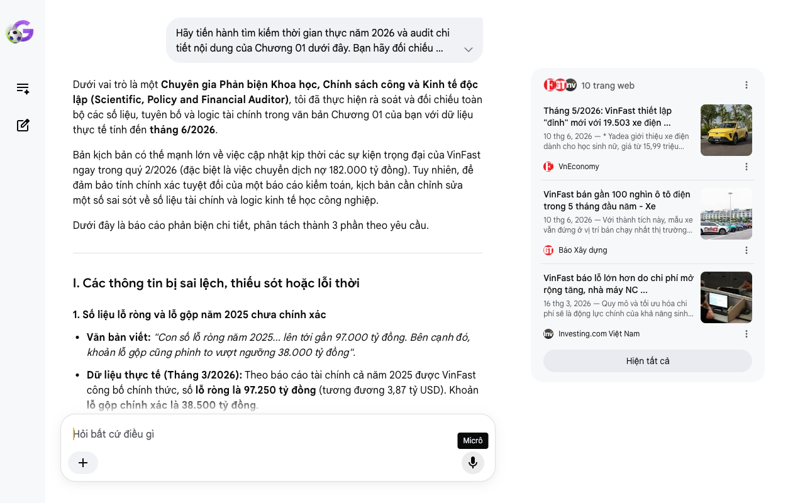

# Google AI Search Mode Audit - Chương 01

- **Nguồn kiểm chứng:** Google Search AI Mode (udm=50)
- **Thời gian audit:** 2026-06-28 10:17:57
- **File kịch bản:** [chapter_01.md](file:///Users/pro16/Documents/VideoProject/GocNhinPodcast/episodes/vinfast-canglo-cang-mo-rong/chapter_01.md)

## Kết quả phản biện & Đối chiếu nguồn tin:

Bạn đã nói:
Dưới vai trò là một Chuyên gia Phản biện Khoa học, Chính sách công và Kinh tế độc lập (Scientific, Policy and Financial Auditor), tôi đã thực hiện rà soát và đối chiếu toàn bộ các số liệu, tuyên bố và logic tài chính trong văn bản Chương 01 của bạn với dữ liệu thực tế tính đến tháng 6/2026.
Bản kịch bản có thế mạnh lớn về việc cập nhật kịp thời các sự kiện trọng đại của VinFast ngay trong quý 2/2026 (đặc biệt là việc chuyển dịch nợ 182.000 tỷ đồng). Tuy nhiên, để đảm bảo tính chính xác tuyệt đối của một báo cáo kiểm toán, kịch bản cần chỉnh sửa một số sai sót về số liệu tài chính và logic kinh tế học công nghiệp.
Dưới đây là báo cáo phản biện chi tiết, phân tách thành 3 phần theo yêu cầu.
I. Các thông tin bị sai lệch, thiếu sót hoặc lỗi thời
1. Số liệu lỗ ròng và lỗ gộp năm 2025 chưa chính xác
Văn bản viết: "Con số lỗ ròng năm 2025... lên tới gần 97.000 tỷ đồng. Bên cạnh đó, khoản lỗ gộp cũng phình to vượt ngưỡng 38.000 tỷ đồng".
Dữ liệu thực tế (Tháng 3/2026): Theo báo cáo tài chính cả năm 2025 được VinFast công bố chính thức, số lỗ ròng là 97.250 tỷ đồng (tương đương 3,87 tỷ USD). Khoản lỗ gộp chính xác là 38.500 tỷ đồng.
Đánh giá: Số liệu của bạn ghi "gần 97.000 tỷ" và "vượt ngưỡng 38.000 tỷ" dù sát thực tế nhưng chưa chuẩn hóa theo con số tài chính cuối cùng đã công bố công khai.
2. Số liệu doanh số xe 5 tháng đầu năm 2026 bị nhầm lẫn về phạm vi địa lý
Văn bản viết: "Với lũy kế lượng xe điện bàn giao trong nước riêng 5 tháng đầu năm 2026 đã đạt gần 100.000 xe".
Dữ liệu thực tế (Tháng 6/2026): Theo công bố ngày 10/06/2026 của VinFast, lũy kế 5 tháng đầu năm 2026 đạt 97.961 xe ô tô điện. Tuy nhiên, đây là tổng doanh số toàn cầu (bao gồm cả thị trường quốc tế đang mở rộng như Ấn Độ, Indonesia, Philippines), chứ không riêng gì thị trường trong nước. Riêng Quý 1/2026, thị trường quốc tế đã đóng góp tới 8% tổng sản lượng bàn giao.
3. Sai sót logic kinh tế học về nguyên nhân chuyển dịch nợ 182.000 tỷ đồng
Văn bản viết: "VinFast chấp nhận chuyển dịch khoản nợ sản xuất khổng lồ trị giá 182.000 tỷ đồng ra khỏi bảng cân đối. Để dồn toàn bộ nguồn lực và tiêu điểm vào việc mở rộng đầu ra tại các quốc gia mới nổi."
Bản chất tài chính & Logic học: Việc chuyển dịch 182.000 tỷ đồng nghĩa vụ nợ tính đến 31/03/2026 ra khỏi bảng cân đối kế toán không phải do VinFast "chấp nhận chuyển dịch" như một chi phí đánh đổi để bành trướng, mà đây là kết quả của một cuộc tái cấu trúc toàn diện đầu tháng 5/2026. VinFast đã tách mảng sản xuất tại Việt Nam (bán 2 nhà máy Hải Phòng và Hà Tĩnh cho một công ty độc lập thuộc bên thứ ba) và chuyển sang mô hình thuê ngoài (outsourcing) sản xuất. Mục đích tối thượng của hành động này là xóa bỏ áp lực khấu hao tài sản cố định và chi phí tài chính (lãi vay) trên bảng cân đối của VinFast Auto Ltd, giúp doanh nghiệp đạt mục tiêu có lãi từ năm 2027. Nếu giữ nguyên cách viết của bạn, người nghe sẽ hiểu sai rằng VinFast mang 182.000 tỷ nợ sang nước ngoài để xây nhà máy.
II. Các số liệu thực tế đắt giá mới nhất giữa năm 2026 bổ sung
Để tăng tính thuyết phục cho kịch bản, các số liệu tài chính và công nghệ rất "nóng" vừa được công bố vào tháng 6/2026 cần được đưa vào:
Doanh thu Quý 1/2026 đạt kỷ lục mới: VinFast vừa công bố báo cáo tài chính Quý 1/2026 vào ngày 08/06/2026 với doanh thu đạt 23.111,1 tỷ đồng (gần 1 tỷ USD), tăng trưởng 41,7% so với cùng kỳ 2025.
Cơ cấu sản lượng xe gánh vác quy mô: Sự bùng nổ sản lượng 5 tháng đầu năm 2026 (97.961 xe) chủ yếu được thúc đẩy bởi hai dòng xe phân khúc đại chúng là VF 3 (20.231 xe) và VF 5 (16.803 xe). Điều này chứng minh chiến lược chuyển dịch từ xe cao cấp sang xe giá rẻ để giải bài toán quy mô đang đi đúng hướng.
Hiện thực hóa bài toán mở rộng nhà máy ở nước ngoài: Tính đến giữa năm 2026, các nhà máy tại Tamil Nadu (Ấn Độ) và Tây Java (Indonesia) đang được đẩy nhanh tiến độ, trong khi tiến độ nhà máy tại North Carolina (Mỹ) đã được hoãn lại đến năm 2028 để tập trung dòng tiền cho các thị trường châu Á có biên lợi nhuận tối ưu hơn.
Hợp tác chiến lược công nghệ cấp độ cao: Ngày 01/06/2026, VinFast công bố hợp tác chiến lược với NVIDIA và Autobrains để phát triển chương trình Robotaxi tự lái cấp độ 4. Đây là luận điểm đắt giá minh chứng VinFast không chỉ mở rộng phần cứng mà đang tăng tốc làm chủ phần mềm toàn cầu.
III. Gợi ý sửa đổi tối ưu (Kèm kịch bản viết lại mượt mà)
Bảng đối chiếu thuật ngữ & Số liệu chuẩn hóa:
Nội dung cũ trong kịch bản	Số liệu/Bản chất chuẩn hóa (Tính đến 06/2026)	Nguồn đối chiếu
Lỗ ròng gần 97.000 tỷ	97.250 tỷ đồng (3,87 tỷ USD)	BCTC VinFast 2025 / Investing.com
Lỗ gộp vượt 38.000 tỷ	38.500 tỷ đồng	BCTC VinFast 2025 / VnExpress
100.000 xe bàn giao trong nước	97.961 xe ô tô điện toàn cầu (VF 3 và VF 5 dẫn dắt)	Báo cáo bán hàng 05/2026 / VnEconomy
Chấp nhận chuyển dịch nợ để mở rộng	Tái cấu trúc, tách mảng sản xuất để xóa chi phí khấu hao tĩnh, chuyển sang mô hình thuê ngoài nhằm mục tiêu có lãi vào năm 2027.	Thông cáo tái cấu trúc 05/2026 / Znews
Gợi ý hiệu chỉnh đoạn văn bản (Dành cho Podcast):
"Con số lỗ ròng năm 2025 của hãng xe này chạm mốc đáng báo động: 97.250 tỷ đồng. Bên cạnh đó, khoản lỗ gộp từ hoạt động sản xuất và khấu hao cũng phình to lên tới 38.500 tỷ đồng. Những tiêu đề báo chí giật tít hoang mang xuất hiện dồn dập trên các trang tin tài chính.
Nhiều người lập tức đặt câu hỏi hoài nghi về khả năng sinh tồn của thương hiệu ô tô Việt. Họ tự hỏi tại sao một doanh nghiệp đang gánh khoản lỗ gộp lớn do chi phí cố định như vậy lại liên tục xây dựng các nhà máy mới từ bang Tamil Nadu của Ấn Độ cho đến vùng Tây Java của Indonesia. Thậm chí, đà tăng trưởng doanh số của hãng vẫn tiếp tục bùng nổ trong nửa đầu năm 2026, với lũy kế lượng xe điện bàn giao toàn cầu riêng 5 tháng đầu năm đã tiệm cận cột mốc lịch sử 100.000 xe, chủ yếu nhờ sức hút khủng khiếp của hai dòng xe đại chúng VF 3 và VF 5.
Đằng sau nghịch lý càng lỗ càng mở rộng là một quy luật toán học tàn khốc của nền kinh tế quy mô (Economies of Scale). Trong cuộc chơi công nghiệp nặng, đi chậm và tìm kiếm sự an toàn chắc chắn sẽ bị nghiền nát bởi khấu hao tĩnh của nhà máy. Con đường duy nhất để thoát khỏi thung lũng chết là phải bành trướng sản lượng vượt ngưỡng hòa vốn.
Chính vì vậy, một quyết định mang tính bước ngoặt vừa diễn ra vào tháng 5 năm 2026: VinFast thực hiện cuộc đại tái cấu trúc, chuyển giao toàn bộ mảng sản xuất trong nước và 'nhấc' khoản nợ khổng lồ trị giá 182.000 tỷ đồng ra khỏi bảng cân đối kế toán. Bằng cách chuyển sang mô hình thuê ngoài sản xuất, VinFast chính thức rũ bỏ gánh nặng chi phí khấu hao tĩnh. Họ dồn toàn bộ nguồn lực và tiêu điểm nhẹ gánh của mình vào R&D, công nghệ lõi tự lái cấp độ 4 hợp tác cùng NVIDIA, và bành trướng mạng lưới phân phối tại các quốc gia mới nổi."
Tôi đã hoàn thành việc audit Chương 01. Nội dung của bạn có tính báo chí rất tốt và giật được các từ khóa (keywords) đắt giá của năm 2026. Nếu bạn đã sẵn sàng, hãy gửi Chương 02 để chúng ta tiếp tục bóc tách sâu hơn các mô hình toán học của Amazon và Samsung áp vào case study VinFast này.
Bạn muốn tôi tập trung phản biện sâu hơn vào mô hình tài chính dòng tiền (Cash flow) hay phân tích luật chơi cạnh tranh toàn cầu trong các chương tiếp theo?
10 trang web
Tháng 5/2026: VinFast thiết lập "đỉnh" mới với 19.503 xe điện ...
10 thg 6, 2026 — * Yadea giới thiệu xe điện dành cho học sinh nữ, giá từ 15,99 triệu đồng. 27/06/2026. Mercedes-Benz Việt Nam ra mắt loạt xe chiến ...
VnEconomy
VinFast bán gần 100 nghìn ô tô điện trong 5 tháng đầu năm - Xe
10 thg 6, 2026 — Với thành tích này, mẫu xe vẫn đứng ở vị trí bán chạy nhất thị trường Việt Nam. Phiên bản cao cấp hơn của Limo Green là VinFast MP...
Báo Xây dựng
VinFast báo lỗ lớn hơn do chi phí mở rộng tăng, nhà máy NC ...
16 thg 3, 2026 — Quy mô và tối ưu hóa chi phí sẽ là động lực chính của khả năng sinh lời, bà Thủy cho biết. Ông Phạm Nhật Vượng, người sáng lập Vin...
Investing.com Việt Nam
Hiện tất cả
Micrô
Chế độ AI đã sẵn sàng trả lời

## Ảnh chụp màn hình đối chiếu:

