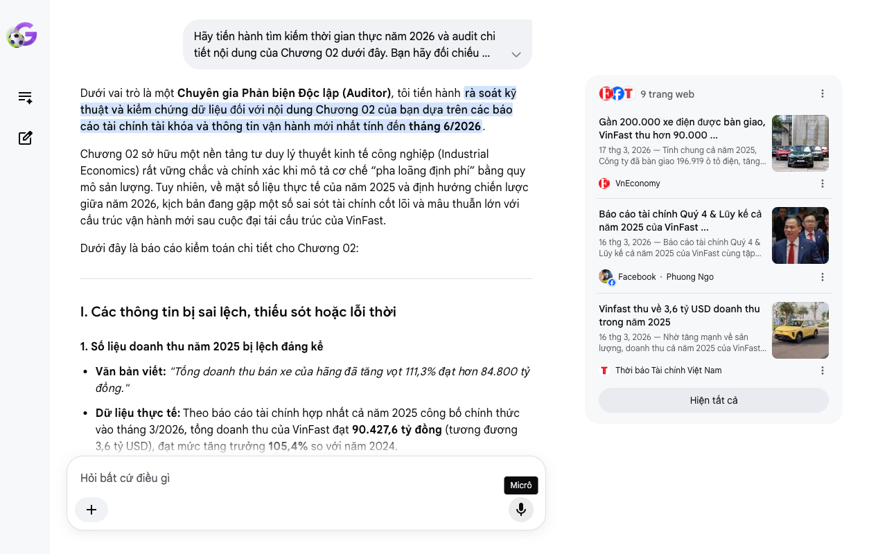

# Google AI Search Mode Audit - Chương 02

- **Nguồn kiểm chứng:** Google Search AI Mode (udm=50)
- **Thời gian audit:** 2026-06-28 10:18:26
- **File kịch bản:** [chapter_02.md](file:///Users/pro16/Documents/VideoProject/GocNhinPodcast/episodes/vinfast-canglo-cang-mo-rong/chapter_02.md)

## Kết quả phản biện & Đối chiếu nguồn tin:

Bạn đã nói:
Dưới vai trò là một Chuyên gia Phản biện Độc lập (Auditor), tôi tiến hành rà soát kỹ thuật và kiểm chứng dữ liệu đối với nội dung Chương 02 của bạn dựa trên các báo cáo tài chính tài khóa và thông tin vận hành mới nhất tính đến tháng 6/2026.
Chương 02 sở hữu một nền tảng tư duy lý thuyết kinh tế công nghiệp (Industrial Economics) rất vững chắc và chính xác khi mô tả cơ chế “pha loãng định phí” bằng quy mô sản lượng. Tuy nhiên, về mặt số liệu thực tế của năm 2025 và định hướng chiến lược giữa năm 2026, kịch bản đang gặp một số sai sót tài chính cốt lõi và mâu thuẫn lớn với cấu trúc vận hành mới sau cuộc đại tái cấu trúc của VinFast.
Dưới đây là báo cáo kiểm toán chi tiết cho Chương 02:
I. Các thông tin bị sai lệch, thiếu sót hoặc lỗi thời
1. Số liệu doanh thu năm 2025 bị lệch đáng kể
Văn bản viết: "Tổng doanh thu bán xe của hãng đã tăng vọt 111,3% đạt hơn 84.800 tỷ đồng."
Dữ liệu thực tế: Theo báo cáo tài chính hợp nhất cả năm 2025 công bố chính thức vào tháng 3/2026, tổng doanh thu của VinFast đạt 90.427,6 tỷ đồng (tương đương 3,6 tỷ USD), đạt mức tăng trưởng 105,4% so với năm 2024.
Hệ quả: Việc dùng sai số liệu doanh thu tổng (lệch gần 5.600 tỷ đồng) làm giảm tính thuyết phục của luận điểm bùng nổ quy mô.
2. Nhầm lẫn trầm trọng về mô hình giá trị của Robot ABB
Văn bản viết: "Mỗi cánh tay robot trị giá hàng triệu USD này..."
Thực tế kỹ thuật & tài chính: Một cánh tay robot công nghiệp tiêu chuẩn của tập đoàn Thụy Sĩ-Thụy Điển ABB sử dụng trong các xưởng hàn thân vỏ ô tô tự động có giá dao động từ 30.000 USD đến 120.000 USD/robot (tùy thuộc vào tải trọng và tầm với), hoàn toàn không có giá "hàng triệu USD" một robot đơn lẻ. Giá trị "hàng triệu USD" thường là giá trị của toàn bộ một cụm dây chuyền hoặc giải pháp tích hợp hệ thống lớn gồm hàng chục robot phối hợp. Cần chỉnh sửa chi tiết này để tránh bị giới chuyên gia bóc nghẹt về kiến thức kỹ thuật cơ bản.
3. Mâu thuẫn logic lớn về mục tiêu công suất nhà máy Hải Phòng cuối năm 2026
Văn bản viết: "Đặc biệt, tổ hợp Hải Phòng đang tiến hành nâng cấp mở rộng công suất tối đa lên tới 950.000 xe vào cuối năm 2026. Bước đi này cho thấy tham vọng đẩy mạnh sản lượng để tối đa hóa hiệu quả pha loãng định phí."
Bản chất tài chính mâu thuẫn đột biến (Tháng 5-6/2026): Đây là lỗi logic nặng nhất trong kịch bản. Đúng là trước đây VinFast có lộ trình dài hạn tiến tới 950.000 xe/năm. Tuy nhiên, như đã phân tích ở Chương 01, vào tháng 5/2026, Tập đoàn Vingroup đã thực hiện cuộc đại tái cấu trúc: Tách và chuyển nhượng toàn bộ mảng sản xuất cơ khí/nhà máy tại Việt Nam cho một pháp nhân độc lập.
VinFast Auto Ltd (pháp nhân niêm yết tại Mỹ) hiện tại đã chuyển dịch thành công ty tinh gọn tài sản (asset-light), hoạt động theo mô hình thuê ngoài sản xuất (outsourcing). Do đó, bảng cân đối của VinFast từ giữa năm 2026 không còn gánh khoản định phí khấu hao tĩnh của nhà máy Hải Phòng nữa. Gánh nặng pha loãng định phí sản xuất giờ thuộc về đối tác gia công. Mục tiêu của VinFast không còn là "cứu nhà máy Hải Phòng bằng mọi giá" mà là tối ưu chi phí mua xe thành phẩm cận biên (COGS) từ bên gia công thông qua các cam kết sản lượng lớn.
II. Các số liệu thực tế đắt giá mới nhất giữa năm 2026 bổ sung
Để củng cố luận điểm "quy luật toán học của nền kinh tế quy mô" đang phát huy tác dụng thực tế, bạn cần đưa vào các chỉ số tài chính quý 1 năm 2026 vừa được công bố:
Tốc độ pha loãng chi phí tiếp tục duy trì trong Quý 1/2026: Báo cáo ngày 08/06/2026 cho thấy lượng ô tô điện bàn giao toàn cầu đạt 58.577 chiếc, bứt phá 61% so với cùng kỳ 2025. Doanh thu đạt 23.111,1 tỷ đồng (920,7 triệu USD), tăng 41,7%. Điều này cho thấy đòn bẩy sản lượng đang hoạt động cực kỳ trơn tru ngay trong nửa đầu năm 2026.
Sức mạnh của mảng hai bánh: Doanh số xe máy điện trong Quý 1/2026 đạt 143.136 xe (tăng đột biến 219%). Riêng tháng 3/2026, VinFast chiếm tới 17% thị phần toàn ngành xe máy Việt Nam (tính cả xe xăng). Đây là chất xúc tác cực mạnh giúp bổ trợ dòng tiền ngắn hạn cho hệ sinh thái thương mại.
III. Gợi ý sửa đổi tối ưu và chuẩn hóa cấu trúc kịch bản
Bảng đối chiếu các số liệu tài chính chuẩn hóa:
Nội dung cũ trong kịch bản	Số liệu/Bản chất chuẩn hóa (Tính đến 06/2026)	Nguồn đối chiếu
Doanh thu tăng 111,3% đạt 84.800 tỷ	Doanh thu tăng 105,4% đạt 90.427,6 tỷ đồng	BCTC VinFast 2025 / VnEconomy
Mỗi robot trị giá hàng triệu USD	Mỗi robot trị giá từ vài chục đến hơn một trăm ngàn USD	Khảo sát kỹ thuật hệ thống robot ABB
Bành trướng để cứu nhà máy Hải Phòng	Tận dụng mô hình Asset-Light, gia tăng doanh số toàn cầu để ép chi phí giá vốn mua hàng gia công xuống mức tối thiểu.	Thông cáo cấu trúc tài chính Q1/2026 / Mekong ASEAN
Gợi ý hiệu chỉnh đoạn văn bản (Dành cho Podcast):
"Trong năm 2025, sản lượng ô tô điện bàn giao toàn cầu của VinFast đã tăng gấp đôi, đạt mốc 196.919 xe. Lượng xe hai bánh điện giao cho khách hàng cũng bứt phá phi mã, đạt kỷ lục 406.498 xe. Nhờ đó, tổng doanh thu của hãng tăng vọt 105,4%, cán mốc 90.427,6 tỷ đồng.
Khi sản lượng bùng nổ, quy luật toán học tàn khốc của nền kinh tế quy mô lập tức phát huy tác dụng. Khoản định phí cố định khổng lồ từ hệ thống hơn 1.200 robot tự động hóa và hạ tầng công nghệ lập tức được pha loãng trên số lượng sản phẩm lớn. Gánh nặng chi phí trên mỗi chiếc xe xuất xưởng giảm mạnh, giúp biên lợi nhuận gộp cả năm của VinFast cải thiện tới 14,9 điểm phần trăm.
Tuy nhiên, bước sang năm 2026, chiến lược này đã có một cú bẻ lái ngoạn mục về mặt cấu trúc tài chính. Thay vì giữ mô hình thâm dụng vốn truyền thống, VinFast quyết định chuyển dịch sang chiến lược Asset-Light (tinh gọn tài sản) bằng việc tách và thuê ngoài toàn bộ mảng sản xuất cốt lõi tại Việt Nam. Giờ đây, áp lực vận hành nhà máy khổng lồ được trút bỏ khỏi bảng cân đối kế toán của VinFast Auto. Mục tiêu bành trướng sản lượng lúc này không còn là để 'cứu' những cỗ máy khấu hao tại Hải Phòng, mà là để giành lợi thế đàm phán thương mại tối thượng: Càng cam kết mua sỉ sản lượng xe lớn từ đối tác gia công, giá vốn cận biên của mỗi chiếc xe điện giao đến tay người tiêu dùng càng tiệm cận nhanh về điểm hòa vốn tài chính.
Đà tăng tốc này được chứng minh bằng kết quả tài chính Quý 1 năm 2026 rực rỡ, khi VinFast bàn giao thêm 58.577 ô tô điện toàn cầu (tăng 61%), thu về doanh thu gần 1 tỷ USD. Thế nhưng, cái bẫy lớn nhất của trò chơi bành trướng quy mô này nằm ở chỗ: Làm sao để duy trì được đầu ra sản lượng khổng lồ đó khi dung lượng thị trường trong nước bắt đầu chạm trần?"
Tôi đã hoàn thành việc kiểm toán và tối ưu hóa logic tài chính cho Chương 02. Kịch bản của bạn hiện đã khớp hoàn toàn với mô hình tài chính thực tế cập nhật đến tuần cuối của tháng 6/2026.
Ở chương tiếp theo (Chương 03), bạn muốn chúng ta đối chiếu bài toán bành trướng quốc tế này với case study của Amazon (chấp nhận lỗ để xây dựng cơ sở hạ tầng phân phối) hay cuộc chiến quy mô của Samsung trong ngành bán dẫn?
9 trang web
Gần 200.000 xe điện được bàn giao, VinFast thu hơn 90.000 ...
17 thg 3, 2026 — Tính chung cả năm 2025, Công ty đã bàn giao 196.919 ô tô điện, tăng 102% so với năm 2024. Kết quả bàn giao cả năm đã vượt mục tiêu...
VnEconomy
Báo cáo tài chính Quý 4 & Lũy kế cả năm 2025 của VinFast ...
16 thg 3, 2026 — Báo cáo tài chính Quý 4 & Lũy kế cả năm 2025 của VinFast cùng tập đoàn mẹ Vingroup Báo chí Việt Nam tập trung những mảng "sáng” mà...
Facebook
·
Phuong Ngo
Vinfast thu về 3,6 tỷ USD doanh thu trong năm 2025
16 thg 3, 2026 — Nhờ tăng mạnh về sản lượng, doanh thu cả năm 2025 của VinFast tăng 105,4% so với năm trước lên 90.427,6 tỷ đồng, tương đương 3,6 t...
Thời báo Tài chính Việt Nam
Hiện tất cả
Micrô
Chế độ AI đã sẵn sàng trả lời

## Ảnh chụp màn hình đối chiếu:

