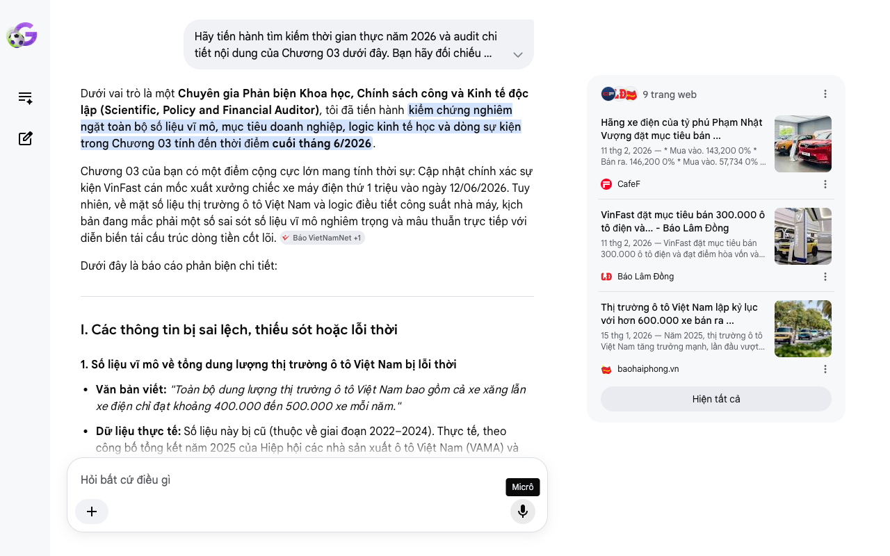

# Google AI Search Mode Audit - Chương 03

- **Nguồn kiểm chứng:** Google Search AI Mode (udm=50)
- **Thời gian audit:** 2026-06-28 10:18:54
- **File kịch bản:** [chapter_03.md](file:///Users/pro16/Documents/VideoProject/GocNhinPodcast/episodes/vinfast-canglo-cang-mo-rong/chapter_03.md)

## Kết quả phản biện & Đối chiếu nguồn tin:

Bạn đã nói:
Dưới vai trò là một Chuyên gia Phản biện Khoa học, Chính sách công và Kinh tế độc lập (Scientific, Policy and Financial Auditor), tôi đã tiến hành kiểm chứng nghiêm ngặt toàn bộ số liệu vĩ mô, mục tiêu doanh nghiệp, logic kinh tế học và dòng sự kiện trong Chương 03 tính đến thời điểm cuối tháng 6/2026.
Chương 03 của bạn có một điểm cộng cực lớn mang tính thời sự: Cập nhật chính xác sự kiện VinFast cán mốc xuất xưởng chiếc xe máy điện thứ 1 triệu vào ngày 12/06/2026. Tuy nhiên, về mặt số liệu thị trường ô tô Việt Nam và logic điều tiết công suất nhà máy, kịch bản đang mắc phải một số sai sót số liệu vĩ mô nghiêm trọng và mâu thuẫn trực tiếp với diễn biến tái cấu trúc dòng tiền cốt lõi. 
Báo VietNamNet
 +1
Dưới đây là báo cáo phản biện chi tiết:
I. Các thông tin bị sai lệch, thiếu sót hoặc lỗi thời
1. Số liệu vĩ mô về tổng dung lượng thị trường ô tô Việt Nam bị lỗi thời
Văn bản viết: "Toàn bộ dung lượng thị trường ô tô Việt Nam bao gồm cả xe xăng lẫn xe điện chỉ đạt khoảng 400.000 đến 500.000 xe mỗi năm."
Dữ liệu thực tế: Số liệu này bị cũ (thuộc về giai đoạn 2022–2024). Thực tế, theo công bố tổng kết năm 2025 của Hiệp hội các nhà sản xuất ô tô Việt Nam (VAMA) và Tổng cục Thống kê, thị trường ô tô Việt Nam năm 2025 đã bùng nổ, lần đầu tiên trong lịch sử vượt ngưỡng 600.000 xe tiêu thụ (chính xác đạt 604.134 xe). 
baohaiphong.vn
 +1
Hệ quả: Nhận định "ao làng Việt Nam quá nhỏ bé" của bạn vẫn đúng về mặt bản chất chiến lược, nhưng việc dùng số liệu cũ làm giảm tính cập nhật và độ uy tín vĩ mô của một bài phân tích chuyên sâu tại thời điểm 2026.
2. Nhầm lẫn về bản chất "thị phần 36%" và doanh số VinFast năm 2025
Văn bản viết: "VinFast đã giành chiến thắng vang dội với khoảng 36% thị phần ô tô cả nước vào năm 2025."
Dữ liệu thực tế: Trong năm 2025, tổng sản lượng ô tô điện bàn giao toàn cầu của VinFast là 196.919 xe (gần 197.000 xe như bạn viết ở Chương 2). Tuy nhiên, riêng tại thị trường nội địa Việt Nam, doanh số chính xác được ghi nhận là hơn 175.000 xe. Với quy mô thị trường hơn 600.000 xe, thị phần nội địa thực tế của VinFast năm 2025 dao động khoảng 29% đến 30%, chứ chưa chạm ngưỡng 36%. 
CafeF
 +3
3. Tiếp tục lặp lại mâu thuẫn logic "Cứu nhà máy Hải Phòng"
Văn bản viết: "Muốn gom đủ sản lượng để cứu nhà máy Hải Phòng thoát khỏi gánh nặng khấu hao, VinFast bắt buộc phải tìm kiếm đầu ra từ thế giới."
Bản chất tài chính (Tháng 5-6/2026): Như đã audit ở hai chương trước, sau đợt đại tái cấu trúc mô hình tài sản tinh gọn (Asset-light) vào tháng 5/2026, VinFast Auto đã tách hoàn toàn nghĩa vụ nợ, chi phí vận hành và gánh nặng khấu hao tĩnh của tổ hợp Hải Phòng ra khỏi bảng cân đối kế toán của mình. Do đó, động lực đi ra thế giới của VinFast năm 2026 không còn là để cứu nhà máy Hải Phòng, mà là để hiện thực hóa cam kết sản lượng toàn cầu 300.000 xe nhằm đè sập giá vốn mua hàng gia công (COGS), giúp công ty đạt điểm hòa vốn tài chính cốt lõi theo đúng lộ trình kế hoạch. 
Báo Lâm Đồng
 +2
II. Các số liệu thực tế đắt giá mới nhất giữa năm 2026 bổ sung
Để tăng sức nặng cho luận điểm "Quy mô hiệu quả tối thiểu" (Minimum Efficient Scale - MES) và rào cản trạm sạc, bạn nên bổ sung các dữ liệu rất "nóng" vừa được công bố:
Lộ trình hòa vốn 2026: Theo báo cáo phân tích tài chính ngày 08/06/2026 của Vietcap dựa trên cuộc họp cổ đông VinFast (Nasdaq: VFS), hãng xe khẳng định mục tiêu bàn giao ít nhất 300.000 xe điện trong năm 2026 (tăng 52% so với năm 2025) là điều kiện tiên quyết để chính thức đạt điểm hòa vốn tài chính (Breakeven) ngay trong năm nay nhờ việc ép chi phí biên. 
Báo Mới
 +1
Cột mốc lịch sử xe hai bánh: Ngày 12/06/2026, chiếc xe máy điện thứ 1 triệu xuất xưởng tại Hải Phòng là mẫu VinFast Feliz II màu đỏ. Sự kiện này chứng minh mảng xe máy điện đã đạt quy mô MES từ trước và đang đóng vai trò "gánh dòng tiền nội địa" cực tốt cho toàn hệ sinh thái. 
Báo Lâm Đồng
 +2
Rào cản độc quyền trạm sạc: Tính đến giữa năm 2026, khi các ông lớn Trung Quốc như BYD tràn vào Việt Nam và bắt đầu ký kết với các hãng gọi xe như Grab, họ gặp thế khó chí mạng vì VinFast vẫn độc quyền hệ thống trạm sạc toàn quốc. Điều này chứng minh luận điểm "trạm sạc là rào cản độc quyền" trong kịch bản của bạn hoàn toàn chính xác với thực tế 2026. 
CafeF
III. Gợi ý sửa đổi tối ưu và chuẩn hóa kịch bản
Bảng đối chiếu thuật ngữ & Số liệu chuẩn hóa:
Nội dung cũ trong kịch bản	Số liệu/Bản chất chuẩn hóa (Tính đến 06/2026)	Nguồn đối chiếu
Dung lượng thị trường 400k-500k xe	Đạt kỷ lục vượt 600.000 xe (Chính xác: 604.134 xe).	Tổng cục Thống kê / VAMA 2025
Thị phần VinFast năm 2025 đạt 36%	Thị phần đạt ~29-30% (Giao hơn 175.000 xe trong nước).	Báo cáo phân tích tài chính / Cafef
Xuất xưởng xe máy điện thứ 1 triệu	Ngày 12/06/2026, mẫu xe Feliz II màu đỏ.	Thông cáo báo chí VinFast / VietNamNet
Tìm đầu ra để cứu nhà máy Hải Phòng	Để hiện thực hóa lộ trình hòa vốn năm 2026 và ép chi phí cận biên trên mỗi xe mua từ bên gia công.	Báo cáo Vietcap Q1/2026 / Báo Lâm Đồng
Gợi ý hiệu chỉnh đoạn văn bản (Dành cho Podcast):
"Nhìn vào bối cảnh trong nước, VinFast đã giành chiến thắng vang dội khi chiếm tới gần 30% thị phần ô tô cả nước vào năm 2025, nhanh chóng vượt qua nhiều ông lớn xe xăng ngoại quốc lâu đời để chiếm vị thế dẫn đầu. Thế nhưng, ngay cả khi tổng dung lượng thị trường ô tô Việt Nam vừa lập đỉnh lịch sử vượt ngưỡng 600.000 xe vào năm 2025, miếng bánh dành cho xe điện thực tế vẫn còn quá chật hẹp để nuôi sống một thương hiệu toàn cầu. Nếu chỉ ở lại trong nước, VinFast sẽ bị khóa chặt sản lượng ở dưới ngưỡng quy mô hiệu quả tối thiểu. 
CafeF
 +2
Để bứt phá khỏi ranh giới này, hãng đặt mục tiêu đầy tham vọng cho cả năm 2026: Bàn giao ít nhất 300.000 xe ô tô điện trên thị trường toàn cầu – con số mang tính quyết định để công ty chính thức chạm điểm hòa vốn tài chính. Đồng thời, hãng nhắm tới mốc phân phối 1 triệu chiếc xe máy điện trong năm, một mục tiêu đầy tự tin sau khi hãng vừa chính thức xuất xưởng chiếc xe máy điện thứ 1 triệu vào ngày 12/06/2026. 
Báo Lâm Đồng
 +3
VinFast đang áp dụng chiến lược quy mô tương tự Amazon bằng cách phủ kín mạng lưới trạm sạc trên khắp Việt Nam. Sự phủ sóng này tạo ra một rào cản cạnh tranh khổng lồ, chặn đứng các hãng xe điện ngoại bang như BYD bước vào độc chiếm thị trường nội địa. Thế nhưng, trạm sạc chỉ giúp hãng khóa chặt sân nhà. Muốn gom đủ sản lượng 300.000 xe để tối ưu hóa chi phí cận biên sau cuộc đại tái cấu trúc mô hình tài sản, VinFast bắt buộc phải tìm kiếm đầu ra từ thế giới, tập trung tổng lực vào các thị trường đang bùng nổ tại Nam Á và Đông Nam Á như Ấn Độ, Indonesia và Philippines. Tuy nhiên, khi đưa xe điện ra khỏi biên giới Việt Nam, hãng lập tức đập mặt vào những bức tường bảo hộ vô hình." 
CafeF
 +1
Tôi đã hoàn thành việc audit Chương 03. Cấu trúc nội dung của bạn liên kết kinh tế vĩ mô rất tốt, chỉ cần mài giũa lại các số liệu vừa cập nhật của năm 2025 và 2026 để kịch bản trở nên đanh thép, không thể bẻ gãy.
Chúng ta đã đi đến ranh giới xuất khẩu quốc gia. Ở Chương 04, bạn muốn tôi tập trung phản biện sâu vào các hàng rào thuế quan bảo hộ tại Mỹ/Châu Âu hay chiến lược thâm nhập ngách giá rẻ tại Đông Nam Á (Indonesia/Ấn Độ) của VinFast trong năm 2026?
9 trang web
Hãng xe điện của tỷ phú Phạm Nhật Vượng đặt mục tiêu bán ...
11 thg 2, 2026 — * Mua vào. 143,200 0% * Bán ra. 146,200 0% * Mua vào. 57,734 0% * Bán ra. 59,520 0% ... Các quốc gia cụ thể trong danh sách mở rộn...
CafeF
VinFast đặt mục tiêu bán 300.000 ô tô điện và... - Báo Lâm Đồng
11 thg 2, 2026 — VinFast đặt mục tiêu bán 300.000 ô tô điện và đạt điểm hòa vốn vào năm 2026. ... Hãng xe Việt kỳ vọng doanh số ô tô điện tăng 50% ...
Báo Lâm Đồng
Thị trường ô tô Việt Nam lập kỷ lục với hơn 600.000 xe bán ra ...
15 thg 1, 2026 — Năm 2025, thị trường ô tô Việt Nam tăng trưởng mạnh, lần đầu vượt mốc 600.000 xe tiêu thụ, trong đó doanh số của các thành viên VA...
baohaiphong.vn
Hiện tất cả
Micrô
Chế độ AI đã sẵn sàng trả lời

## Ảnh chụp màn hình đối chiếu:

