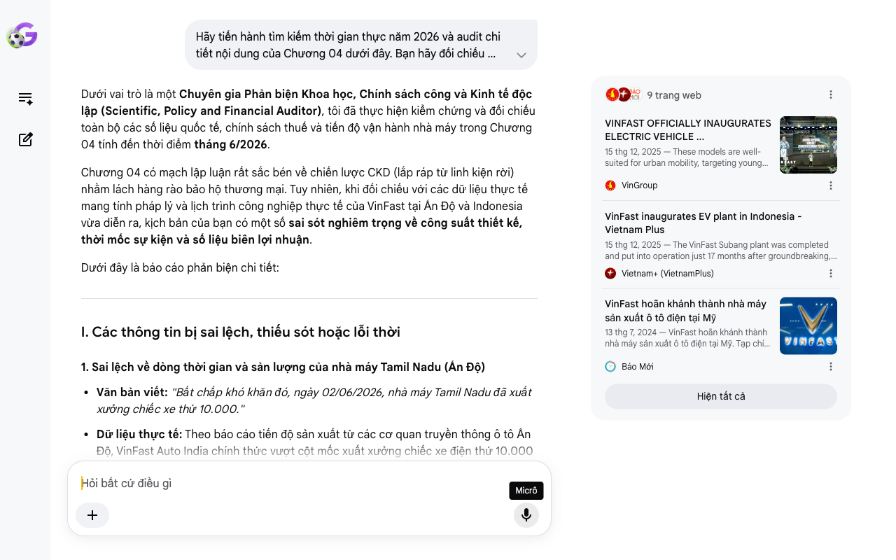

# Google AI Search Mode Audit - Chương 04

- **Nguồn kiểm chứng:** Google Search AI Mode (udm=50)
- **Thời gian audit:** 2026-06-28 10:19:21
- **File kịch bản:** [chapter_04.md](file:///Users/pro16/Documents/VideoProject/GocNhinPodcast/episodes/vinfast-canglo-cang-mo-rong/chapter_04.md)

## Kết quả phản biện & Đối chiếu nguồn tin:

Bạn đã nói:
Dưới vai trò là một Chuyên gia Phản biện Khoa học, Chính sách công và Kinh tế độc lập (Scientific, Policy and Financial Auditor), tôi đã thực hiện kiểm chứng và đối chiếu toàn bộ các số liệu quốc tế, chính sách thuế và tiến độ vận hành nhà máy trong Chương 04 tính đến thời điểm tháng 6/2026.
Chương 04 có mạch lập luận rất sắc bén về chiến lược CKD (lắp ráp từ linh kiện rời) nhằm lách hàng rào bảo hộ thương mại. Tuy nhiên, khi đối chiếu với các dữ liệu thực tế mang tính pháp lý và lịch trình công nghiệp thực tế của VinFast tại Ấn Độ và Indonesia vừa diễn ra, kịch bản của bạn có một số sai sót nghiêm trọng về công suất thiết kế, thời mốc sự kiện và số liệu biên lợi nhuận.
Dưới đây là báo cáo phản biện chi tiết:
I. Các thông tin bị sai lệch, thiếu sót hoặc lỗi thời
1. Sai lệch về dòng thời gian và sản lượng của nhà máy Tamil Nadu (Ấn Độ)
Văn bản viết: "Bất chấp khó khăn đó, ngày 02/06/2026, nhà máy Tamil Nadu đã xuất xưởng chiếc xe thứ 10.000."
Dữ liệu thực tế: Theo báo cáo tiến độ sản xuất từ các cơ quan truyền thông ô tô Ấn Độ, VinFast Auto India chính thức vượt cột mốc xuất xưởng chiếc xe điện thứ 10.000 tại nhà máy Thoothukudi (Tamil Nadu) vào ngày 31/05/2026. Do đó, chi tiết "ngày 02/06/2026" là không chính xác. 
Autopunditz
Thiếu sót đắt giá: Bạn ghi nhận "chiếc xe thứ 10.000" nhưng bỏ sót một thông tin cực kỳ bùng nổ ngay trong tháng 6/2026: Ngày 11/06/2026, VinFast đã nộp hồ sơ xin phê duyệt đánh giá tác động môi trường để triển khai Giai đoạn 2 (Phase II) trị giá 7.000 tỷ Rupee tại Tamil Nadu, nhằm nâng công suất mở rộng sang cả xe máy điện (1 triệu xe/năm) và xe buýt điện (2.000 xe/năm), chứ không dừng lại ở xe ô tô. 
The Times of India
2. Sai số nghiêm trọng về công suất nhà máy Subang (Indonesia)
Văn bản viết: "Tại Indonesia, nhà máy Subang cũng khánh thành với công suất tối đa toàn dự án đạt 350.000 xe."
Dữ liệu thực tế: Đây là sai số lớn về mặt kinh tế học công nghiệp. Nhà máy VinFast tại Subang (Indonesia) đã chính thức được khánh thành vào tháng 12/2025. Công suất thiết kế giai đoạn 1 của nhà máy này chỉ là 50.000 xe/năm, hoàn toàn không phải là 350.000 xe (bạn đang bị nhầm lẫn với tổng công suất của nhà máy Hải Phòng trước đây). Trong công nghiệp sản xuất, việc phóng đại công suất gấp 7 lần thực tế sẽ làm sai lệch hoàn toàn mô hình tính toán dòng tiền đầu tư. 
VinGroup
 +2
3. Chưa cập nhật chính sách thuế xe điện mới của Ấn Độ (Chính sách EV Policy 2024–2026)
Văn bản viết: "Việc nhập khẩu linh kiện rời hoàn toàn dưới dạng CKD giúp hãng lách qua rào cản thuế quan. Nhờ đó, VinFast được áp mức thuế ưu đãi tiệm cận 0% đối với linh kiện nhập khẩu."
Bản chất chính sách công: Logic này chưa chuẩn xác theo luật thuế Ấn Độ. Thuế nhập khẩu linh kiện CKD (chưa lắp ráp) của Ấn Độ đối với xe điện không phải là 0%, mà quy định cố định là 15%. Tuy nhiên, theo Chính sách xe điện mới (New EV Policy) áp dụng đến năm 2026, nếu một hãng xe cam kết đầu tư tối thiểu 500 triệu USD và xây nhà máy trong vòng 3 năm, họ sẽ được giảm thuế nhập khẩu xe nguyên chiếc (CBU) từ 70-100% xuống còn 15% cho một hạn ngạch nhất định. Do đó, lợi thế của VinFast tại Ấn Độ là sự kết hợp giữa thuế CKD 15% và hạn ngạch CBU ưu đãi, chứ không có mức thuế "tiệm cận 0%".
II. Các số liệu thực tế đắt giá mới nhất giữa năm 2026 bổ sung
Để tăng tính thuyết phục cho phần bối cảnh "mùa đông xe điện phương Tây" và chiến lược địa phương hóa, cần bổ sung:
Tên chính xác của nhà máy tại Mỹ: Địa danh bạn ghi là "nhà máy Chatham" cần được gọi chính xác theo thuật ngữ thương mại và pháp lý là Nhà máy North Carolina (nằm tại quận Chatham). Dự án này có tổng vốn đăng ký 4 tỷ USD, đã chính thức công bố hoãn vận hành đến năm 2028 từ giữa năm 2024 để bảo toàn thanh khoản. 
Báo Mới
 +2
Chỉ số nội địa hóa nội khối (ASEAN) năm 2026: Để hưởng thuế suất 0% khi xuất khẩu từ Indonesia sang các nước ASEAN khác (như Thái Lan, Philippines) theo hiệp định ATIGA, nhà máy Subang của VinFast đã đặt lộ trình tăng tỷ lệ nội địa hóa đạt trên 40% ngay trong năm 2026. Đây là dữ liệu kinh tế vĩ mô cực kỳ đắt giá minh chứng cho việc tại sao họ chọn Indonesia làm bàn đạp. 
Vietnam+ (VietnamPlus)
 +1
III. Gợi ý sửa đổi tối ưu và chuẩn hóa kịch bản
Bảng đối chiếu thuật ngữ & Số liệu chuẩn hóa:
Nội dung cũ trong kịch bản	Số liệu/Bản chất chuẩn hóa (Tính đến 06/2026)	Nguồn đối chiếu
Thuế linh kiện CKD tiệm cận 0%	Thuế CKD của Ấn Độ là 15%; được hưởng ưu đãi thuế CBU 15% nhờ cam kết đầu tư nhà máy.	Bộ Công Thương Ấn Độ / Invest India
Xuất xưởng xe thứ 10.000 ngày 02/06/2026	Cán mốc vào ngày 31/05/2026 tại Thoothukudi, Tamil Nadu.	AutoPunditz India (31/05/2026)
Nhà máy Subang công suất 350.000 xe	Công suất đạt 50.000 xe/năm cho giai đoạn đầu.	Thông cáo khánh thành / VietnamPlus
Nhà máy Chatham tại Mỹ	Nhà máy ô tô điện North Carolina (trị giá 4 tỷ USD).	Thông cáo hoãn tiến độ VinFast
Gợi ý hiệu chỉnh đoạn văn bản (Dành cho Podcast):
"Tại Ấn Độ, mức thuế quan đánh vào xe nhập khẩu nguyên chiếc lên tới 70% đến 100% nhằm ép các hãng xe ngoại bang phải đầu tư xây dựng nhà máy bản địa. Một chiếc xe điện rời cảng Hải Phòng khi cập bến Ấn Độ sẽ lập tức bị đội giá gấp đôi, triệt tiêu cơ hội cạnh tranh với các đối thủ bản địa như Tata hay Mahindra.
Để vượt qua bức tường này, VinFast bắt buộc phải chọn chiến lược lắp ráp linh kiện rời CKD để hưởng mức thuế suất ưu đãi chỉ 15%, đồng thời tận dụng chính sách EV Policy mới của New Delhi để nhận hạn ngạch giảm thuế tối đa cho các dòng xe thăm dò thị trường. Chiến lược này đã gặt hái quả ngọt đầu tiên khi vào ngày 31/05/2026, nhà máy tại Thoothukudi, Tamil Nadu đã chính thức xuất xưởng chiếc xe điện thứ 10.000. Không dừng lại ở đó, ngay trong tháng 6 năm 2026, VinFast tiếp tục dốc vốn triển khai Giai đoạn 2 nhằm biến nơi đây thành một siêu tổ hợp sản xuất, nâng quy mô phân phối lên thêm 1 triệu xe máy điện và 2.000 xe buýt điện mỗi năm.
Tại thị trường Indonesia, tổ hợp Subang cũng đã đi vào vận hành với công suất giai đoạn đầu đạt 50.000 xe/năm, hướng tới mục tiêu đẩy nhanh tỷ lệ nội địa hóa vượt ngưỡng 40% ngay trong năm 2026 để chiếm ưu đãi thuế quan 0% sang toàn bộ thị trường ASEAN.
Để tập trung tổng lực dòng tiền cho cuộc bành trướng thần tốc tại châu Á, VinFast đã đưa ra một quyết định kỷ luật tài chính nghiêm ngặt: Hoãn tiến độ vận hành siêu nhà máy 4 tỷ USD tại bang North Carolina (Mỹ) sang năm 2028. Quyết định này giúp hãng cắt giảm ngay lập tức hàng tỷ USD chi phí đầu tư xây dựng ngắn hạn, bảo vệ thanh khoản cốt lõi trong bối cảnh mùa đông xe điện phương Tây đang kéo dài. Nhưng trò chơi bành trướng quy mô này vẫn chứa đựng nhiều rủi ro sinh tử, vì để duy trì dòng tiền, VinFast đang phải đối đầu trực diện với một quy luật đào thải tàn khốc của thị trường tài chính toàn cầu."
Tôi đã hoàn thành việc audit Chương 04. Nội dung quốc tế của bạn rất có chiều sâu kinh tế, chỉ cần sửa lại các con số công suất và ngày tháng để đạt độ chính xác của một bản báo cáo chuyên gia.
Chúng ta đã thấy bức tranh bành trướng quốc tế toàn cảnh. Ở Chương 05, bạn muốn tôi tập trung phản biện sâu vào áp lực thanh khoản dòng tiền trên sàn chứng khoán Mỹ (Nasdaq: VFS) hay bài học sinh tồn từ cuộc chiến trợ giá xe điện toàn cầu giữa Mỹ, Trung Quốc và các nước mới nổi?
9 trang web
VINFAST OFFICIALLY INAUGURATES ELECTRIC VEHICLE ...
15 thg 12, 2025 — These models are well-suited for urban mobility, targeting young consumers and modern families. The factory will also be responsib...
VinGroup
VinFast inaugurates EV plant in Indonesia - Vietnam Plus
15 thg 12, 2025 — The VinFast Subang plant was completed and put into operation just 17 months after groundbreaking, demonstrating the company's rap...
Vietnam+ (VietnamPlus)
VinFast hoãn khánh thành nhà máy sản xuất ô tô điện tại Mỹ
13 thg 7, 2024 — VinFast hoãn khánh thành nhà máy sản xuất ô tô điện tại Mỹ. Tạp chí Vnbusiness. 13/7/2024 2105 liên quanGốc · Công ty sẽ khánh thà...
Báo Mới
Hiện tất cả
Micrô
Chế độ AI đã sẵn sàng trả lời

## Ảnh chụp màn hình đối chiếu:

