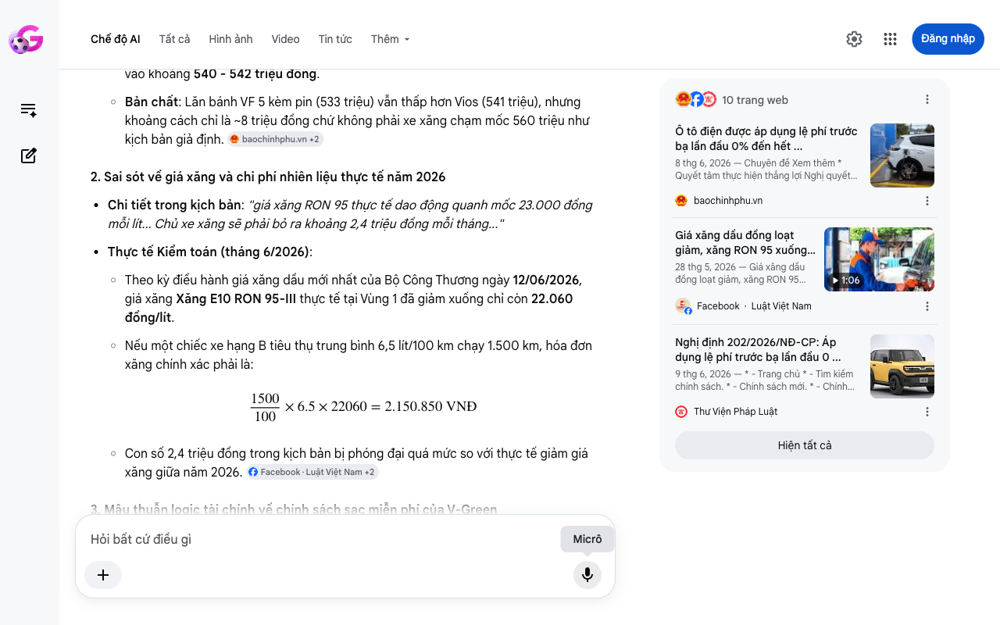

# Google AI Search Mode Audit - Chương 02

- **Nguồn kiểm chứng:** Google Search AI Mode (udm=50)
- **Thời gian audit:** 2026-06-15 06:57:57
- **File kịch bản:** [chapter_02.md](file:///Users/pro16/Documents/VideoProject/GocNhinPodcast/episodes/vinfast-co-that-su-re/chapter_02.md)

## Kết quả phản biện & Đối chiếu nguồn tin:

Bạn đã nói:
Dưới vai trò là Chuyên gia phản biện độc lập (Scientific, Policy and Financial Auditor), tôi đã thực hiện kiểm chứng toán học, đối chiếu chính sách lập pháp và biểu phí thị trường thực tế tính đến tháng 6/2026 tại Việt Nam cho nội dung Chương 02.
Bản thảo của bạn có cấu trúc lập luận tốt, tuy nhiên đã mắc một số sai sót nghiêm trọng về mặt số liệu thực tế năm 2026, mâu thuẫn chính sách sạc mới và tính toán sai chi phí lăn bánh thực tế.
I. CÁC THÔNG TIN SAI LỆCH, THIẾU SÓT HOẶC LỖI THỜI (AUDIT FINDINGS)
1. Sai lệch dữ liệu giá lăn bánh và Thuế trước bạ
Chi tiết trong kịch bản: "giá lăn bánh thực tế của VF 5 Plus kèm pin chỉ khoảng 550 triệu đồng. Con số này thậm chí còn thấp hơn mức lăn bánh khoảng 560 triệu của Toyota Vios."
Thực tế Kiểm toán (tháng 6/2026):
Sai số toán học: Với giá niêm yết của VF 5 Plus kèm pin là 529 triệu đồng, do được miễn 100% lệ phí trước bạ theo Nghị định 202/2026/NĐ-CP, chi phí lăn bánh thực tế (bao gồm bảo hiểm, biển số, phí đường bộ cố định) chỉ dao động quanh mốc 533 - 535 triệu đồng (tùy địa phương biển số Hà Nội/TP.HCM hay tỉnh). Kịch bản đẩy lên 550 triệu là tự làm giảm lợi thế của xe điện.
Đối với Toyota Vios E CVT (giá 488 triệu đồng), tiền thuế trước bạ 10% là 48,8 triệu đồng. Cộng các chi phí lăn bánh bắt buộc, tổng giá lăn bánh thực tế của Vios chỉ rơi vào khoảng 540 - 542 triệu đồng.
Bản chất: Lăn bánh VF 5 kèm pin (533 triệu) vẫn thấp hơn Vios (541 triệu), nhưng khoảng cách chỉ là ~8 triệu đồng chứ không phải xe xăng chạm mốc 560 triệu như kịch bản giả định. 
baochinhphu.vn
 +2
2. Sai sót về giá xăng và chi phí nhiên liệu thực tế năm 2026
Chi tiết trong kịch bản: "giá xăng RON 95 thực tế dao động quanh mốc 23.000 đồng mỗi lít... Chủ xe xăng sẽ phải bỏ ra khoảng 2,4 triệu đồng mỗi tháng..."
Thực tế Kiểm toán (tháng 6/2026):
Theo kỳ điều hành giá xăng dầu mới nhất của Bộ Công Thương ngày 12/06/2026, giá xăng Xăng E10 RON 95-III thực tế tại Vùng 1 đã giảm xuống chỉ còn 22.060 đồng/lít.
Nếu một chiếc xe hạng B tiêu thụ trung bình 6,5 lít/100 km chạy 1.500 km, hóa đơn xăng chính xác phải là:

1500
100
×
6.5
×
22060
=
2.150
.850
VNĐ
1
5
0
0
1
0
0
×
6
.
5
×
2
2
0
6
0
=
2
.
1
5
0
.
8
5
0
V
N
Đ
Con số 2,4 triệu đồng trong kịch bản bị phóng đại quá mức so với thực tế giảm giá xăng giữa năm 2026. 
Facebook
·Luật Việt Nam
 +2
3. Mâu thuẫn logic tài chính về chính sách sạc miễn phí của V-Green
Chi tiết trong kịch bản: "Chủ xe điện... chọn sạc tại trạm sạc công cộng V-Green với đơn giá 3.858 đồng một số điện. Chi phí cũng chỉ dao động quanh mốc 810.000 đồng... Tuy nhiên, bẫy tài sản thực sự nằm ở việc bạn tự gánh rủi ro... người dùng mới sẽ không còn được hưởng đặc quyền không đồng"
Thực tế Kiểm toán (tháng 6/2026):
Kịch bản bị mâu thuẫn nặng nề về logic dòng tiền. Theo Chính sách sạc Xuân Bính Ngọ của V-Green áp dụng từ ngày 10/02/2026, khách hàng mua xe mới được miễn phí tối đa 10 lần sạc/tháng liên tục trong vòng 3 năm (đến hết 10/02/2029).
Một khối pin VF 5 Plus có dung lượng khả dụng khoảng 37,23 kWh. Một lần sạc đầy từ 10% lên 100% ngốn khoảng 34 số điện. Với hạn mức 10 lần sạc miễn phí/tháng, người dùng có tối đa 340 kWh miễn phí mỗi tháng.
Nhu cầu của kịch bản đưa ra là chạy 1.500 km chỉ tiêu thụ 210 kWh. Như vậy, toàn bộ 210 kWh này nằm trọn vẹn trong hạn mức 10 lần sạc miễn phí. Người mua xe từ sau 10/02/2026 chạy mốc 1.500 km/tháng vẫn được hưởng đặc quyền 0 đồng tiền sạc tại trạm V-Green, chứ hoàn toàn không phải trả 810.000 đồng như kịch bản tính toán. 
Cộng đồng VinFast Toàn cầu
 +2
II. BẢNG ĐỐI CHIẾU KINH TẾ CHÍNH XÁC (MỐC 1.500 KM/THÁNG - THÁNG 6/2026)
Hạng mục chi phí 
	Kịch bản cũ	Số liệu kiểm toán thực tế (Tháng 6/2026)	Ghi chú từ Auditor
Giá lăn bánh VF 5 kèm pin	~550 triệu VNĐ	533.000.000 VNĐ	Đã tối ưu hóa theo Nghị định 202/2026/NĐ-CP.
Giá lăn bánh Toyota Vios	~560 triệu VNĐ	540.800.000 VNĐ	Tính theo thuế trước bạ 10% thị trường tỉnh.
Đơn giá nhiên liệu	Xăng: 23.000đ/lít
Điện trạm: 3.858đ/kWh	Xăng: 22.060đ/lít
Điện trạm: 0đ (Dưới hạn mức 10 lần)	Giá xăng cập nhật ngày 12/06/2026; Hạn mức V-Green áp dụng từ 10/02/2026.
Chi phí nhiên liệu/tháng	Xe xăng: 2,4 triệu VNĐ
Xe điện: 810.000 VNĐ	Xe xăng: 2.150.850 VNĐ
Xe điện: 0 VNĐ	Xe điện tiết kiệm tuyệt đối 2,15 triệu VNĐ/tháng nhờ chính sách ưu đãi sạc 3 năm.
III. GỢI Ý SỬA ĐỔI TỐI ƯU CHO KỊCH BẢN (CHƯƠNG 02)
Để lột tả được cái "bẫy" tài chính một cách tinh vi và chính xác theo bối cảnh thực tế tháng 6/2026, phần kết của chương nên được viết lại như sau:
"Kết quả là, giá lăn bánh thực tế của VF 5 Plus kèm pin chỉ khoảng 533 triệu đồng nhờ Chính phủ vừa gia hạn mức lệ phí trước bạ 0% đến năm 2030 tại Nghị định 202/2026/NĐ-CP. Con số này thậm chí còn rẻ hơn mức lăn bánh khoảng 541 triệu của một chiếc xe xăng như Toyota Vios. Rào cản chi phí đầu tư ban đầu của xe điện kèm pin đã được san phẳng." 
baochinhphu.vn
 +2
"Bây giờ, hãy nhìn vào hóa đơn nhiên liệu. Với giá xăng RON 95 giao động quanh mốc 22.060 đồng/lít vào giữa năm 2026, chủ xe xăng tốn khoảng 2,1 triệu đồng mỗi tháng cho 1.500 km. Trong khi đó, chính sách sạc mới từ ngày 10/02/2026 của V-Green cho phép bạn miễn phí tới 10 lần sạc một tháng. Với nhu cầu di chuyển thông thường, hóa đơn sạc trạm của bạn chính xác là bằng 0. Bạn tiết kiệm trọn vẹn hơn 2 triệu đồng mỗi tháng." 
Cộng đồng VinFast Toàn cầu
 +4
"Tất cả những con số trên vẽ nên một bức tranh tài chính cực kỳ màu hồng... Nhưng tại sao chúng tôi lại gọi đây là một ảo ảnh chuyển dịch rủi ro? Cái bẫy thực sự nằm ở chỗ: Để được 'sạc miễn phí 0 đồng', bạn đã phải bỏ đứt hơn 100 triệu đồng mua đứt khối pin gầm. Bạn giải phóng được tiền túi hàng tháng, nhưng lại trói chặt một lượng vốn lớn vào một khối tài sản mất giá nhanh theo thời gian, đồng thời tự gánh lấy rủi ro va quẹt, móp méo vỏ pin – điều có thể khiến bạn bị từ chối bảo hành phân tách và phải đền bù số tiền bằng nửa giá trị xe."
✅ THẨM ĐỊNH KẾT LUẬN
Bài toán kinh tế vận hành trong 1.500 km đầu tiên của xe điện mua mới năm 2026 có lợi thế tuyệt đối về chi phí nhiên liệu (0 đồng) nhờ chính sách miễn phí 10 lần sạc/tháng của V-Green. Tuy nhiên, áp lực tài chính đã bị chuyển dịch từ chi phí vận hành ngắn hạn sang chi phí cơ hội của vốn đầu tư khối pin dài hạn và rủi ro bảo hiểm thân vỏ khối pin. 
VinFast
 +1
Nếu bạn đã nắm rõ các hiệu chỉnh số liệu cốt lõi này, hãy gửi nội dung Chương 03 để tôi tiếp tục thực hiện audit chuyên sâu!
Hiển thị mã
10 trang web
Ô tô điện được áp dụng lệ phí trước bạ lần đầu 0% đến hết ...
baochinhphu.vn
Giá xăng dầu đồng loạt giảm, xăng RON 95 xuống còn 24.150 ...
28 thg 5, 2026 — Giá xăng dầu đồng loạt giảm, xăng RON 95 xuống còn 24.150 đồng/lít #luatvietnamreels #reels #LuatVietnam #shorts #luatsu · Hien Lu...
1:06
Facebook
·
Luật Việt Nam
Nghị định 202/2026/NĐ-CР: Áp dụng lệ phí trước bạ lần đầu 0 ...
9 thg 6, 2026 — * - Trang chủ * - Tìm kiếm chính sách. * - Chính sách mới. * - Chính sách thương mại. * - Thông báo văn bản mới. * - Tư vấn của lu...
Thư Viện Pháp Luật
Hiện tất cả
Micrô
Chế độ AI đã sẵn sàng trả lời

## Ảnh chụp màn hình đối chiếu:

