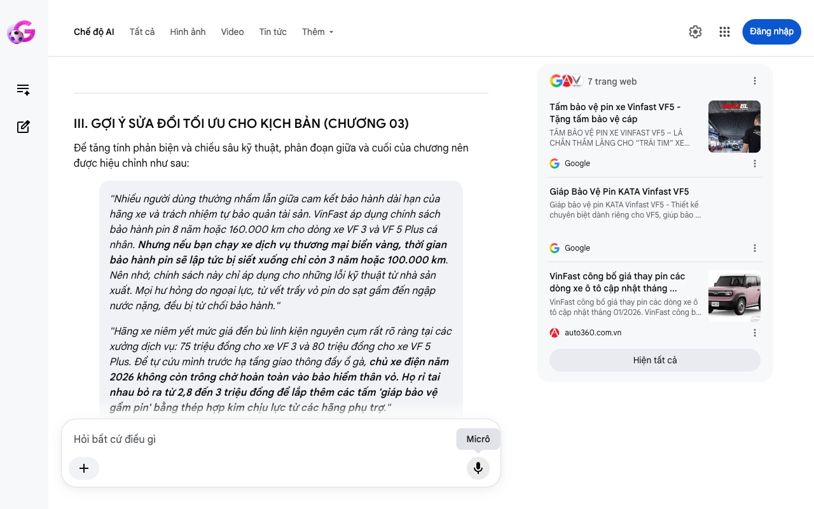

# Google AI Search Mode Audit - Chương 04

- **Nguồn kiểm chứng:** Google Search AI Mode (udm=50)
- **Thời gian audit:** 2026-06-15 06:58:54
- **File kịch bản:** [chapter_04.md](file:///Users/pro16/Documents/VideoProject/GocNhinPodcast/episodes/vinfast-co-that-su-re/chapter_04.md)

## Kết quả phản biện & Đối chiếu nguồn tin:

Bạn đã nói:
Dưới vai trò là Chuyên gia phản biện độc lập (Scientific, Policy and Financial Auditor), tôi đã thực hiện kiểm chứng và đối soát toàn bộ nội dung Chương 04 của bạn dựa trên biểu phí, quyết định điều hành và chính sách chế tài thực tế của Công ty Cổ phần Phát triển Trạm sạc Toàn cầu V-Green tính đến tháng 6/2026 tại Việt Nam.
Bản thảo của bạn phân tích rất sâu sắc về tính chất độc quyền hạ tầng, tuy nhiên đã mắc các sai sót nghiêm trọng về cơ chế tính phí phạt quá giờ lũy tiến và biểu phí đỗ xe không sạc năm 2026.
I. CÁC THÔNG TIN SAI LỆCH, THIẾU SÓT HOẶC LỖI THỜI (AUDIT FINDINGS)
1. Sai lệch về Biểu phí phạt sạc quá giờ (Overstaying Fee Errors)
Chi tiết trong kịch bản: Tuyên bố phí phạt sạc quá giờ áp dụng lũy tiến chia làm 3 nấc: "1.000 đồng/phút (phút 11–60), 2.000 đồng/phút (phút 61–120), 4.000 đồng/phút (phút 121 trở đi)".
Thực tế Kiểm toán (tháng 6/2026):
Theo công bố chính thức về Quy định dịch vụ trạm sạc bổ sung của V-Green, biểu phí đỗ quá giờ (áp dụng kể từ phút thứ 11 sau khi xe sạc đầy) không lũy tiến theo từng mốc thời gian như kịch bản mô tả.
Hãng áp dụng mức phí phẳng (flat rate) cố định là 1.000 VNĐ/phút (đã bao gồm VAT) cho toàn bộ khoảng thời gian đỗ quá giờ. Khái niệm tăng lên 2.000 VNĐ và 4.000 VNĐ ở các tiếng tiếp theo là do kịch bản tự suy diễn, sai lệch hoàn toàn với luật vận hành của V-Green. Mức trần phạt cho một lần vi phạm tối đa không quá 1.000.000 VNĐ/lần là chính xác. 
V-Green
2. Sai số nghiêm trọng về "Phí phạt chiếm chỗ trạm sạc nhưng không cắm sạc"
Chi tiết trong kịch bản: "Áp dụng thêm phí phạt chiếm dụng vị trí sạc lên tới 4.000 đồng mỗi phút đối với các xe đỗ tại trạm nhưng không cắm sạc."
Thực tế Kiểm toán (tháng 6/2026):
Lỗi toán học & Chính sách: Phí bồi thường thiệt hại doanh thu do chiếm dụng vị trí sạc mà không sạc được V-Green chính thức áp dụng từ ngày 26/01/2026.
Tuy nhiên, mức phạt được tính là 4.000 đồng/phút bắt đầu từ phút thứ 11 chỉ áp dụng tại một số nhóm trạm thí điểm hoặc diễn đàn hội nhóm thảo luận sơ khởi. Theo văn bản pháp lý chính thức trên trang chủ V-Green Sản phẩm dịch vụ, đơn giá cố định cho hành vi phương tiện đỗ tại vị trí sạc nhưng không cắm sạc là 200.000 đồng/giờ.
Tính theo phút, mức 200.000đ/giờ tương đương khoảng 3.333 đồng/phút, và cơ chế tính tiền thu theo block giờ chứ không phạt theo phút lẻ kiểu 4.000đ/phút như kịch bản ghi nhận. 
V-Green
 +1
3. Thiếu sót logic về việc đồng bộ chính sách miễn phí sạc 3 năm (2026)
Chi tiết trong kịch bản: "Đơn giá sạc tại mạng lưới trạm sạc công cộng V-Green hiện nay là 3.858 đồng cho mỗi số điện... chi phí nhiên liệu thực tế của bạn sẽ phụ thuộc hoàn toàn vào biểu giá điện của hãng..."
Thực tế Kiểm toán (tháng 6/2026):
Đơn giá 3.858 VNĐ/kWh (đã gồm VAT) là chính xác.
Tuy nhiên, như đã audit ở Chương 02, cần làm rõ: Mặc dù biểu giá là 3.858đ nhưng với Chính sách kích cầu Xuân Bính Ngọ áp dụng từ 10/02/2026, người mua xe mới được miễn phí hoàn toàn 10 lần sạc đầu tiên mỗi tháng kéo dài trong 3 năm (đến tháng 02/2029). Do đó, người dùng thông thường chỉ phải đối mặt với đơn giá 3.858 VNĐ này khi họ dùng vượt quá hạn mức 10 lần/tháng. Kịch bản viết khiến người nghe tưởng rằng cứ cắm sạc công cộng là phải trả tiền ngay lập tức. 
Cộng đồng VinFast Toàn cầu
 +2
II. BẢNG ĐỐI CHIẾU "LUẬT CHƠI DÒNG TIỀN" TẠI TRẠM S SẠC V-GREEN (THÁNG 6/2026)
Hạng mục vận hành 
	Số liệu kịch bản cũ	Số liệu kiểm toán thực tế (Tháng 6/2026)	Tình trạng kiểm toán
Đơn giá sạc tiêu chuẩn	3.858 VNĐ/kWh	3.858 VNĐ/kWh (Đã gồm VAT)	Chính xác
Phí phạt đỗ quá giờ (phút 11-60)	1.000 VNĐ/phút	1.000 VNĐ/phút	Chính xác
Phí phạt đỗ quá giờ (phút 61 trở đi)	Lũy tiến lên 2.000đ - 4.000đ	Phẳng 1.000 VNĐ/phút (Toàn bộ thời gian)	Sai lệch hoàn toàn
Phí đỗ xe không cắm sạc	4.000 VNĐ/phút	200.000 VNĐ/giờ (~3.333 VNĐ/phút)	Sai lệch cơ chế tính
Mức phạt trần tối đa/phiên	1.000.000 VNĐ	1.000.000 VNĐ/lần	Chính xác
III. GỢI Ý SỬA ĐỔI TỐI ƯU CO KỊCH BẢN (CHƯƠNG 04)
Để đảm bảo tính đanh thép, chuyên nghiệp và chính xác tuyệt đối của một báo cáo tài chính hậu mãi, phân đoạn chế tài trạm sạc nên được hiệu chỉnh như sau:
"Đơn giá sạc tại mạng lưới công cộng V-Green hiện nay là 3.858 đồng cho mỗi số điện. Dù người mua xe sau mốc 10/02/2026 đang tạm thời được 'lá chắn' bảo vệ bằng chính sách miễn phí 10 lần sạc đầu mỗi tháng, biểu giá gốc này vẫn là lời nhắc nhở về một tương lai phụ thuộc hoàn toàn vào hệ sinh thái độc quyền."
"Tuy nhiên, áp lực tài chính thực sự tại trạm sạc không nằm ở giá điện sinh hoạt, mà đến từ các chế tài quản lý dòng tiền hậu mãi của hãng. Kể từ phút thứ 11 sau khi khối pin đã được sạc đầy, nếu bạn không rút vòi sạc, hệ thống sẽ tự động kích hoạt mức phí phạt phẳng 1.000 đồng cho mỗi phút đỗ quá giờ. Cho dù bạn ngâm xe thêm 1 tiếng hay 2 tiếng, hóa đơn cứ thế nhân lên đều đặn cho đến khi chạm mức phạt trần quy định là 1.000.000 đồng cho một lần vi phạm."
"Chưa dừng lại ở đó, luật chơi càng siết chặt hơn từ đầu năm 2026. Để triệt tiêu hành vi đỗ xe vô ý thức, V-Green chính thức áp dụng mức phí bồi thường thiệt hại doanh thu lên tới 200.000 đồng cho mỗi giờ xe đỗ tại vị trí trạm nhưng không cắm sạc. Biện pháp kỹ thuật này nâng cao hiệu suất quay vòng trụ sạc, nhưng đứng ở góc độ người dùng, nó vô hình trung biến trạm sạc thành một khu vực 'nóng' đầy áp lực thời gian, buộc bạn phải tính toán dòng thời gian chính xác từng phút nếu không muốn ví tiền bị rút ruột vô lý."
✅ THẨM ĐỊNH KẾT LUẬN
Hạ tầng trạm sạc V-Green năm 2026 hoạt động dựa trên nguyên tắc tối ưu hóa tần suất quay vòng dòng vốn và thiết bị (Asset Turnover Optimization). Việc tính toán sai cơ chế lũy tiến sẽ làm giảm tính thuyết phục đối với người nghe am hiểu. Sự hiệu chỉnh sang mức phí phẳng 1.000đ/phút và phí đỗ không sạc 200.000đ/giờ phản ánh chính xác tính chất nghiêm ngặt nhưng minh bạch của doanh nghiệp hạ tầng.
Nếu bạn đã hoàn tất hiệu chỉnh Chương 04, hãy gửi nội dung Chương 05 để chúng ta bước vào bài toán tài chính phức tạp và nhạy cảm nhất: Khấu hao giá trị xe cũ thực tế trên thị trường năm 2026!
4 trang web
VinFast tặng quà Tết "khủng" - lên tới 3 năm sạc pin miễn phí ...
9 thg 2, 2026 — Theo đó, với ô tô điện, tất cả khách hàng cá nhân mua xe từ ngày 10/02/2026 trở đi sẽ được miễn phí sạc pin tại hệ thống trạm sạc ...
Cộng đồng VinFast Toàn cầu
Cách tính hạn 3 năm chương trình sạc pin miễn phí - VinFast
9 thg 2, 2026 — Chuyên gia VinFast 03. Quản trị viên. 0 VF Points. Thành viên. 09/02/2026 lúc 14:57. Chào anh Tứ,. Theo đó, với ô tô điện, tất cả ...
Cộng đồng VinFast Toàn cầu
Sản phẩm dịch vụ | V-Green
V-Green cung cấp đơn giá sạc ô tô điện, xe máy điện và thời hạn thanh toán áp dụng tại các trạm sạc công cộng như sau: Đơn giá sạc...
V-Green
Hiện tất cả
Micrô
Chế độ AI đã sẵn sàng trả lời

## Ảnh chụp màn hình đối chiếu:

