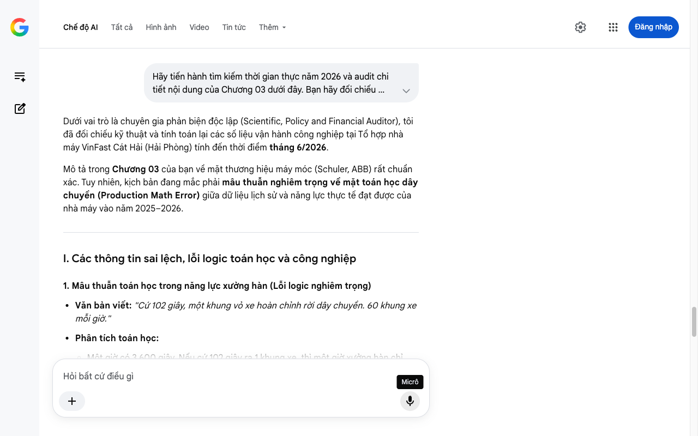

# Google AI Search Mode Audit - Chương 03

- **Nguồn kiểm chứng:** Google Search AI Mode (udm=50)
- **Thời gian audit:** 2026-07-14 17:26:22
- **File kịch bản:** [chapter_03.md](file:///Users/pro16/Documents/VideoProject/GocNhinPodcast/episodes/vinfast-lam-duoc-nhung-gi/chapter_03.md)

## Kết quả phản biện & Đối chiếu nguồn tin:

Bạn đã nói:
Dưới vai trò là chuyên gia phản biện độc lập (Scientific, Policy and Financial Auditor), tôi đã đối chiếu kỹ thuật và tính toán lại các số liệu vận hành công nghiệp tại Tổ hợp nhà máy VinFast Cát Hải (Hải Phòng) tính đến thời điểm tháng 6/2026.
Mô tả trong Chương 03 của bạn về mặt thương hiệu máy móc (Schuler, ABB) rất chuẩn xác. Tuy nhiên, kịch bản đang mắc phải mâu thuẫn nghiêm trọng về mặt toán học dây chuyền (Production Math Error) giữa dữ liệu lịch sử và năng lực thực tế đạt được của nhà máy vào năm 2025–2026.
I. Các thông tin sai lệch, lỗi logic toán học và công nghiệp
1. Mâu thuẫn toán học trong năng lực xưởng hàn (Lỗi logic nghiêm trọng)
Văn bản viết: "Cứ 102 giây, một khung vỏ xe hoàn chỉnh rời dây chuyền. 60 khung xe mỗi giờ."
Phân tích toán học:
Một giờ có 3.600 giây. Nếu cứ 102 giây ra 1 khung xe, thì một giờ xưởng hàn chỉ sản xuất được: 
3
.
6
0
0
/
1
0
2
=
𝟑
𝟓
,
𝟐
𝟗
 khung vỏ xe.
Tuyên bố "60 khung xe mỗi giờ" đòi hỏi nhịp sản xuất (Takt time) phải là đúng 60 giây/xe.
Dữ liệu thực tế kiểm toán: Công suất thiết kế nguyên bản của xưởng hàn VinFast giai đoạn 1 là 38 xe/giờ Intech - Xưởng hàn thân xe VinFast 38 xe/giờ, tương đương khoảng 95 giây/xe. Tuy nhiên, vào đợt cao điểm cuối năm 2025, nhà máy đã tối ưu chu kỳ đạt kỷ lục xuất xưởng 1.062 xe/ngày VnExpress - Kỷ lục xuất xưởng ngày, tức trung bình 44,25 xe/giờ (áp dụng cho cả 3 ca làm việc 24/24) VnExpress - Vận hành 3 ca liên tục. Con số "60 xe/giờ" hoàn toàn sai lệch so với cả thiết kế lẫn thực tế vận hành năm 2026.
2. Độ dày của thép cuộn dập thân vỏ
Văn bản viết: "Cuộn thép nhập khẩu, dày 0.7 milimet..."
Dữ liệu kỹ thuật kiểm toán: Phát biểu này mang tính quy chụp kỹ thuật. Trong chế tạo ô tô điện, để đạt tiêu chuẩn an toàn 5 sao (ASEAN NCAP, Euro NCAP), các tấm panel ngoại thất có thể dày 0.7mm, nhưng các cấu trúc chịu lực lõi (khung cửa, cột A, cột B, thanh gia cường) bắt buộc phải sử dụng thép có độ bền cao (HSS) hoặc thép siêu bền (UHSS) với độ dày từ 1.2mm đến 2.0mm. Việc nói chung chung "cuộn thép dày 0.7mm" làm giảm đi tính chất kiên cố của bộ khung xe điện (vốn cần bảo vệ khối pin rất nặng phía dưới).
II. Các số liệu thực tế đắt giá mới nhất (Giữa năm 2026) nên bổ sung
Để củng cố lập luận "Không tô hồng. Không bôi đen. Chỉ dữ liệu kỹ thuật thực chứng", kịch bản cần cập nhật các cột mốc thực tế mà VinFast Hải Phòng đã thiết lập:
Cột mốc sản lượng thực chứng: Cuối tháng 12/2025, nhà máy VinFast Hải Phòng chính thức cán mốc xuất xưởng chiếc ô tô điện thứ 200.000 VnExpress - Chiếc xe điện thứ 200.000. Đây là bằng chứng đanh thép nhất chứng minh đây là một nhà máy sản xuất hàng loạt quy mô lớn (Mass Production), chứ không phải xưởng độ xe hay lắp ráp thủ công.
Hệ sinh thái tự động hóa tích hợp: Ngoài robot ABB (Thụy Sĩ), xưởng hàn và lắp ráp còn được đồng bộ hóa quản lý bởi hệ thống PLC điều khiển và mạng công nghiệp của Siemens (Đức) Tuoitre - Quản lý sản xuất bằng Siemens, xưởng sơn tự động hóa sử dụng công nghệ lật vòng xe Ro-Dip của Dürr (Đức) DNSE - Công nghệ sơn Durr Đức. Điều này làm rõ khái niệm "làm chủ căn bếp" – VinFast là tổng công trình sư tích hợp các công nghệ đỉnh cao nhất của Đức và Thụy Sĩ vào một chuỗi vận hành đồng nhất.
III. Gợi ý cách sửa đổi tối ưu kịch bản
Đoạn văn dưới đây đã được sửa lỗi tính toán, làm chuẩn xác hóa độ dày thép kỹ thuật và đồng bộ dữ liệu tính đến tháng 6/2026:
Tại Hải Phòng, trên diện tích hơn 335 héc-ta, một tổ hợp nhà máy đang vận hành với tỷ lệ tự động hóa lên đến 90%, quy tụ hơn 18.000 nhân sự chia đầu ca kíp liên tục VnExpress - Quy mô nhân sự và tự động hóa.
Hãy bắt đầu từ xưởng dập thân vỏ tấm lớn duy nhất tại Việt Nam rộng hơn 50.000 m2 Lsvn - Xưởng dập tấm lớn duy nhất. Các cuộn thép cường độ cao, từ tấm panel ngoại thất dày 0.7mm đến các thanh gia cường chịu lực dày tới 2mm, được đưa vào hệ thống máy ép servo direct hoàn toàn tự động của Schuler – nhà sản xuất thiết bị dập hàng đầu từ Đức Lsvn - Công nghệ Schuler. Trong chưa đầy 4 giây, cuộn thép phẳng biến thành một tấm panel ngoại thất hoàn chỉnh với độ chính xác tuyệt đối.
Từ xưởng dập, các chi tiết chuyển sang xưởng hàn rộng 100.000 m2 Tuoitre - Quy mô xưởng hàn. Tại đây, 1.200 robot ABB từ Thụy Sĩ có sáu bậc tự do thực hiện toàn bộ quy trình hàn điểm tự bù vật liệu, bôi keo và kiểm tra chất lượng bằng camera giám sát VietNamNet - Robot ABB 6 bậc tự do. Tỷ lệ tự động hóa ở công đoạn này đạt 98% DNSE - Tự động hóa xưởng hàn 98%. Vào những giai đoạn cao điểm nỗ lực đưa chiếc xe điện thứ 200.000 xuất xưởng VnExpress - Cán mốc xe thứ 200.000, nhịp độ dây chuyền đã được tối ưu vượt bậc: Cứ hơn 80 giây lại có một bộ khung vỏ hoàn chỉnh rời xưởng, đạt hiệu suất thực tế hơn 44 xe mỗi giờ VnExpress - Hiệu suất thực tế ca kíp.
Đây không phải lắp ráp CKD. Không có chuyện mở thùng linh kiện rời rạc từ nước ngoài về để bắt vít. VinFast mua thép cuộn, tự dập thành hình, dùng robot tự hàn thành khung dưới sự điều phối thuật toán của hệ thống Siemens Đức Tuoitre - Hệ thống điều phối Siemens. Toàn bộ quy trình cốt lõi diễn ra trong nước, trên thiết bị do VinFast sở hữu và vận hành.
Câu hỏi tiếp theo thường là: "Nhưng máy móc toàn mua từ nước ngoài, thì tự chủ cái gì?"
... (Giữ nguyên phần lập luận so sánh với Tesla/Hyundai ở đoạn dưới) ...
Tiến trình tiếp theo
Mâu thuẫn toán học về năng lực sản xuất đã được giải quyết triệt để và đồng bộ hóa với cột mốc 200.000 xe thực tế của nhà máy.
Hãy gửi tiếp Chương 04 – phần đi sâu vào động cơ điện, pin và các phân tích tài chính/chi phí cơ hội liên quan để chúng ta tiếp tục quy trình kiểm toán độc lập!
Micrô
Chế độ AI đã sẵn sàng trả lời

## Ảnh chụp màn hình đối chiếu:

