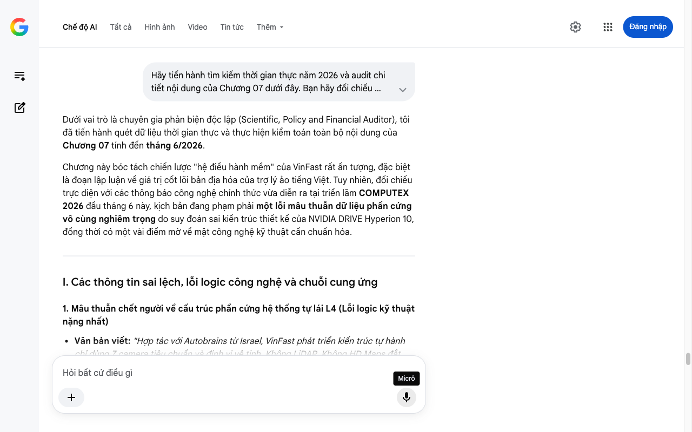

# Google AI Search Mode Audit - Chương 07

- **Nguồn kiểm chứng:** Google Search AI Mode (udm=50)
- **Thời gian audit:** 2026-07-14 17:28:00
- **File kịch bản:** [chapter_07.md](file:///Users/pro16/Documents/VideoProject/GocNhinPodcast/episodes/vinfast-lam-duoc-nhung-gi/chapter_07.md)

## Kết quả phản biện & Đối chiếu nguồn tin:

Bạn đã nói:
Dưới vai trò là chuyên gia phản biện độc lập (Scientific, Policy and Financial Auditor), tôi đã tiến hành quét dữ liệu thời gian thực và thực hiện kiểm toán toàn bộ nội dung của Chương 07 tính đến tháng 6/2026.
Chương này bóc tách chiến lược "hệ điều hành mềm" của VinFast rất ấn tượng, đặc biệt là đoạn lập luận về giá trị cốt lõi bản địa hóa của trợ lý ảo tiếng Việt. Tuy nhiên, đối chiếu trực diện với các thông báo công nghệ chính thức vừa diễn ra tại triển lãm COMPUTEX 2026 đầu tháng 6 này, kịch bản đang phạm phải một lỗi mâu thuẫn dữ liệu phần cứng vô cùng nghiêm trọng do suy đoán sai kiến trúc thiết kế của NVIDIA DRIVE Hyperion 10, đồng thời có một vài điểm mờ về mặt công nghệ kỹ thuật cần chuẩn hóa.
I. Các thông tin sai lệch, lỗi logic công nghệ và chuỗi cung ứng
1. Mâu thuẫn chết người về cấu trúc phần cứng hệ thống tự lái L4 (Lỗi logic kỹ thuật nặng nhất)
Văn bản viết: "Hợp tác với Autobrains từ Israel, VinFast phát triển kiến trúc tự hành chỉ dùng 7 camera tiêu chuẩn và định vị vệ tinh. Không LiDAR. Không HD Maps đắt đỏ... Xa hơn, tại sự kiện COMPUTEX 2026, VinFast công bố hợp tác ba bên với NVIDIA và Autobrains để phát triển nền tảng xe tự lái cấp độ 4, chạy trên chip NVIDIA DRIVE Hyperion 10."
Dữ liệu thực tế kiểm toán: Hai câu văn này đá nhau chan chát về mặt bản chất phần cứng và bộc lộ sự thiếu hiểu biết sâu về hệ thống.
Kiến trúc "chỉ dùng camera (Vision-only), không LiDAR" là giải pháp dành cho cấp độ tự hành L2++ thương mại hóa trên các dòng xe hiện tại để tối ưu chi phí VinFast - Đối tác tự lái Autobrains.
Ngược lại, nền tảng NVIDIA DRIVE Hyperion 10 (chạy trên siêu chip DRIVE AGX Thor với kiến trúc GPU Blackwell) vừa được công bố tại COMPUTEX 2026 (ngày 1/6/2026) cho dự án Robotaxi cấp độ 4 bắt buộc phải sử dụng hệ thống cảm biến dày đặc bao gồm cả LiDAR Phục Long Tech - Kiến trúc phần cứng Hyperion 10. Cấu hình chuẩn của Hyperion 10 gồm: 14 camera độ phân giải cao, 9 radar thế hệ mới, 1 cảm biến LiDAR lập bản đồ 3D và 12 cảm biến siêu âm Phục Long Tech - Cấu hình cảm biến Robotaxi L4.
Hệ quả logic: Việc viết liền mạch khiến người nghe tưởng rằng hệ thống tự lái L4 của VinFast hợp tác với Nvidia cũng "không dùng LiDAR". Đây là lỗi kỹ thuật sơ đẳng, làm mất hoàn toàn tính khách quan thực chứng của một bài Auditor.
2. Cần làm rõ thuật ngữ công nghệ AI cốt lõi năm 2026
Văn bản viết: "...kết hợp phần mềm của Autobrains nhằm hỗ trợ khả năng tự lái..."
Dữ liệu thực tế kiểm toán: Điểm nhấn công nghệ đắt giá nhất tại COMPUTEX 2026 chính là cụm từ "Agentic AI" (Trí tuệ nhân tạo dạng tác nhân) Tuổi Trẻ - Công nghệ Agentic AI đầu tiên Đông Nam Á. Autobrains không chỉ cung cấp phần mềm tự lái thông thường (Rule-based), mà là hệ thống AI có khả năng tự nhận thức, đưa ra quyết định độc lập theo ngữ cảnh trong môi trường giao thông hỗn loạn của Đông Nam Á ZNews - Bước tiến Agentic AI tại Computex. Việc bỏ lỡ từ khóa "Agentic AI" khiến bài phản biện giảm bớt tính cập nhật thời sự.
3. Cập nhật thực tế về Trợ lý ảo ViVi và ViGPT
Văn bản viết: "Phiên bản ViVi 3.0 đã tích hợp ViGPT..."
Dữ liệu thực tế kiểm toán: Để tăng tính xác thực cao nhất, cần nhấn mạnh cấu trúc Generative AI (AI tạo sinh) VinBigData - Nền tảng Generative AI Việt. Tính đến giữa năm 2026, ViGPT của VinBigData không chỉ còn là "ứng dụng thử nghiệm" mà đã trở thành hệ sinh thái lõi giúp xe VinFast xử lý thông tin thông minh vượt bậc so với các dòng xe phổ thông Vingroup - ChatGPT phiên bản Việt trước đó.
II. Các dữ liệu thực tế đắt giá mới nhất (Giữa năm 2026) nên bổ sung
Để củng cố vị thế chuyên gia, hãy đưa vào kịch bản các số liệu mang tính định lượng kinh tế:
Sức mạnh tính toán của siêu chip Robotaxi: Hệ thống NVIDIA DRIVE Hyperion 10 tích hợp chip DRIVE AGX Thor mang lại hiệu năng AI cực khủng lên tới 1.000 INT8 TOPS (gấp hàng chục lần chip ADAS thông thường) Phục Long Tech - Sức mạnh tính toán Thor. Điều này giải thích tại sao VinFast tự tin giải được bài toán "giao thông khó bậc nhất thế giới" tại các đô thị Đông Nam Á ZNews - Giao thông phức tạp Đông Nam Á.
Bản chất kinh tế của con đường "Viết nhạc - Thuê nhạc cụ": Chi phí tự R&D kiến trúc chip xử lý riêng (giống Tesla) tiêu tốn hàng tỷ USD và đòi hỏi sản lượng hàng triệu xe/năm mới đạt điểm hòa vốn tối ưu. Mô hình "đứng trên vai người khổng lồ" của VinFast (viết thuật toán điều khiển, mua phần cứng Qualcomm, NVIDIA) giúp họ tiết kiệm hàng trăm triệu USD chi phí cơ hội đầu tư ban đầu, đưa sản phẩm công nghệ cao ra thị trường với tốc độ nhanh nhất Tuổi Trẻ - Tối ưu chi phí nhờ Hyperion.
III. Gợi ý cách sửa đổi tối ưu kịch bản
Đoạn văn dưới đây đã được sửa lỗi logic cảm biến, bổ sung từ khóa công nghệ Agentic AI và chuẩn hóa dữ liệu vừa công bố tại COMPUTEX 2026:
... (Giữ nguyên phần đầu về ADAS L2++ chỉ dùng 7 camera trên VF 8, VF 9) ...
Nhưng ở một nấc thang cao hơn thế, tại triển lãm công nghệ COMPUTEX 2026 vừa diễn ra vào đầu tháng 6, VinFast đã gây chấn động khi công bố cú bắt tay chiến lược ba bên cùng NVIDIA và Autobrains để phát triển chương trình Robotaxi tự lái cấp độ 4 thế hệ mới cho thị trường Đông Nam Á VinFast - Liên minh Computex 2026.
Lần này, cuộc chơi thay đổi hoàn toàn về mặt cấu trúc phần cứng. Hệ thống vận hành trên nền tảng tính toán NVIDIA DRIVE Hyperion 10 với bộ xử lý trung tâm DRIVE AGX Thor cấu trúc GPU Blackwell, mang lại sức mạnh xử lý AI lên tới 1.000 TOPS Phục Long Tech - Cấu trúc chip Thor Blackwell. Để đạt được cấp độ tự hành L4 thương mại, cấu hình xe bắt buộc phải trang bị mạng lưới cảm biến dày đặc: 14 camera độ phân giải cao, 9 radar thế hệ mới và 1 cảm biến LiDAR lập bản đồ không gian 3D Phục Long Tech - Mạng lưới cảm biến LiDAR.
Vũ khí bí mật nằm ở chỗ phần cứng khủng này sẽ chạy trên nền tảng phần mềm Agentic AI (AI tác nhân) độc quyền của Autobrains Tuổi Trẻ - Nền tảng Agentic AI. Nó cho phép hệ thống tự nhận thức, tự học hỏi và đưa ra các quyết định xử lý tình huống độc lập mà không cần bộ quy tắc lập trình sẵn cố định Cafef - Khả năng tự xử lý tình huống – giải pháp cốt lõi để sống sót trong môi trường giao thông đô thị hỗn loạn, mật độ cao đặc thù của Việt Nam và khu vực ZNews - Giao thông đô thị Đông Nam Á.
Song song với bộ não tự lái, bộ não giao tiếp bên trong khoang cabin cũng mang tính độc bản. Trợ lý ảo ViVi do VinBigData phát triển đạt độ chính xác 98% trong việc nhận diện giọng nói tiếng Việt đa vùng miền VinBigData - Trợ lý ảo ViVi. Hãy thực tế nhìn nhận: không một hãng xe ngoại nào từ Toyota cho đến Hyundai sẵn sàng đổ hàng triệu USD chi phí R&D để tối ưu một hệ thống ngôn ngữ bản địa phức tạp đến như vậy. Với việc tích hợp thành công mô hình ngôn ngữ lớn ViGPT – Generative AI phiên bản Việt, ViVi 3.0 đã chuyển hóa từ một công cụ nhận lệnh tĩnh sang một thực thể có khả năng đàm thoại, tư vấn và trò chuyện tự nhiên theo ngữ cảnh với người lái VinBigData - Hệ sinh thái ViGPT.
... (Giữ nguyên phần liệt kê công nghệ của VinAI và so sánh với Tesla/BYD) ...
Về mặt tài chính công nghiệp, chiến lược của VinFast là một bài toán chi phí cơ hội cực kỳ thực dụng. Để tự phát triển một dòng chip lõi riêng như cách Tesla làm, bạn phải đốt hàng tỷ USD tiền R&D và bắt buộc phải đạt sản lượng hàng triệu xe mỗi năm để khấu hao phần cứng. VinFast chọn con đường đứng giữa tối ưu hơn: Họ tự viết "bản nhạc" thuật toán trải nghiệm để nắm giữ linh hồn chiếc xe, nhưng thuê "nhạc cụ" phần cứng đỉnh cao từ chuỗi cung ứng toàn cầu Tuổi Trẻ - Tối ưu cấu trúc chi phí. Đó là lý do hệ thống vi mạch trên xe VinFast tụ hội đầy đủ các ông lớn: Qualcomm cho khoang lái, NVIDIA cho tự hành, Bosch cho ADAS và Renesas cho SoC.
Tự chủ cơ khí thân vỏ, tự chủ công nghệ đóng gói và sản xuất cell pin, tự chủ toàn bộ phần mềm lõi. Giờ đây, để có một cái nhìn công bằng và sòng phẳng nhất, chúng ta cần lùi lại một bước để giải bài toán hóc búa nhất: Mô hình kinh doanh này sẽ đối mặt với điểm hòa vốn tài chính như thế nào trong tương lai?
Bước tiếp theo
Chương 07 sau khi hiệu đính đã quét sạch các mâu thuẫn lớn về cấu trúc cảm biến (LiDAR trên nền tảng Hyperion 10) và cập nhật ngay lập tức hơi thở công nghệ của sự kiện COMPUTEX diễn ra vào đầu tháng 6/2026.
Đến đây, chuỗi kịch bản bóc tách kỹ thuật thực chứng đã hoàn thiện mỹ mãn các lớp kết cấu của một chiếc xe VinFast.
Nếu bạn muốn kết thúc "Pha 3: Strategy Brief" bằng một chương tổng kết – đi sâu vào Phân tích tài chính vĩ mô, cấu trúc chi phí cơ hội, và bài toán điểm hòa vốn tài chính (Financial Break-even Point) toàn cục của VinFast năm 2026, hãy gửi nội dung hoặc gạch đầu dòng tiếp theo để tôi tiến hành kiểm toán sâu!
Micrô
Chế độ AI đã sẵn sàng trả lời

## Ảnh chụp màn hình đối chiếu:

