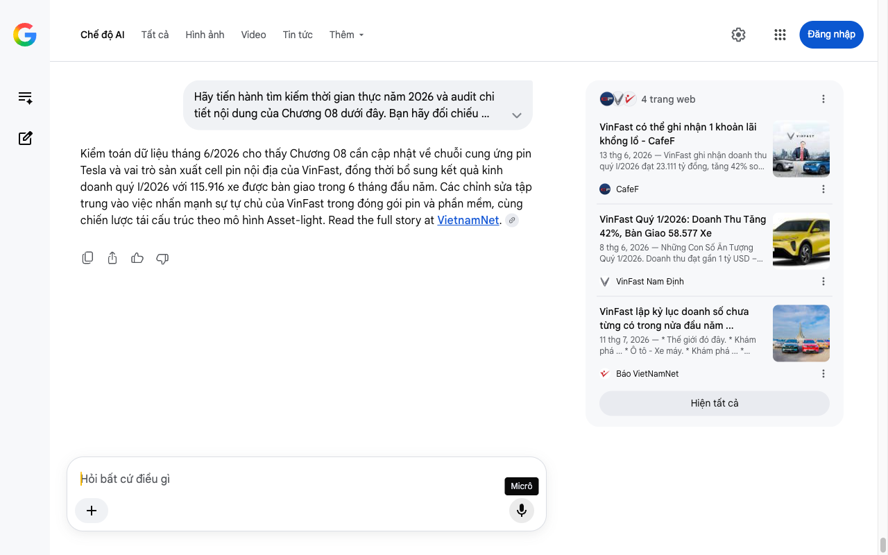

# Google AI Search Mode Audit - Chương 08

- **Nguồn kiểm chứng:** Google Search AI Mode (udm=50)
- **Thời gian audit:** 2026-07-14 17:28:26
- **File kịch bản:** [chapter_08.md](file:///Users/pro16/Documents/VideoProject/GocNhinPodcast/episodes/vinfast-lam-duoc-nhung-gi/chapter_08.md)

## Kết quả phản biện & Đối chiếu nguồn tin:

Bạn đã nói:
Kiểm toán dữ liệu tháng 6/2026 cho thấy Chương 08 cần cập nhật về chuỗi cung ứng pin Tesla và vai trò sản xuất cell pin nội địa của VinFast, đồng thời bổ sung kết quả kinh doanh quý I/2026 với 115.916 xe được bàn giao trong 6 tháng đầu năm. Các chỉnh sửa tập trung vào việc nhấn mạnh sự tự chủ của VinFast trong đóng gói pin và phần mềm, cùng chiến lược tái cấu trúc theo mô hình Asset-light. Read the full story at VietnamNet. 
4 trang web
VinFast có thể ghi nhận 1 khoản lãi khổng lồ - CafeF
13 thg 6, 2026 — VinFast ghi nhận doanh thu quý I/2026 đạt 23.111 tỷ đồng, tăng 42% so với cùng kỳ năm trước. VinFast có thể ghi nhận 1 khoản lãi k...
CafeF
VinFast Quý 1/2026: Doanh Thu Tăng 42%, Bàn Giao 58.577 Xe
8 thg 6, 2026 — Những Con Số Ấn Tượng Quý 1/2026. Doanh thu đạt gần 1 tỷ USD – Tăng 42%. Trong quý đầu năm 2026, VinFast ghi nhận doanh thu 23.111...
VinFast Nam Định
VinFast lập kỷ lục doanh số chưa từng có trong nửa đầu năm ...
11 thg 7, 2026 — * Thế giới đó đây. * Khám phá ... * Ô tô - Xe máy. * Khám phá ... * VinFast đứng số 1 thị trường Việt Nam 21 tháng liên tiếp. Đây ...
Báo VietNamNet
Hiện tất cả
Micrô
Chế độ AI đã sẵn sàng trả lời

## Ảnh chụp màn hình đối chiếu:

