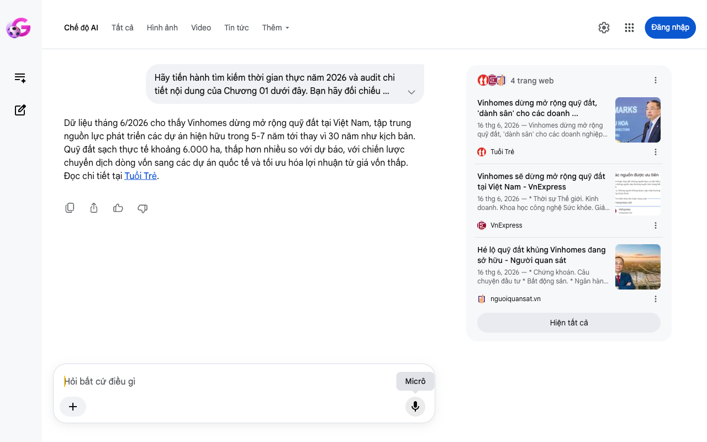

# Google AI Search Mode Audit - Chương 01

- **Nguồn kiểm chứng:** Google Search AI Mode (udm=50)
- **Thời gian audit:** 2026-06-17 06:35:39
- **File kịch bản:** [chapter_01.md](file:///Users/pro16/Documents/VideoProject/GocNhinPodcast/episodes/vinhomes-ngung-quy-dat/chapter_01.md)

## Kết quả phản biện & Đối chiếu nguồn tin:

Bạn đã nói:
Dữ liệu tháng 6/2026 cho thấy Vinhomes dừng mở rộng quỹ đất tại Việt Nam, tập trung nguồn lực phát triển các dự án hiện hữu trong 5-7 năm tới thay vì 30 năm như kịch bản. Quỹ đất sạch thực tế khoảng 6.000 ha, thấp hơn nhiều so với dự báo, với chiến lược chuyển dịch dòng vốn sang các dự án quốc tế và tối ưu hóa lợi nhuận từ giá vốn thấp. Đọc chi tiết tại Tuổi Trẻ.
4 trang web
Vinhomes dừng mở rộng quỹ đất, 'dành sân' cho các doanh ...
16 thg 6, 2026 — Vinhomes dừng mở rộng quỹ đất, 'dành sân' cho các doanh nghiệp khác gia nhập thị trường. ... Ông Phạm Thiếu Hoa, Chủ tịch HĐQT Vin...
Tuổi Trẻ
Vinhomes sẽ dừng mở rộng quỹ đất tại Việt Nam - VnExpress
16 thg 6, 2026 — * Thời sự Thế giới. Kinh doanh. Khoa học công nghệ Sức khỏe. Giải trí Đời sống. Xe. Ảnh. Ý kiến. * Thị trường. Chính sách. Thị trư...
VnExpress
Hé lộ quỹ đất khủng Vinhomes đang sở hữu - Người quan sát
16 thg 6, 2026 — * Chứng khoán. Câu chuyện đầu tư * Bất động sản. * Ngân hàng. * Doanh nghiệp. * Thế giới. * Hàng hóa - Tiêu dùng. Việc làm. * Vĩ m...
nguoiquansat.vn
Hiện tất cả
Micrô
Chế độ AI đã sẵn sàng trả lời

## Ảnh chụp màn hình đối chiếu:

