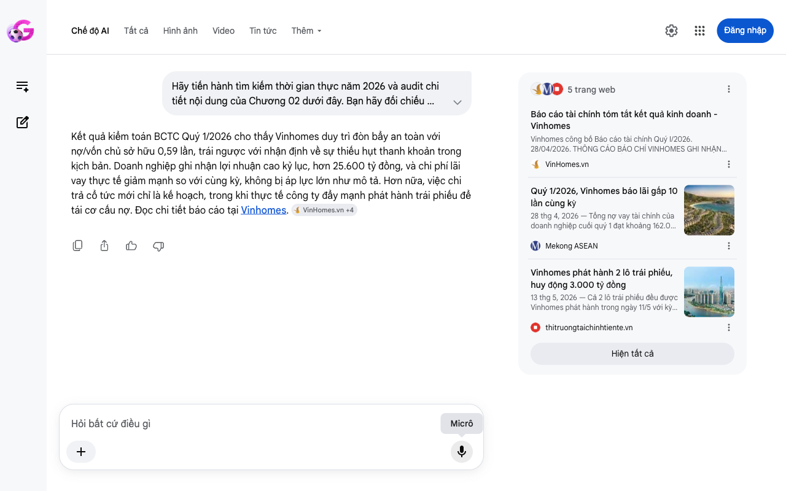

# Google AI Search Mode Audit - Chương 02

- **Nguồn kiểm chứng:** Google Search AI Mode (udm=50)
- **Thời gian audit:** 2026-06-17 06:36:04
- **File kịch bản:** [chapter_02.md](file:///Users/pro16/Documents/VideoProject/GocNhinPodcast/episodes/vinhomes-ngung-quy-dat/chapter_02.md)

## Kết quả phản biện & Đối chiếu nguồn tin:

Bạn đã nói:
Kết quả kiểm toán BCTC Quý 1/2026 cho thấy Vinhomes duy trì đòn bẩy an toàn với nợ/vốn chủ sở hữu 0,59 lần, trái ngược với nhận định về sự thiếu hụt thanh khoản trong kịch bản. Doanh nghiệp ghi nhận lợi nhuận cao kỷ lục, hơn 25.600 tỷ đồng, và chi phí lãi vay thực tế giảm mạnh so với cùng kỳ, không bị áp lực lớn như mô tả. Hơn nữa, việc chi trả cổ tức mới chỉ là kế hoạch, trong khi thực tế công ty đẩy mạnh phát hành trái phiếu để tái cơ cấu nợ. Đọc chi tiết báo cáo tại Vinhomes. 
VinHomes.vn
 +4
5 trang web
Báo cáo tài chính tóm tắt kết quả kinh doanh - Vinhomes
Vinhomes công bố Báo cáo tài chính Quý I/2026. 28/04/2026. THÔNG CÁO BÁO CHÍ VINHOMES GHI NHẬN LỢI NHUẬN SAU THUẾ QUÝ I/2026 ĐẠT 2...
VinHomes.vn
Quý 1/2026, Vinhomes báo lãi gấp 10 lần cùng kỳ
28 thg 4, 2026 — Tổng nợ vay tài chính của doanh nghiệp cuối quý 1 đạt khoảng 162.067 tỷ đồng. Trong đó, dư nợ trái phiếu chiếm hơn 59.617 tỷ đồng ...
Mekong ASEAN
Vinhomes phát hành 2 lô trái phiếu, huy động 3.000 tỷ đồng
13 thg 5, 2026 — Cả 2 lô trái phiếu đều được Vinhomes phát hành trong ngày 11/5 với kỳ hạn 3 năm, lãi suất kết hợp 12,5%/năm.
thitruongtaichinhtiente.vn
Hiện tất cả
Micrô
Chế độ AI đã sẵn sàng trả lời

## Ảnh chụp màn hình đối chiếu:

