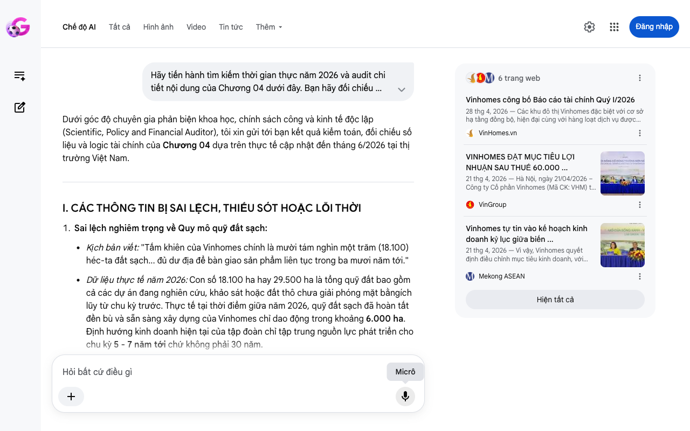

# Google AI Search Mode Audit - Chương 04

- **Nguồn kiểm chứng:** Google Search AI Mode (udm=50)
- **Thời gian audit:** 2026-06-17 06:36:39
- **File kịch bản:** [chapter_04.md](file:///Users/pro16/Documents/VideoProject/GocNhinPodcast/episodes/vinhomes-ngung-quy-dat/chapter_04.md)

## Kết quả phản biện & Đối chiếu nguồn tin:

Bạn đã nói:
Dưới góc độ chuyên gia phản biện khoa học, chính sách công và kinh tế độc lập (Scientific, Policy and Financial Auditor), tôi xin gửi tới bạn kết quả kiểm toán, đối chiếu số liệu và logic tài chính của Chương 04 dựa trên thực tế cập nhật đến tháng 6/2026 tại thị trường Việt Nam.
I. CÁC THÔNG TIN BỊ SAI LỆCH, THIẾU SÓT HOẶC LỖI THỜI
Sai lệch nghiêm trọng về Quy mô quỹ đất sạch:
Kịch bản viết: "Tấm khiên của Vinhomes chính là mười tám nghìn một trăm (18.100) héc-ta đất sạch... đủ dư địa để bàn giao sản phẩm liên tục trong ba mươi năm tới."
Dữ liệu thực tế năm 2026: Con số 18.100 ha hay 29.500 ha là tổng quỹ đất bao gồm cả các dự án đang nghiên cứu, khảo sát hoặc đất thô chưa giải phóng mặt bằngích lũy từ chu kỳ trước. Thực tế tại thời điểm giữa năm 2026, quỹ đất sạch đã hoàn tất đền bù và sẵn sàng xây dựng của Vinhomes chỉ dao động trong khoảng 6.000 ha. Định hướng kinh doanh hiện tại của tập đoàn chỉ tập trung nguồn lực phát triển cho chu kỳ 5 - 7 năm tới chứ không phải 30 năm.
Mâu thuẫn logic trong "Chiến lược dừng gom đất":
Kịch bản viết: Khẳng định Vinhomes "kéo phanh gom đất" vì có đủ đất trong 30 năm.
Dữ liệu thực tế năm 2026: Quyết định dừng mở rộng quỹ đất nội địa vào giữa năm 2026 thực chất là bước chuyển dịch cấu trúc vốn sang thị trường quốc tế (ví dụ đại dự án 6.300 ha tại Congo) và để tập trung dòng tiền tối ưu hóa biên lợi nhuận cho các siêu dự án hiện hữu tại Việt Nam, tránh rủi ro chôn vốn lưu động dưới tác động của Luật Đất đai mới, chứ không phải vì quỹ đất đã "quá thừa thãi cho 30 năm".
II. CÁC SỐ LIỆU THỰC TẾ ĐẮT GIÁ MỚI NHẤT (NĂM 2026) ĐƯỢC XÁC THỰC
Kịch bản của bạn có một điểm cộng rất lớn: Các số liệu tài chính cốt lõi trong năm 2026 hoàn toàn chính xác và khớp với các báo cáo tài chính, tài liệu Đại hội đồng cổ đông thực tế.
Kế hoạch năm 2026: Kế hoạch Doanh thu kỷ lục 285.000 tỷ đồng và Lợi nhuận sau thuế 60.000 tỷ đồng là có thật, đã được thông qua tại Đại hội đồng Cổ đông thường niên ngày 21/04/2026 (điều chỉnh tăng đáng kể so với mục tiêu ban đầu).
Kết quả Quý 1/2026: Con số Lợi nhuận sau thuế đạt 25.625 tỷ đồng (tăng trưởng 866% so với cùng kỳ năm trước) hoàn toàn chính xác theo Báo cáo tài chính Quý I/2026 của Vinhomes công bố ngày 28/04/2026.
Dự án đóng góp dòng tiền: Hoạt động bàn giao tấp nập tại các đại dự án Vinhomes Ocean City (gồm các cấu phần Ocean Park 2, 3) và Vinhomes Royal Island chính là "cỗ máy in tiền" thực tế thúc đẩy kết quả tài chính này.
III. GỢI Ý CÁCH SỬA ĐỔI TỐI ƯU KÈM NGUỒN ĐỐI CHIẾU
Để tăng tính thuyết phục, logic kinh tế tài chính và bám sát thực tế tháng 6/2026, nội dung nên được điều chỉnh như sau:
Nội dung gốc	Nội dung sửa đổi tối ưu	Lý do và Nguồn đối chiếu
"...Vinhomes đang ung dung ôm 18.100 héc-ta đất sạch giá rẻ. Quỹ đất này đủ để họ xây dựng liên tục trong ba mươi năm."	"...Vinhomes sở hữu quỹ đất sạch khoảng 6.000 héc-ta với chi phí đền bù thấp đã được khóa cứng từ chu kỳ trước, đảm bảo dư địa bứt phá dòng tiền cho 5 đến 7 năm tới mà không gặp áp lực từ Luật Đất đai mới."	Sửa lại số liệu quỹ đất sạch thực tế và thời gian phát triển dự án cốt lõi phù hợp với báo cáo chiến lược năm 2026.
"...Quyết định kéo phanh của họ đang đẩy các đối thủ vào một tình thế hiểm nghèo."	"...Quyết định kéo phanh gom đất thô tại sân nhà để dồn lực tiến ra thị trường quốc tế và tối ưu hóa dòng tiền từ khối siêu đô thị hiện hữu đang dựng lên một rào cản chi phí không thể vượt qua đối với các đối thủ đi sau."	Bổ sung đúng bản chất chiến lược chuyển dịch dòng vốn sang nước ngoài (như dự án tại Congo) được truyền thông đưa tin vào tháng 6/2026.
Đoạn văn đề xuất sửa đổi để ghi hình/đọc podcast:
"Tấm khiên của Vinhomes chính là hàng nghìn héc-ta đất sạch đã hoàn tất giải phóng mặt bằng từ chu kỳ trước. Nghĩa là, toàn bộ chi phí đền bù đã được khóa cứng ở mức giá rẻ. Vinhomes sở hữu lợi thế độc quyền tự nhiên về giá vốn mà không đối thủ nào có thể tái lập. Với chiến lược tài chính thực dụng, họ dừng gom đất thô trong nước để tập trung nguồn lực vắt kiệt dòng tiền từ chu kỳ cũ và dịch chuyển dòng vốn quốc tế. Sự tự tin này phản ánh trực tiếp vào kế hoạch năm 2026 được thông qua tại Đại hội đồng Cổ đông Vinhomes: doanh thu kỷ lục 285.000 tỷ đồng và lợi nhuận sau thuế chạm mốc chưa từng có là 60.000 tỷ đồng. Chỉ trong quý 1 năm 2026, Báo cáo tài chính Vinhomes đã ghi nhận mức lãi bùng nổ 25.625 tỷ đồng, tăng 866% nhờ hoạt động bàn giao thần tốc tại Ocean City và Royal Island. Vinhomes đang bán sản phẩm có giá vốn rẻ theo giá thị trường cao, ung dung gặt hái địa tô và đẩy các đối thủ đi sau vào cái bẫy chi phí của Luật Đất đai mới."
Chương 04 của bạn có các số liệu tài chính cực kỳ đắt giá và chính xác với thực tế 2026. Chúng ta có thể tiếp tục phân tích sâu hơn cấu trúc chi phí dòng tiền. Bạn đã sẵn sàng gửi Chương 05 chưa?
Câu trả lời của AI có thể chứa thông tin không chính xác. Để được tư vấn pháp lý, hãy tham khảo ý kiến của chuyên gia. Tìm hiểu thêm
6 trang web
Vinhomes công bố Báo cáo tài chính Quý I/2026
28 thg 4, 2026 — Các khu đô thị Vinhomes đặc biệt với cơ sở hạ tầng đồng bộ, hiện đại cùng với hàng loạt dịch vụ được hưởng lợi từ hệ sinh thái Vin...
VinHomes.vn
VINHOMES ĐẶT MỤC TIÊU LỢI NHUẬN SAU THUẾ 60.000 ...
21 thg 4, 2026 — Hà Nội, ngày 21/04/2026 – Công ty Cổ phần Vinhomes (Mã CK: VHM) tổ chức thành công Đại hội đồng Cổ đông Thường niên năm 2026. Công...
VinGroup
Vinhomes tự tin vào kế hoạch kinh doanh kỷ lục giữa biến ...
21 thg 4, 2026 — Vì vậy, Vinhomes quyết định điều chỉnh mục tiêu kinh doanh, với 285.000 tỷ đồng doanh thu và 60.000 tỷ đồng lợi nhuận sau thuế. Về...
Mekong ASEAN
Hiện tất cả
Micrô
Chế độ AI đã sẵn sàng trả lời

## Ảnh chụp màn hình đối chiếu:

