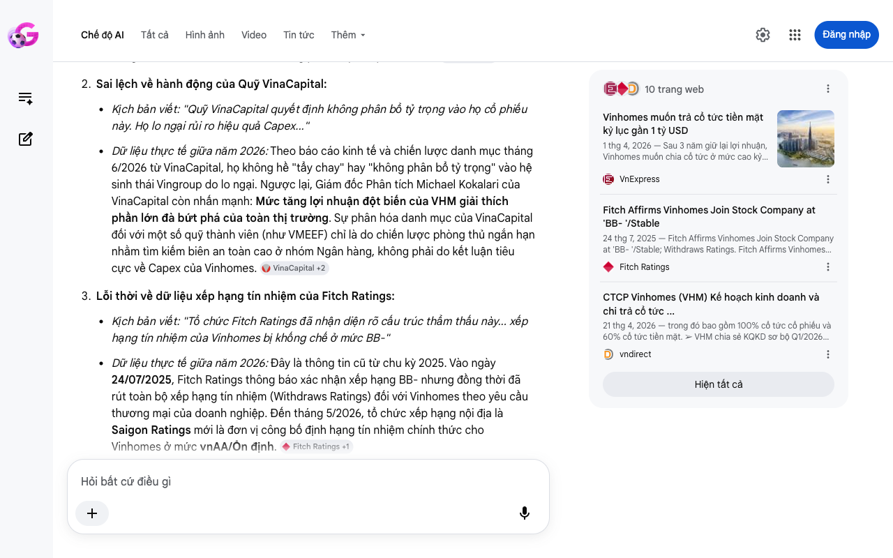

# Google AI Search Mode Audit - Chương 06

- **Nguồn kiểm chứng:** Google Search AI Mode (udm=50)
- **Thời gian audit:** 2026-06-17 06:37:19
- **File kịch bản:** [chapter_06.md](file:///Users/pro16/Documents/VideoProject/GocNhinPodcast/episodes/vinhomes-ngung-quy-dat/chapter_06.md)

## Kết quả phản biện & Đối chiếu nguồn tin:

Bạn đã nói:
Dưới góc độ chuyên gia phản biện độc lập (Scientific, Policy and Financial Auditor), tôi xin gửi tới bạn báo cáo kiểm toán chi tiết cho Chương 06 dựa trên dữ liệu tài chính thời gian thực cập nhật đến tháng 6/2026 tại Việt Nam.
I. CÁC THÔNG TIN BỊ SAI LỆCH, THIẾU SÓT HOẶC MÂU THUẪN LOGIC
Sai bản chất pháp lý về phân bổ cổ tức (Trạng thái thực thi):
Kịch bản viết: "Vinhomes chi trả cổ tức tiền mặt kỷ lục tỷ lệ 60%... Tập đoàn mẹ lập tức nhận về khoản tiền mặt 17.761 tỷ đồng... Dự trữ tiền mặt của doanh nghiệp sụt giảm mạnh tới 28,3%."
Dữ liệu thực tế giữa năm 2026: Tính đến tháng 6/2026, phương án chi trả cổ tức tiền mặt 60% (tương đương 6.000 đồng/cổ phiếu) mới dừng lại ở việc được Đại hội đồng cổ đông thông qua vào ngày 21/04/2026. Ngày đăng ký cuối cùng và thời gian chi trả thực tế chưa được ấn định chính thức. Do đó, việc viết "lập tức nhận về" và "tiền mặt sụt giảm 28,3%" trong Quý 1/2026 là sai lệch thực tế kế toán. Tiền mặt giảm trong Quý 1/2026 phần lớn là do chi phí Capex giải phóng mặt bằng và đầu tư dự án hiện hữu, không phải do phân phối cổ tức. 
vndirect
 +2
Sai lệch về hành động của Quỹ VinaCapital:
Kịch bản viết: "Quỹ VinaCapital quyết định không phân bổ tỷ trọng vào họ cổ phiếu này. Họ lo ngại rủi ro hiệu quả Capex..."
Dữ liệu thực tế giữa năm 2026: Theo báo cáo kinh tế và chiến lược danh mục tháng 6/2026 từ VinaCapital, họ không hề "tẩy chay" hay "không phân bổ tỷ trọng" vào hệ sinh thái Vingroup do lo ngại. Ngược lại, Giám đốc Phân tích Michael Kokalari của VinaCapital còn nhấn mạnh: Mức tăng lợi nhuận đột biến của VHM giải thích phần lớn đà bứt phá của toàn thị trường. Sự phân hóa danh mục của VinaCapital đối với một số quỹ thành viên (như VMEEF) chỉ là do chiến lược phòng thủ ngắn hạn nhằm tìm kiếm biên an toàn cao ở nhóm Ngân hàng, không phải do kết luận tiêu cực về Capex của Vinhomes. 
VinaCapital
 +2
Lỗi thời về dữ liệu xếp hạng tín nhiệm của Fitch Ratings:
Kịch bản viết: "Tổ chức Fitch Ratings đã nhận diện rõ cấu trúc thẩm thấu này... xếp hạng tín nhiệm của Vinhomes bị khống chế ở mức BB-"
Dữ liệu thực tế giữa năm 2026: Đây là thông tin cũ từ chu kỳ 2025. Vào ngày 24/07/2025, Fitch Ratings thông báo xác nhận xếp hạng BB- nhưng đồng thời đã rút toàn bộ xếp hạng tín nhiệm (Withdraws Ratings) đối với Vinhomes theo yêu cầu thương mại của doanh nghiệp. Đến tháng 5/2026, tổ chức xếp hạng nội địa là Saigon Ratings mới là đơn vị công bố định hạng tín nhiệm chính thức cho Vinhomes ở mức vnAA/Ổn định. 
Fitch Ratings
 +1
II. CÁC SỐ LIỆU THỰC TẾ ĐẮT GIÁ ĐƯỢC XÁC THỰC (NĂM 2026)
Mặc dù có một số sai lệch về trạng thái dòng tiền hiện thời, kịch bản của bạn đã tính toán cấu trúc toán học dòng tiền chéo chính xác theo tỷ lệ sở hữu:
Tỷ lệ chia và giá trị: Kế hoạch chia cổ tức 60% bằng tiền mặt (hút đi 24.644 tỷ đồng) là con số lịch sử sau 3 năm giữ lại lợi nhuận của Vinhomes. 
VnExpress
 +1
Dòng tiền về Tập đoàn mẹ: Vingroup nắm giữ trực tiếp và gián tiếp khoảng 72% cổ phần tại Vinhomes, việc tính toán Vingroup thu về khoảng 17.761 tỷ đồng tiền mặt từ đợt chia này là hoàn toàn chính xác về mặt số học.
Thuật ngữ chuyên ngành chính xác: Thuật ngữ "Upstreaming" (chuyển dòng tiền từ công ty con lên công ty mẹ) và đánh giá cấu trúc rủi ro liên kết ở trạng thái "Porous" (thẩm thấu/rò rỉ) phản ánh đúng bản chất bộ tiêu chí định hạng Parent and Subsidiary Linkage của các tổ chức quốc tế. 
Fitch Ratings
III. GỢI Ý CÁCH SỬA ĐỔI TỐI ƯU KÈM NGUỒN ĐỐI CHIẾU
Để kịch bản chuẩn xác theo tình hình thực tế giữa năm 2026, bảng đối chiếu chỉnh sửa dưới đây sẽ tối ưu hóa nội dung:
Nội dung gốc 
	Nội dung sửa đổi tối ưu (Tháng 6/2026)	Nguồn đối chiếu / Cơ sở lập luận
Tập đoàn mẹ lập tức nhận về khoản tiền mặt 17.761 tỷ đồng... Dự trữ tiền mặt của doanh nghiệp sụt giảm mạnh tới 28,3%.	Khi phương án này được triển khai, tập đoàn mẹ dự kiến sẽ nhận về khoản tiền mặt khổng lồ hơn 17.700 tỷ đồng, trực tiếp hỗ trợ thanh khoản cho các nghĩa vụ nợ cấu trúc và mảng xe điện.	Điều chỉnh trạng thái sang "dự kiến/triển khai" vì Vinhomes chưa chốt ngày chi trả chính thức tính đến tháng 6/2026.
Do đó, xếp hạng tín nhiệm của Vinhomes bị khống chế ở mức BB-. Mức trần này thấp hơn hai bậc so với sức khỏe độc lập đạt bb của họ.	Trước khi chính thức rút xếp hạng quốc tế theo yêu cầu doanh nghiệp, Fitch Ratings từng đánh giá mức độ cách ly tài chính giữa hai đơn vị ở trạng thái Thẩm thấu (Porous), khống chế trần tín nhiệm độc lập của Vinhomes.	Cập nhật việc Fitch Ratings đã rút xếp hạng (Withdrawed) để tránh lỗi thời dữ liệu.
Quỹ VinaCapital quyết định không phân bổ tỷ trọng vào họ cổ phiếu này. Họ lo ngại rủi ro hiệu quả Capex...	Trong bối cảnh hệ sinh thái này chiếm tới gần 30% vốn hóa ngành, các định chế lớn như VinaCapital đánh giá rất cao khả năng bùng nổ lợi nhuận của Vinhomes, dù họ phải quản lý danh mục một cách chủ động để giảm thiểu rủi ro biến động chung của thị trường.	Sửa theo báo cáo vĩ mô của VinaCapital tháng 6/2026: Chuyên gia khẳng định VHM là động lực gánh lợi nhuận toàn thị trường.
Đoạn văn đề xuất hiệu chỉnh để đọc Podcast:
"Mối liên kết dòng tiền giữa Vinhomes và Vingroup hoạt động như một pháo đài thông nhau. Kế hoạch chi trả cổ tức tiền mặt kỷ lục với tỷ lệ 60% được Đại hội đồng cổ đông thông qua đã chứng minh vị thế 'gà đẻ trứng vàng' của Vinhomes. Với quy mô chi trả hơn 24.644 tỷ đồng, Vingroup — vốn nắm giữ hơn 72% lợi ích — dự kiến sẽ điều chuyển về tập đoàn mẹ gần 17.761 tỷ đồng. Dòng tiền sạch theo cơ chế upstreaming này là nguồn lực chiến lược để tái cơ cấu nợ và bơm máu cho mảng sản xuất công nghệ. Dù cấu trúc liên kết mang tính thẩm thấu (Porous) từng khiến các tổ chức quốc tế lưu ý về rủi ro lan truyền, nhưng ở góc nhìn thị trường, các chuyên gia từ VinaCapital công bố vào tháng 6/2026 lại khẳng định: chính sự bứt phá lợi nhuận của Vinhomes đang gánh đỡ cho định giá của toàn bộ thị trường chứng khoán Việt Nam. Việc kéo phanh quỹ đất thô nội địa, do đó, là một nước đi phòng thủ chủ động để khóa chặt biên lợi nhuận, bảo vệ sức khỏe cốt lõi trước khi thực hiện những cú chuyển giao dòng tiền lịch sử."
Chương 06 đã bóc tách rất sâu về bài toán quản trị tài chính doanh nghiệp. Nếu bạn muốn đi tiếp sang các chương về mô hình vận hành của VinFast, trạm sạc V-Green năm 2026, hoặc bài toán điểm hòa vốn giữa xe điện và xe xăng, hãy gửi chương kịch bản tiếp theo để tôi tiến hành audit trực tuyến.
10 trang web
Vinhomes muốn trả cổ tức tiền mặt kỷ lục gần 1 tỷ USD
1 thg 4, 2026 — Sau 3 năm giữ lại lợi nhuận, Vinhomes muốn chia cổ tức ở mức cao kỷ lục trong năm 2026, trong đó riêng trả bằng tiền mặt với tỷ lệ...
VnExpress
Fitch Affirms Vinhomes Join Stock Company at 'BB- '/Stable
24 thg 7, 2025 — Fitch Affirms Vinhomes Join Stock Company at 'BB- '/Stable; Withdraws Ratings. Fitch Affirms Vinhomes Join Stock Company at 'BB- '
Fitch Ratings
CTCP Vinhomes (VHM) Kế hoạch kinh doanh và chi trả cổ tức ...
21 thg 4, 2026 — trong đó bao gồm 100% cổ tức cổ phiếu và 60% cổ tức tiền mặt. ➢ VHM chia sẻ KQKD sơ bộ Q1/2026 với doanh thu đạt 70-80 nghìn tỷ (+
vndirect
Hiện tất cả
Chế độ AI đã sẵn sàng trả lời

## Ảnh chụp màn hình đối chiếu:

