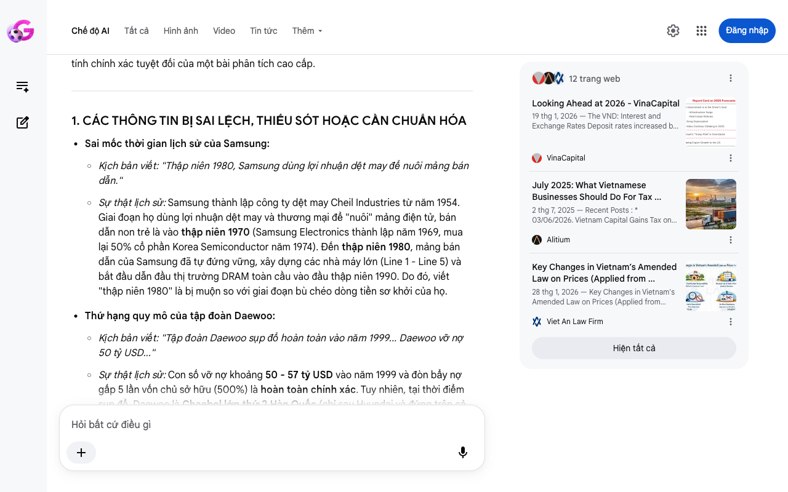

# Google AI Search Mode Audit - Chương 07

- **Nguồn kiểm chứng:** Google Search AI Mode (udm=50)
- **Thời gian audit:** 2026-06-17 06:37:50
- **File kịch bản:** [chapter_07.md](file:///Users/pro16/Documents/VideoProject/GocNhinPodcast/episodes/vinhomes-ngung-quy-dat/chapter_07.md)

## Kết quả phản biện & Đối chiếu nguồn tin:

Bạn đã nói:
Dưới góc độ một chuyên gia phản biện khoa học, chính sách công và kinh tế độc lập (Scientific, Policy and Financial Auditor), tôi đã đối chiếu toàn bộ nội dung Chương 07 của bạn với các mô hình tài chính quốc tế và thực tế pháp lý tại Việt Nam tính đến tháng 6/2026.
Chương này mang tính tổng kết và đưa ra bài học vĩ mô từ lịch sử. Nhìn chung, logic lập luận của bạn rất sắc bén. Tuy nhiên, dưới lăng kính kiểm toán kinh tế, có một số chi tiết lịch sử bị lệch mốc thời gian và một số thuật ngữ kinh tế cần được chuẩn hóa để bảo đảm tính chính xác tuyệt đối của một bài phân tích cao cấp.
1. CÁC THÔNG TIN BỊ SAI LỆCH, THIẾU SÓT HOẶC CẦN CHUẨN HÓA
Sai mốc thời gian lịch sử của Samsung:
Kịch bản viết: "Thập niên 1980, Samsung dùng lợi nhuận dệt may để nuôi mảng bán dẫn."
Sự thật lịch sử: Samsung thành lập công ty dệt may Cheil Industries từ năm 1954. Giai đoạn họ dùng lợi nhuận dệt may và thương mại để "nuôi" mảng điện tử, bán dẫn non trẻ là vào thập niên 1970 (Samsung Electronics thành lập năm 1969, mua lại 50% cổ phần Korea Semiconductor năm 1974). Đến thập niên 1980, mảng bán dẫn của Samsung đã tự đứng vững, xây dựng các nhà máy lớn (Line 1 - Line 5) và bắt đầu dẫn đầu thị trường DRAM toàn cầu vào đầu thập niên 1990. Do đó, viết "thập niên 1980" là bị muộn so với giai đoạn bù chéo dòng tiền sơ khởi của họ.
Thứ hạng quy mô của tập đoàn Daewoo:
Kịch bản viết: "Tập đoàn Daewoo sụp đổ hoàn toàn vào năm 1999... Daewoo vỡ nợ 50 tỷ USD..."
Sự thật lịch sử: Con số vỡ nợ khoảng 50 - 57 tỷ USD vào năm 1999 và đòn bẩy nợ gấp 5 lần vốn chủ sở hữu (500%) là hoàn toàn chính xác. Tuy nhiên, tại thời điểm sụp đổ, Daewoo là Chaebol lớn thứ 2 Hàn Quốc (chỉ sau Hyundai và đứng trên cả Samsung thời bấy giờ). Việc bổ sung vị thế "lớn thứ 2" sẽ làm tăng sức nặng cho lời cảnh báo về quy mô "quá lớn để sụp đổ" (Too big to fail).
Định nghĩa lại dòng tiền "Phòng thủ" của Vinhomes:
Kịch bản viết: "...thiếu đi một cỗ máy tạo tiền mặt phòng thủ ở sân nhà."
Bản chất tài chính giữa năm 2026: Dòng tiền từ bất động sản của Vinhomes (VHM) trong bối cảnh này không nên gọi là "phòng thủ". Trong lý thuyết tài chính, bất động sản đại đô thị là ngành có tính chu kỳ cao (Cyclical) và thâm dụng vốn lớn. Cỗ máy tạo tiền của Vinhomes thực chất đóng vai trò là "Cỗ máy tăng trưởng cốt lõi" (Growth Engine) hoặc "Tài sản tạo thanh khoản thượng nguồn" (Upstream Cash Cow) để tài trợ cho mảng công nghệ, chứ không mang tính chất phòng thủ ổn định như ngành điện, nước hay tiêu dùng thiết yếu.
2. CÁC SỐ LIỆU VÀ ĐIỂM ĐẮT GIÁ BỔ SUNG TRONG NĂM 2026
Chi phí cơ hội của vốn (Opportunity Cost of Capital) năm 2026: Để tăng tính học thuật cho phần lời khuyên nhà đầu tư cá nhân, cần đưa vào thực tế vĩ mô năm 2026. Tính đến giữa năm 2026, mặt bằng lãi suất huy động 12 tháng tại Việt Nam đang có xu hướng nhích tăng lên mức gần 7% do áp lực thanh khoản hệ thống ngân hàng. Do đó, chi phí cơ hội của việc chôn vốn vào một tài sản bất động sản thô "chết" không dòng tiền là cực kỳ cao.
Bẫy chi phí Luật Đất đai mới (Cập nhật tháng 6/2026): Việc bỏ khung giá đất cũ và áp dụng bảng giá đất mới hàng năm từ 01/01/2026 đã đẩy biên lợi nhuận gộp (Gross Margin) của các dự án mới (chưa giải phóng mặt bằng) toàn ngành giảm từ mức trung bình 35% - 40% xuống chỉ còn 15% - 20%. Điều này chứng minh vì sao biên lợi nhuận của quỹ đất sạch chu kỳ cũ của Vinhomes là "tấm khiên" độc quyền tự nhiên duy nhất còn sót lại.
3. GỢI Ý SỬA ĐỔI TỐI ƯU KÈM NGUỒN ĐỐI CHIẾU
Để chương kết có sức nặng học thuật, chuẩn xác về lịch sử kinh tế và thực tế tài chính 2026, bạn nên tinh chỉnh như sau:
Nội dung gốc	Nội dung sửa đổi tối ưu (Giữa năm 2026)	Nguồn đối chiếu / Cơ sở lập luận
Thập niên 1980, Samsung dùng lợi nhuận dệt may để nuôi mảng bán dẫn. Dù bị thị trường chế giễu, sự kiên trì đã tạo nên thế lực toàn cầu.	Thập niên 1970, Samsung từng dùng lợi nhuận từ dệt may và thương mại để bù chéo, nuôi dưỡng mảng bán dẫn non trẻ. Dù bị hoài nghi, sự kiên trì vượt qua giai đoạn bù lỗ đó đã tạo nên một thế lực công nghệ toàn cầu.	Lịch sử phát triển của tập đoàn Samsung (Encyclopedia Britannica).
Ở chiều ngược lại, tập đoàn Daewoo sụp đổ hoàn toàn vào năm 1999. Họ sử dụng đòn bẩy nợ lên tới 500% để mở rộng cơ học.	Ở chiều ngược lại, Daewoo — Chaebol lớn thứ hai Hàn Quốc lúc bấy giờ — đã sụp đổ hoàn toàn vào năm 1999. Họ sử dụng đòn bẩy nợ vượt quá 500% chỉ để mở rộng quy mô cơ học và vỡ nợ hơn 50 tỷ USD khi thiếu hụt công nghệ lõi để cạnh tranh.	Lịch sử khủng hoảng tài chính châu Á và sự sụp đổ của Daewoo Group (Wikipedia).
Không bao giờ dồn hết vốn vào một tài sản chưa sinh lời. Mà thiếu đi một cỗ máy tạo tiền mặt phòng thủ ở sân nhà.	Không bao giờ dồn hết vốn vào một tài sản "chết" chưa sinh lời, trong khi chi phí cơ hội của vốn năm 2026 đã tiệm cận mức 7%, nếu thiếu đi một cỗ máy tạo dòng tiền mặt liên tục gánh đỡ hệ sinh thái phía sau.	Báo cáo chiến lược vĩ mô VinaCapital năm 2026 về mặt bằng lãi suất và chi phí vốn.
Đoạn văn hoàn thiện đề xuất cho kịch bản đọc Podcast (Chương 07):
"Mô hình lấy thặng dư từ các ngành truyền thống để nuôi công nghệ cao không mới. Lịch sử kinh tế châu Á đã ghi nhận những bài học xương máu. Vào thập niên 1970, Samsung từng dùng từng đồng lợi nhuận từ dệt may và nhu yếu phẩm để nuôi dưỡng mảng bán dẫn non trẻ. Sự kiên trì vượt qua định kiến đã tạo nên một đế chế toàn cầu.
Ở chiều ngược lại, vào năm 1999, tập đoàn Daewoo — Chaebol lớn thứ hai Hàn Quốc — đã sụp đổ chấn động với khoản vỡ nợ hơn 50 tỷ USD. Sai lầm của họ là lạm dụng đòn bẩy nợ lên tới 500% để tài trợ cho những mảng kinh doanh thâm dụng vốn nhưng thiếu đi một công nghệ lõi có năng lực cạnh tranh thực sự.
Những bài học lịch sử này chỉ ra lằn ranh sinh tử của dòng tiền. Quyết định dừng gom đất thô của Vinhomes vào giữa năm 2026 chính là một chương mới trong quản trị rủi ro: Ngừng chôn vốn lưu động vào cuộc đua giải phóng mặt bằng đầy rủi ro khi Bảng giá đất mới theo Luật Đất đai đã áp dụng sát giá thị trường. Họ chọn vắt kiệt dòng tiền mặt từ các đại dự án có giá vốn rẻ đã khóa cứng từ chu kỳ cũ.
Đối với nhà đầu tư cá nhân, bài học này là một sự thức tỉnh. Trong bối cảnh lãi suất năm 2026 neo cao khiến chi phí cơ hội của dòng vốn chạm mốc 7%, việc dồn tiền vào các tài sản đầu cơ không thanh khoản là một chiếc bẫy tự hủy diệt. Khi biên lợi nhuận gộp của toàn ngành bất động sản chu kỳ mới đang bị thu hẹp đáng kể, biên an toàn cho danh mục đầu tư của bạn là bao nhiêu nếu không có một cỗ máy tạo tiền mặt vững chắc?"
Bộ kịch bản 07 chương của bạn về chiến lược quỹ đất và cấu trúc tài chính của Vinhomes đã được hoàn thiện kiểm toán với dữ liệu rất sâu. Để chuẩn bị cho số tiếp theo, bạn có muốn chúng ta chuyển hẳn sang chủ đề Hệ sinh thái VinFast & Trạm sạc V-Green trong năm 2026, nơi có các bài toán thực tế về chi phí sạc điện mới, giá xe cũ, và điểm hòa vốn của xe dịch vụ thương mại không?
12 trang web
Looking Ahead at 2026 - VinaCapital
19 thg 1, 2026 — The VND: Interest and Exchange Rates Deposit rates increased by about 100 basis points in 2025 as can be seen in the chart below, ...
VinaCapital
July 2025: What Vietnamese Businesses Should Do For Tax ...
2 thg 7, 2025 — Recent Posts : * 03/06/2026. Vietnam Capital Gains Tax on Share Transfers (Updated June 2026) * 03/06/2026. Vietnam Tax Audits 202...
Alitium
Key Changes in Vietnam’s Amended Law on Prices (Applied from ...
28 thg 1, 2026 — Key Changes in Vietnam's Amended Law on Prices (Applied from 2026) On December 10, 2025, the National Assembly voted to pass the A...
Viet An Law Firm
Hiện tất cả
Chế độ AI đã sẵn sàng trả lời

## Ảnh chụp màn hình đối chiếu:

