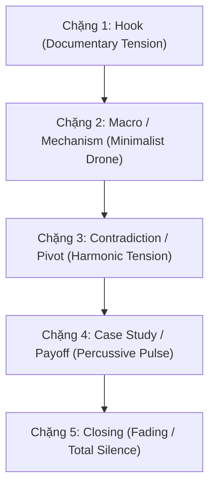

# Hướng Dẫn Thiết Kế m Thanh & Nhạc Nền (Audio & Music Style Guide) — Hiểu Biết Hơn

> 🎭 **HÓA THÂN CHUYÊN GIA:** The Cinematic Sonic Alchemist (Kiến Trúc Sư Nhạc Nền Điện Ảnh)
> 📂 **MỤC TIÊU:** Định hình bản sắc âm thanh (Sonic Identity) nhất quán cho toàn bộ kênh, thiết kế nhịp điệu tương thích với giọng đọc điềm đạm, kỹ trị của Hiểu Biết Hơn.

---

## 1. Triết Lý m Thanh Cốt Lõi (Sonic Philosophy)

> *"m nhạc không có nhiệm vụ lấp đầy khoảng trống. m nhạc có nhiệm vụ mở lối nhận thức."*

Đối với một kênh phân tích chính sách công và kinh tế vĩ mô chuyên sâu như Hiểu Biết Hơn, âm nhạc không phải là yếu tố trang trí kê dưới giọng đọc. m nhạc là **bầu khí quyển nhận thức** (Cognitive Atmosphere).

*   **Sự tiết chế tối thượng (Supreme Restraint):** Nhạc nền phải lùi lại phía sau để nhường không gian cho dữ liệu và logic. Nhạc nền thành công là khi khán giả ghi nhớ sâu sắc luận điểm mà không bị phân tâm bởi giai điệu.
*   **Vũ khí của sự im lặng (The Power of Silence):** m nhạc chỉ thực sự có giá trị khi nó biết biến mất. Những khoảng lặng chủ ý (Drops & Silences) sau các câu chốt hạ (Golden Lines) là thời gian để thính giả xử lý và cảm nhận toàn bộ sức nặng vĩ mô của sự thật.
*   **Nhịp điệu điện ảnh (Cinematic Pacing):** Tông giọng chủ đạo là **Lạnh lùng - Kỹ trị - Khách quan** (Cold, Analytical, Documentary-grade). Nhạc nền phải tránh xa các kho lưu trữ nhạc stock rẻ tiền, hướng tới chất lượng score điện ảnh tối giản (minimalist cinematic score).

---

## 2. Hệ Màu m Thanh (Sonic Palette)

Toàn bộ kênh thống nhất sử dụng một hệ màu âm thanh đặc trưng, kết hợp giữa nhạc cụ cổ điển trầm ấm và âm tổng hợp hiện đại:

| Nhạc cụ / Chất liệu | Vai trò chiến thuật | Cảm xúc mang lại |
|---|---|---|
| **Cello & Viola (Trầm ấm, khô)** | Nhạc cụ dẫn dắt chính, đi các nốt trầm (low pulses). | Sự điềm tĩnh, sâu sắc, từng trải. |
| **Piano (Tối giản, các nốt cách xa nhau)** | Điểm xuyết ở các nút thắt hoặc chuyển ý. | Tính phân tích, tư duy sâu, sắc sảo. |
| **Analog Synth Drone (m nền cực thấp)** | Giữ nền không gian cho toàn bộ video. | Sự bí ẩn, áp lực vĩ mô âm thầm. |
| **Sub-bass Swell (Tần số siêu trầm)** | Đẩy cao trào ngầm trước các bước ngoặt logic. | Sự nghiêm trọng, ranh giới sinh tử. |
| **Sparse Percussion (Muted wood, soft taiko)** | Giữ nhịp ẩn ở các phần Case Study (BPM 75 - 90). | Sự vận động cơ học, tính logic tuần tự. |

---

## 3. Kiến Trúc m Nhạc Theo Cấu Trúc Video (Audio Mapping)

Một video phân tích dài (18 - 25 phút) bắt buộc phải đi qua 5 chặng âm thanh có chủ ý, tương ứng với biểu đồ cảm xúc của người nghe:

### 3.1. Chặng 1: Hook (Mở đầu kịch tính thực tế)
*   **Mục tiêu:** Tạo cú shock nhận thức ngay từ giây đầu tiên.
*   **Mood âm thanh:** Sự tò mò, áp lực thực địa âm thầm.
*   **Mô tả:** Bắt đầu bằng âm drone nền cực thấp (sub-bass drone) kết hợp với tiếng Cello rải nốt rời rạc, tạo cảm giác một sự kiện lớn sắp xảy ra. Nhạc tăng dần độ dày khi nghịch lý xuất hiện và **tắt lịm hoàn toàn (Drop)** ngay trước câu Lời hứa video (Open Loop).

### 3.2. Chặng 2: Bản Chất Vĩ Mô & Cơ Chế (Macro & Mechanism)
*   **Mục tiêu:** Phục vụ sự thấu hiểu thông tin nặng về số liệu, nghị định, thông tư.
*   **Mood âm thanh:** Tập trung cao độ, lạnh lùng, minh bạch.
*   **Mô tả:** Nhạc nền tối giản tuyệt đối. Chỉ sử dụng tiếng trầm của đàn dây kéo dài (slow string sustain) và tiếng piano gõ nốt đơn độc cách nhau 4-5 giây. Giữ tần số trung (mid-range) trống trải để giọng đọc nam trung (baritone) nổi bật nhất.

### 3.3. Chặng 3: Nghịch Lý & Bước Ngoặt (Contradiction & Deepening Turn)
*   **Mục tiêu:** Đẩy người nghe vào trạng thái hoài nghi, nhận ra sự thật phức tạp hơn báo chí đưa tin.
*   **Mood âm thanh:** Sự giằng xé nội tâm, áp lực tăng dần.
*   **Mô tả:** Xuất hiện các nốt nhạc dây lặp lại nhịp nhàng (ostinato strings) với nhịp độ tăng dần nhưng giữ âm lượng nhỏ. Tiếng sub-bass swell âm thầm nổi lên tạo độ nén cho câu hỏi tu từ của Narrator.

### 3.4. Chặng 4: Case Study & Điểm Rơi (Case Study & Payoff)
*   **Mục tiêu:** Trình bày bằng chứng thực tế, so sánh quốc tế (Tesla, NIO, Cao Cao...).
*   **Mood âm thanh:** Logic tuần tự, vận động cơ học vững chãi.
*   **Mô tả:** Xuất hiện nhịp gõ nhẹ của nhạc cụ gõ bằng gỗ (muted wood percussion) hoặc nhịp synthesizer điện tử tối giản. Nhịp điệu này giúp tăng tốc độ xử lý thông tin của não bộ, làm mạch phân tích trôi đi sắc bén.

### 3.5. Chặng 5: Kết Thúc Mở (Closing Tension)
*   **Mục tiêu:** Giữ lại tension suy ngẫm cho khán giả sau khi tắt video.
*   **Mood âm thanh:** Trầm mặc, universal, rộng lớn.
*   **Mô tả:** Nhạc cụ gõ biến mất. m thanh Cello trầm buồn kéo dài phối hợp với âm piano tắt dần. Câu kết của video phải được nói trên một **không gian tĩnh lặng hoàn toàn (Absolute Silence)**, không có bất kỳ tiếng nhạc nào kéo dài sau chữ cuối cùng.

---

## 4. Quy Tắc Khoảng Lặng & Điểm Rơi (The Law of Silence)

Khi dựng dựng âm thanh (Audio Editing), kỹ thuật viên bắt buộc phải thực hiện **3 loại điểm dừng âm nhạc** sau:

1.  **The Truth Drop (Ngắt nhạc tức thời):**
    *   *Khi nào:* Ngay trước và sau một câu khẳng định đắt giá (Golden Line).
    *   *Cách làm:* Nhạc nền đang chạy đột ngột tắt hẳn (hoặc giảm 80% âm lượng bằng hiệu ứng low-pass filter) trước câu nói 1 giây, giữ im lặng trong suốt câu nói và để khoảng lặng kéo dài thêm 1.5 giây sau câu nói rồi mới cho nhạc quay lại nhẹ nhàng.
2.  **The Transition Pause (Khoảng thở chuyển ý):**
    *   *Khi nào:* Giữa các chương (chapters) khi chuyển đổi từ phân tích cơ chế sang case study hoặc sang bài toán tài chính mới.
    *   *Cách làm:* Cho nhạc nền của chương cũ tắt hẳn, để lại 2 giây hoàn toàn im lặng (chỉ có âm môi trường cực mỏng - room tone), sau đó nhạc chương mới bắt đầu bằng một nhạc cụ khác.
3.  **The Post-CTA Silence (Lặng sau kêu gọi):**
    *   *Khi nào:* Ngay sau câu kêu gọi đăng ký kênh (Subscribe) ở cuối Chương 1.
    *   *Cách làm:* Sau khi dứt lời kêu gọi, để nhạc nền dừng hẳn hoặc giữ nốt ngân rất mỏng trong 2 giây để khán giả thực hiện hành động nhấn nút mà không bị xao nhãng.

---

## 5. Hệ Thống Prompts Nhạc Mẫu Cho AI Music (Suno/Udio/Mubert)

### 🌟 PROMPT NHẠC NỀN THƯƠNG HIỆU VĨNH CỬU (Evergreen Signature Score Prompt)
Để tạo ra một nhạc nền duy nhất làm **chữ ký âm thanh thương hiệu (Sonic Signature)** — phù hợp và sử dụng được cho **mọi video** của kênh mà không bao giờ bị lệch mood hay gây nhàm chán, hãy sử dụng prompt tối ưu hóa sau đây để tạo một bản nhạc nền lặp (loopable score) dài từ 5 đến 10 phút:

> **Evergreen Signature Prompt:**
> `evergreen signature documentary background score, minimalist ambient tension, slow low cello sustain, sparse warm acoustic piano notes far apart, deep sub-bass pulse, warm analog synthesizer pad, neutral-dark atmosphere, organic acoustic textures, 80 bpm, loopable, no drums, no vocal, no brass, no electric guitar, no positive chords, soft master mix, spacious and non-intrusive, maximum restraint`

*   **Tại sao bản nhạc tạo ra từ prompt này lại phù hợp với mọi video?**
    *   **Tính Trung Tính Tối Thượng (Neutral-Dark Atmosphere):** m nhạc không mang định kiến cảm xúc vui tươi hay quá bi thảm. Nó giữ người nghe ở trạng thái tập trung sâu sắc, tò mò và khách quan.
    *   **Mật Độ m mỏng (Spacious & Sparse):** Nốt piano rải rất thưa (cách nhau 5-6 giây) phối hợp với cello trầm ấm tạo ra nhiều khoảng trống (room to breathe) cho tần số giọng đọc. Voiceover luôn rõ ràng mà không cần phải chỉnh EQ hay giảm âm lượng nhạc quá lớn.
    *   **Nhịp Tim Vĩ Mô (80 BPM Cello/Sub-bass Pulse):** Nhịp pulse nhẹ nhàng ở tần số thấp hoạt động như một máy đếm nhịp sinh học, giữ nhịp thở ổn định cho người nghe suốt phân tích dài mà không tạo cảm giác dồn dập hay gây mệt mỏi.
    *   **Không Có Trống & Nhạc Cụ Ồn Ào (Maximum Restraint):** Việc cấm trống (drums), kèn đồng (brass), và nhạc cụ điện tử chói tai giúp nhạc nền giữ nguyên tính "kỹ trị", sang trọng của dòng phim tài liệu cao cấp (HBO/Bloomberg).

---

Để sản xuất các đoạn nhạc nền độc bản phân theo từng trạng thái cảm xúc cụ thể của tập phim, sử dụng các prompts cấu trúc chi tiết dưới đây:

### Prompt 1: Dùng cho phân đoạn Hook & Tranh biện (Tension & Hook)
> **Prompt:** `restrained documentary tension, minimalist cinematic score, slow low cello pulse, distant analog synthesizer drone, sparse dry piano notes far apart, organic instrumentation, dark ambient, 80 bpm, no heroic brass, no drums, no vocal, keep space for voiceover`

### Prompt 2: Dùng cho phân đoạn Phân tích Cơ chế & Số liệu vĩ mô (Cold Analytical)
> **Prompt:** `cold analytical economics score, minimalist ambient drone, sub-bass pulse, very sparse acoustic piano, slow atmospheric strings sustain, intellectual atmosphere, neutral mood, 75 bpm, no rhythm section, no emotional violin, dry mix`

### Prompt 3: Dùng cho phân đoạn Case Study & Phân tích cơ học (Logic Drive)
> **Prompt:** `minimalist percussive drive, muted woodblocks, sparse soft taiko hits, low synth bass pulse, slow tension builder, non-intrusive rhythmic bed, documentary background music, 90 bpm, no brass, no synth lead, no acoustic drums`

### Prompt 4: Dùng cho phân đoạn Kết thúc mở & Chiêm nghiệm (Closing Reflection)
> **Prompt:** `reflective documentary outro, melancholic low cello sustain, fading minimalist piano chords, ambient sub-bass swell, grand spacious reverb, philosophical tension, slow release, 70 bpm, fading to absolute silence, no drums, no positive chords`

---

## 6. Quy Tắc Cấm Tuyệt Đối (The Blacklist)

Để bảo vệ tông giọng chuyên nghiệp của Hiểu Biết Hơn và duy trì chỉ số CPM quảng cáo cao (không bị đánh gậy vàng do nhạc giật gân):

*   ❌ **CẤM tuyệt đối Epic Orchestral Brass:** Tránh các loại nhạc kèn đồng hoành tráng, trống dồn dập kiểu trailer Hollywood. Kênh phân tích tài chính không phải phim hành động.
*   ❌ **CẤM nhạc Lofi Beats / Chillhop vô tri:** Không dùng nhạc lofi có tiếng vinyl crackle hay nhịp lofi hiphop đều đều buồn ngủ. Nhạc này làm giảm tính chuyên môn của phân tích vĩ mô.
*   ❌ **CẤM nhạc điện tử EDM / Trap Beats:** Tránh các loại trống 808, bass giật, nhạc điện tử sôi động.
*   ❌ **CẤM nhạc có giọng hát (Vocal/Ad-libs):** Bất kỳ tiếng vocal vocalise, ad-lib hay giọng bè nào đều sẽ xung đột trực tiếp với dải tần số của giọng Narrator.
*   ❌ **CẤM nhạc quá tích cực (Corporate Optimistic):** Tránh nhạc ukelele, nhạc acoustic guitar vui nhộn, hoặc nhạc chuông doanh nghiệp tươi sáng.
