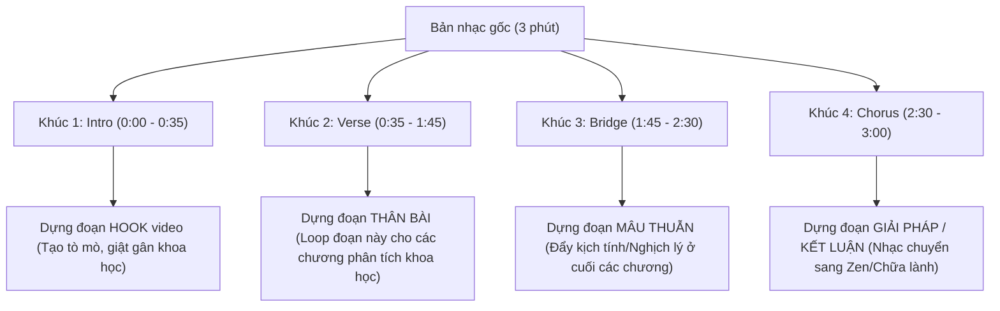

# Brand Soundtrack Specification — Lyria-3-pro-preview

Tài liệu đặc tả **Bản Nhạc Nền Thương Hiệu Duy Nhất (The Signature Theme)** dùng chung cho tất cả các video của kênh **Đạo & Khoa Học** (Tâm Lý Học Hành Vi). Được thiết kế bởi **The Sonic Alchemist** và tối ưu hóa kỹ thuật cho mô hình sinh nhạc **Google Lyria-3-pro-preview**.

---

## 1. Triết Lý Âm Thanh Kênh (Sonic Identity)
Kênh Đạo & Khoa Học bóc tách các cơ chế tâm lý đen tối dưới lăng kính khoa học thần kinh thực chứng và đối chiếu với triết lý Phật pháp. Nhạc nền thương hiệu của kênh phải là một thực thể âm thanh **duy nhất, nhất quán và có khả năng biến đổi linh hoạt** để làm nền cho mọi video.

### Ràng buộc bất biến (Iron Rules):
- ❌ **Tuyệt đối KHÔNG vocal/lyrics/choral:** Không có giọng hát hay tiếng bè của con người để tránh đè tần số giọng đọc của MC.
- ❌ **Tuyệt đối KHÔNG trống/nhịp điệu dồn dập (No Drums/Beat):** Không Lofi beat, không trống cơ học, không hi-hats. Trống sẽ phá vỡ tính học thuật và sự tĩnh lặng của video.
- ❌ **Không hòa âm quá dày:** Nhạc cụ phải cực kỳ thưa thớt, tạo ra nhiều khoảng lặng (Negative space) để người nghe "tiêu hóa" thông tin.
- ✅ **Rung động tần số tự nhiên:** Sử dụng chuông xoay Tây Tạng (Tibetan singing bowls), chuông khánh, tiếng gió quét thoảng qua.
- ✅ **Tần số chữa lành (Healing Frequencies):** Định vị tần số nhạc ở mức **432Hz** hoặc **417Hz** để xoa dịu hệ thần kinh tự chủ (hạ cortisol và stress sinh lý).

---

## 2. Prompt Duy Nhất Tạo Nhạc Nền Thương Hiệu (The Signature Theme)
Hãy sao chép toàn bộ Prompt tiếng Anh dưới đây và dán vào ô nhập liệu của **Lyria-3-pro-preview** để tạo ra bản nhạc nền signature dài 3 phút của kênh:

> **Text Prompt for Lyria:**
> A 3-minute professional signature ambient track for a scientific and meditative documentary channel, 432Hz tuning, extreme slow tempo 65 BPM, high-fidelity stereo.
> - **0:00 - 0:35 (Intro / Hook Segment):** Cold, introspective dark ambient pads with a very low, slow cello drone. Creating psychological tension, mystery, and deep focus. No drums.
> - **0:35 - 1:45 (Verse / Analysis Segment):** The cello recedes. Extremely sparse Steinway piano notes falling far apart. Soft, warm analog synthesizer pads swelling gently in the far background, leaving massive negative space for a male voiceover.
> - **1:45 - 2:30 (Bridge / Tension Segment):** Deep sub-bass swells start to rise, creating a sense of internal emotional weight and cognitive crisis. The piano notes become slightly minor, questioning, and tense.
> - **2:30 - 3:00 (Chorus / Zen Resolution):** A clear, resonant strike of a Tibetan singing bowl. The harmony shifts smoothly from cold minor to a warm, consoling major pad. Quiet, natural wind and forest rustle textures, evoking deep self-compassion and release.
> - **3:00 - 3:10 (Outro):** The instruments slowly fade out, leaving only the long, rich decay of the Tibetan singing bowl and quiet, distant wind chimes fading into absolute silence.
> - **Negative Prompt:** vocals, singing, choir, heavy drums, rhythmic beat, percussion, brass, guitar solo, uplifting pop chords, fast tempo.

---

## 3. Hướng Dẫn Kỹ Thuật Cho Video Editor (Áp dụng cho Mọi Video)
Editor của kênh sẽ tải bản nhạc 3 phút duy nhất sinh ra từ prompt trên về làm tài liệu gốc (Signature Audio Asset) và áp dụng cho mọi video theo sơ đồ cắt ghép sau:

### Cách xử lý trên Timeline Premiere/CapCut:
1.  **Đoạn Hook (Mở đầu video):** Thả **Khúc 1 (Intro)** vào. Âm lượng đặt ở mức `-18dB`. Ngay khi kết thúc Hook để vào nhạc hiệu kênh, hãy cho âm lượng nhỏ dần (fade out) để nhường chỗ cho intro.
2.  **Đoạn phân tích (Thân bài):** Cắt riêng **Khúc 2 (Verse)**. Editor có thể kéo dài khúc này bằng cách sao chép và lặp lại (loop) liên tục dưới giọng đọc MC. Do khúc này cực kỳ thưa thớt (chỉ có piano xa xăm và synth pad khẽ), việc loop sẽ không gây cảm giác lặp lại khó chịu. Âm lượng đặt cực nhỏ ở mức `-24dB` đến `-28dB`.
3.  **Điểm lật ý / Đỉnh điểm nghịch lý:** Khi kịch bản đi đến các mâu thuẫn nhức nhối (cuối các chương), chuyển sang dùng **Khúc 3 (Bridge)** để sub-bass đẩy độ căng thẳng lên nhẹ.
4.  **Đoạn Giải pháp / Phật pháp / Kết bài:** Sử dụng **Khúc 4 (Chorus)**. Đây là lúc tiếng chuông xoay Tây Tạng vang lên báo hiệu sự xoa dịu, hạ vũ khí của ý chí. Âm lượng đặt ở mức `-20dB` để người nghe cảm nhận rõ không gian âm thanh mở ra thư thái.
5.  **Nguyên tắc "Khoảng lặng đắt giá" (Audio Ducking):** Tại những câu chốt hạ (truth punch) hoặc các disclaimer quan trọng được đánh dấu trong kịch bản, Editor hãy chủ động dùng keyframe kéo âm lượng nhạc về `-무한대` (tắt hẳn) trong 1.5 - 2 giây để tạo khoảng lặng sâu trước khi sang câu thoại tiếp theo.
