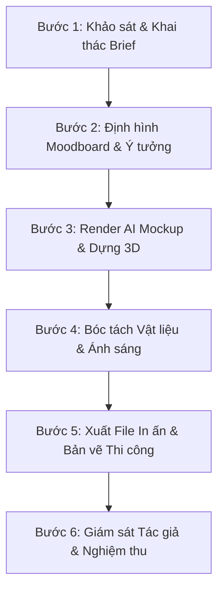

# QUY TRÌNH VẬN HÀNH CHUẨN: TỪ BRIEF ĐẾN THI CÔNG (SOP: BRIEF-TO-PRODUCTION)

Tài liệu này quy định quy trình 6 giai đoạn tiêu chuẩn mà chuyên gia Dr. Visio thực thi để hoàn thành một dự án thiết kế backdrop phòng khám từ con số 0 đến khi nghiệm thu thực tế.

---

---

## 📋 GIAI ĐOẠN 1: KHẢO SÁT HIỆN TRẠNG & KHAI THÁC BRIEF (DISCOVERY)
1. Thu thập bộ câu hỏi khảo sát từ [`client_intake_form.md`](./client_intake_form.md).
2. Khảo sát hiện trạng không gian vật lý:
   - Đo đạc chính xác: Chiều rộng, chiều cao trần thạch cao, chiều cao dầm bê tông, vị trí ổ cắm điện nguồn 220V.
   - Kiểm tra nguồn sáng tự nhiên: Cửa kính lớn đón nắng hướng nào để tính toán hiện tượng chói mắt (Glare).
   - Kiểm tra khoảng lùi chụp ảnh tối đa từ vách tường đến chướng ngại vật gần nhất (cột, quầy tư vấn, sofa chờ).

---

## 🎨 GIAI ĐOẠN 2: CHIẾN LƯỢC VISUAL & MOODBOARD (CREATIVE STRATEGY)
1. Xác định "Tông giọng cảm xúc" (Emotional Tone) của phòng khám:
   - Sang trọng tĩnh lặng (Quiet Luxury).
   - Công nghệ cao vị lai (Hi-tech Futuristic & Clinical Sterile).
   - Chữa lành ấm áp sinh thái (Biophilic Warmth).
2. Tổng hợp bảng vật liệu (Material Board): Mẫu đá, màu inox PVD, mã màu sơn cát lụa, loại đèn LED dây.
3. Trình khách hàng bản Moodboard ý tưởng 2D để chốt hướng đi trước khi dựng chi tiết.

---

## 🖥️ GIAI ĐOẠN 3: TẠO CONCEPT MOCKUP BẰNG AI & 3D (3D RENDERING)
1. Sử dụng bộ công thức prompt tại [`05_ai_render_prompting.md`](../skills/05_ai_render_prompting.md) để xuất từ 3 đến 5 phương án concept kiến trúc chân thực bằng Midjourney v6 hoặc Flux.1 Pro.
2. Ghép logo thương hiệu thật của phòng khám vào mockup để khách hàng hình dung trực quan 100%.
3. Thuyết trình phương án kèm theo luận điểm tâm lý học bệnh nhân và lý do lựa chọn vật liệu.

---

## 📐 GIAI ĐOẠN 4: BÓC TÁCH KỸ THUẬT & DỰ TOÁN THI CÔNG (TECHNICAL SPECS)
1. Bản vẽ bổ kỹ thuật 2D CAD:
   - Mặt đứng chính diện (Front Elevation): Kích thước chi tiết từng mảng tường, vị trí tâm logo.
   - Mặt cắt (Cross Section): Chi tiết khung sắt hộp, độ dày tấm ốp than tre, khoảng giấu đèn LED hắt.
2. Bảng kê vật tư chi tiết (Bill of Materials - BOM):
   - Quy cách sắt hộp: 25x25mm hoặc 30x30mm mạ kẽm chống gỉ.
   - Loại mica: Mica Cháo Đài Loan dày 3mm gắn mặt, chân uốn inox xước mạ vàng titan.
   - Nguồn điện: Bộ chuyển đổi nguồn Meanwell 12V-300W có tản nhiệt nhôm, đặt tại vị trí dễ bảo trì thay thế.

---

## 🖨️ GIAI ĐOẠN 5: XUẤT FILE IN ẤN & GIA CÔNG CƠ KHÍ (PRE-PRESS & FABRICATION)
1. Đối với chi tiết in đồ họa (Hộp đèn không viền vải 3M / Bạt khử mùi):
   - Hệ màu: **CMYK chuẩn FOGRA39**.
   - Độ phân giải: **150 DPI** với kích thước thật tỉ lệ 1:1 (hoặc 300 DPI với tỉ lệ 1:2).
   - Bù xén biên (Bleed): Tối thiểu 50mm mỗi cạnh để nẹp khung nhôm hoặc gấp mép căng khung.
2. Đối với bộ chữ nổi CNC/Laser:
   - Xuất file vector đường cắt dạng `.DXF`, `.AI`, `.DWG` không lỗi gấp khúc hay hở đường path.

---

## 🔍 GIAI ĐOẠN 6: GIÁM SÁT THI CÔNG & BÀN GIAO (QUALITY CONTROL)
1. Kiểm tra độ phẳng của vách nền bằng thước nivô cân bằng laser (không bị gợn sóng).
2. Bật nguồn đèn LED chạy liên tục 4 tiếng để test độ tỏa nhiệt của bộ nguồn và màu ánh sáng (không có điểm chập chờn hay chênh lệch CCT giữa các đoạn nối dây).
3. Dùng camera điện thoại (iPhone/Samsung) chụp thử ở chế độ chân dung xóa phông từ khoảng cách 3m: Đảm bảo logo sắc nét, ánh sáng mịn, không bóng chói, khuôn mặt người chụp rạng rỡ.
